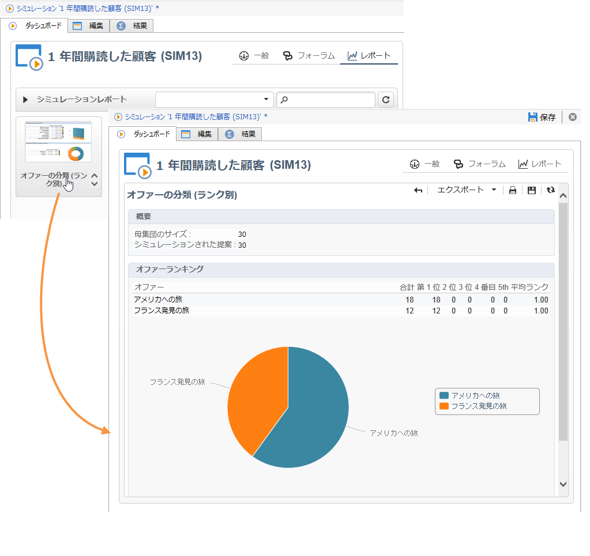

# アウトバウンドチャネル{#offers-on-an-outbound-channel}

## E メールのオファー配信 {#email-offer-delivery}

データベースにアフリカ旅行のカテゴリがあり、各オファーの実施要件、コンテキスト、表示域は既に設定されているとします。これから、E メール経由でオファーを提示するためのキャンペーンを作成します。

1. マーケティングキャンペーンとターゲティングワークフローを作成します。

   

1. Edit the email delivery and click the **[!UICONTROL Offers]** icon.

   

1. 休暇シーズンに合ったオファー環境用の E メールスペースを選択します。

   

1. アフリカ旅行のオファーを含んだカテゴリを選択します。

   

1. 配信するオファーの数を 2 に設定します。

   

1. オファー管理ウィンドウを閉じ、配信のコンテンツを作成します。

   

1. メニューを使用して、最初のオファー提案を挿入し、HTML レンダリング関数を選択します。

   

1. 2 番目のオファー提案を挿入します。

   

1. Click **[!UICONTROL Preview]** to preview your offers in the delivery then select a recipient to preview the offers as they will receive them.

   

1. 配信を保存し、ターゲティングワークフローを開始します。
1. Open your delivery and click the **[!UICONTROL Audit]** tab of your delivery: you can see that the offer engine has selected the propositions to be made from the various offers in the catalog.

   

## オファーシミュレーションの実行 {#perform-an-offer-simulation}

1. 宇宙で、 **[!UICONTROL Profiles and Targets]** リンクをクリック **[!UICONTROL Simulations]** し、ボタンをクリックし **[!UICONTROL Create]** ます。

   

1. ラベルを選択し、必要に応じて実行設定を指定します。

   

1. シミュレーションを保存します。新しいタブが表示されます。

   

1. タブをクリ **[!UICONTROL Edit]** ックし、次に **[!UICONTROL Scope]**。

   

1. オファーをシミュレートするカテゴリを選択します。

   

1. シミュレーションに使用するオファースペースを選択します。

   

1. 有効制限日を入力します。ここでは、少なくとも開始日を指定する必要があります。この情報は、特定の日において有効なオファーを絞り込むためにオファーエンジンで使用されます。
1. 必要な場合は、1 つまたは複数のテーマを選択し、このキーワードが設定に含まれているオファーのみを提案の対象としてオファー数を限定します。

   この例では、「**Travel**」（旅行）カテゴリの下に、2 つのテーマを持つ 2 つのサブカテゴリがあります。「**Customers>1 year**」（1 年を超える顧客）のテーマに属するオファーに関するシミュレーションを実行することにします。

   

1. ターゲットにする受信者を選択します。

   

1. 各受信者に送信されるオファーの数を設定します。

   この例では、オファーエンジンにより、各受信者に対して重み付けが最も大きい 3 つのオファーが選択されます。

   

1. Save your settings, then click **[!UICONTROL Start]** in the **[!UICONTROL Dashboard]** tab to run the simulation.

   

1. Once the simulation is finished, consult the **[!UICONTROL Results]** for a detailed breakdown of propositions per offer.

   この例では、オファーエンジンによって 3 件の提案を基にした分類が表示されています。

   

1. オファーを表 **[!UICONTROL Breakdown of offers by rank]** 示して、オファーエンジンによって選択されたオファーのリストを表示します。

   

1. If necessary, you can change the scope settings and run the simulation again by clicking **[!UICONTROL Start simulation]**.

   

1. シミュレーションデータの保存が必要な場合は、レポートの履歴機能または書き出し機能を使用して保存できます。

   

