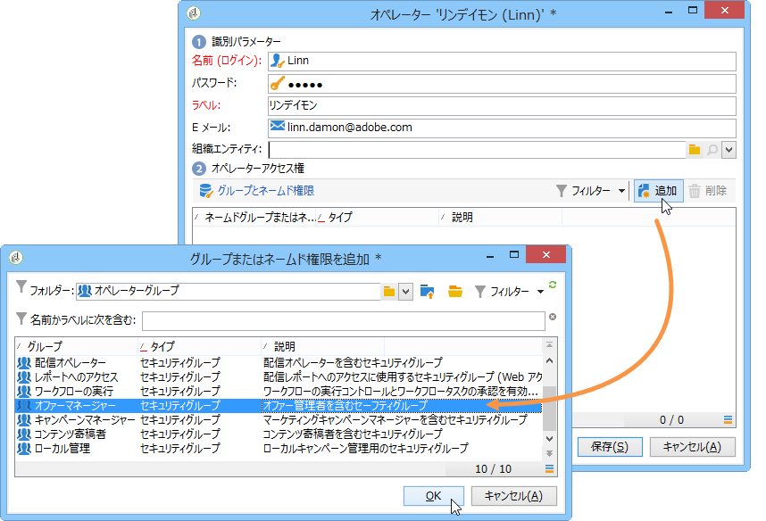
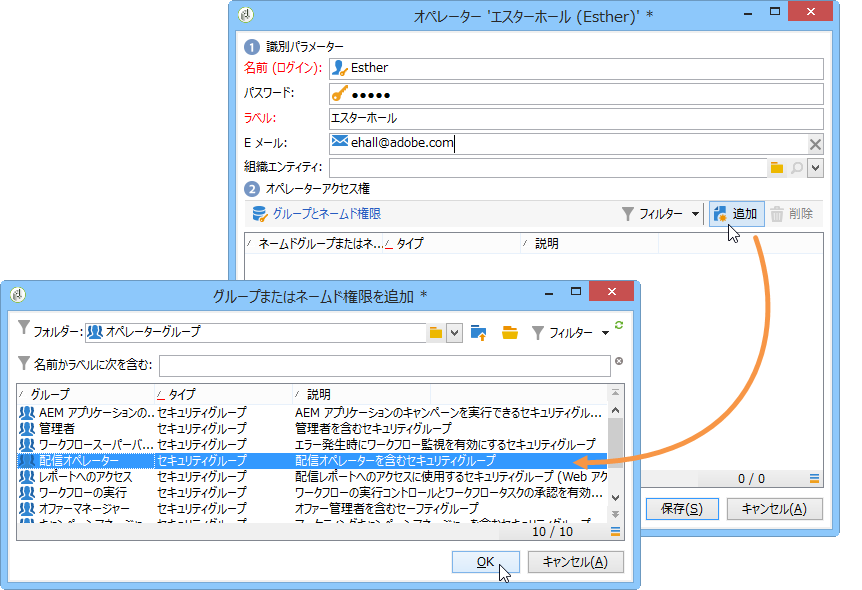

# オペレーターのプロファイル{#operator-profiles}

インタラクションを使用するオペレーターには、オファーマネージャーと配信責任者という 2 つのタイプがあります。それぞれが異なる権限を持ち、ツリーやプラットフォームの一部にのみアクセスできます。

* **[!UICONTROL オファーマネージャー]**：オファーの作成と管理
* **[!UICONTROL 配信責任者]**：オファーの承認と使用

インタラクションに特化したオペレーターを作成する手順は、このプラットフォームの他のすべてのオペレーターを作成する手順と同じです。詳しくは、[この節](../../platform/using/access-management.md#creating-an-operator)を参照してください。権限は、オペレーターの作成時に設定します。

## オファーマネージャー {#offer-manager}

1. 新しいオペレーターを作成します。
1. **[!UICONTROL グループとネームド権限]**&#x200B;ウィンドウに移動して、「**[!UICONTROL 追加]**」をクリックし、「**[!UICONTROL オファーマネージャー]**」グループを選択します。

   

オファーマネージャーに割り当てられる権限で実行できるタスクは次のとおりです。

* **[!UICONTROL デザイン]**&#x200B;環境を修正する。
* **[!UICONTROL ライブ]**&#x200B;環境を表示する。
* 管理機能（定義済みスペースおよびフィルター）を設定する。
* カテゴリを作成および変更する。
* オファーを作成する。
* オファーの実施要件を設定する。
* オファーを承認する。

   >[!NOTE]
   >
   >オファーマネージャーは、2 つの状況においてのみオファーを承認できます。1 つは、誰もレビュー担当者として割り当てられていない場合です。もう 1 つは、テンプレートの作成を担当するオペレーター（レビュー担当者の割り当て権限を持つ）が、オファーのベースとなるオファーテンプレートで、自分自身をレビュー担当者に指定した場合です。

## 配信責任者 {#delivery-manager}

1. 新しいオペレーターを作成します。
1. **[!UICONTROL グループとネームド権限]**&#x200B;ウィンドウに移動して、「**[!UICONTROL 追加]**」をクリックし、「**[!UICONTROL 配信責任者]**」グループを選択します。

   

配信責任者に割り当てられる権限で実行できるタスクは次のとおりです。

* **[!UICONTROL ライブ]**&#x200B;環境を表示する。
* オファーカテゴリを表示および修正する。
* 自分がレビュー担当者として割り当てられている場合、オファーを承認する。

   >[!NOTE]
   >
   >配信責任者がオファーを承認できるのは、オファーの設定時に、自分がレビュー担当者として定義されている場合のみです。

## オペレーターに関する権限の概要 {#recap-of-rights-according-to-operator}

<table> 
 <tbody> 
  <tr> 
   <td> </td> 
   <td> <strong>オファーマネージャー（編集）</strong>  </td> 
   <td> <strong>オファーマネージャー（ライブ）</strong>  </td> 
  </tr> 
  <tr> 
   <td> <strong>ツリー構造のレベル</strong>  </td> 
   <td> </td> 
   <td> </td> 
  </tr> 
  <tr> 
   <td> 編集対象のオファー／ライブオファー  </td> 
   <td> 読み取り／書き込み  </td> 
   <td> 読み取り  </td> 
  </tr> 
  <tr> 
   <td> 受信者 - 環境  </td> 
   <td> 読み取り／書き込み  </td> 
   <td> 読み取り  </td> 
  </tr> 
  <tr> 
   <td> 管理  </td> 
   <td> 読み取り／書き込み  </td> 
   <td> 読み取り  </td> 
  </tr> 
  <tr> 
   <td> スペース  </td> 
   <td> 読み取り／書き込み  </td> 
   <td> 読み取り  </td> 
  </tr> 
  <tr> 
   <td> 定義済みオファーフィルター  </td> 
   <td> 読み取り／書き込み  </td> 
   <td> 読み取り  </td> 
  </tr> 
  <tr> 
   <td> タイポロジ  </td> 
   <td> 読み取り／書き込み  </td> 
   <td> 読み取り  </td> 
  </tr> 
  <tr> 
   <td> タイポロジルール  </td> 
   <td> 読み取り／書き込み  </td> 
   <td> 読み取り  </td> 
  </tr> 
  <tr> 
   <td> オファーカタログ  </td> 
   <td> 読み取り／書き込み  </td> 
   <td> 読み取り  </td> 
  </tr> 
  <tr> 
   <td> オファーカテゴリ  </td> 
   <td> 読み取り／書き込み  </td> 
   <td> 読み取り  </td> 
  </tr> 
 </tbody> 
</table>

<table> 
 <tbody> 
  <tr> 
   <td> </td> 
   <td> <strong>配信責任者（編集）</strong>  </td> 
   <td> <strong>配信責任者（ライブ）</strong>  </td> 
  </tr> 
  <tr> 
   <td> <strong>ツリー構造のレベル</strong>  </td> 
   <td> </td> 
   <td> </td> 
  </tr> 
  <tr> 
   <td> 編集対象のオファー／ライブオファー  </td> 
   <td> </td> 
   <td> 読み取り  </td> 
  </tr> 
  <tr> 
   <td> 受信者 - 環境  </td> 
   <td> </td> 
   <td> 読み取り  </td> 
  </tr> 
  <tr> 
   <td> 管理  </td> 
   <td> </td> 
   <td> </td> 
  </tr> 
  <tr> 
   <td> スペース  </td> 
   <td> </td> 
   <td> </td> 
  </tr> 
  <tr> 
   <td> 定義済みオファーフィルター  </td> 
   <td> 読み取り  </td> 
   <td> 読み取り  </td> 
  </tr> 
  <tr> 
   <td> タイポロジ  </td> 
   <td> 読み取り  </td> 
   <td> 読み取り  </td> 
  </tr> 
  <tr> 
   <td> タイポロジルール  </td> 
   <td> </td> 
   <td> 読み取り  </td> 
  </tr> 
  <tr> 
   <td> オファーカタログ  </td> 
   <td> 読み取り  </td> 
   <td> 読み取り  </td> 
  </tr> 
  <tr> 
   <td> オファーカテゴリ  </td> 
   <td> </td> 
   <td> 読み取り  </td> 
  </tr> 
 </tbody> 
</table>

