# プレゼンテーションルール{#presentation-rules}

## プレゼンテーションルールの作成 {#creating-a-presentation-rule}

欧州、アフリカ、米国、カナダ向けの旅行オファーがデータベースに数件格納されている事例があるとします。これからカナダ旅行のオファーを送信しますが、受信者からこの種のオファーが拒否された場合は、以後送信しないようにする必要があります。

そこで、カナダ旅行のオファーを受信者 1 人につき 1 回のみ送信し、拒否された場合は二度と送信しないようにルールを設定します。

1. Adobe Campaign のツリーで、**[!UICONTROL 管理]**／**[!UICONTROL キャンペーン管理]**／**[!UICONTROL タイポロジ管理]**／**[!UICONTROL タイポロジルール]**&#x200B;ノードに移動します。
1. 「**[!UICONTROL オファーのプレゼンテーション]**」タイプのルールを新規作成します。

   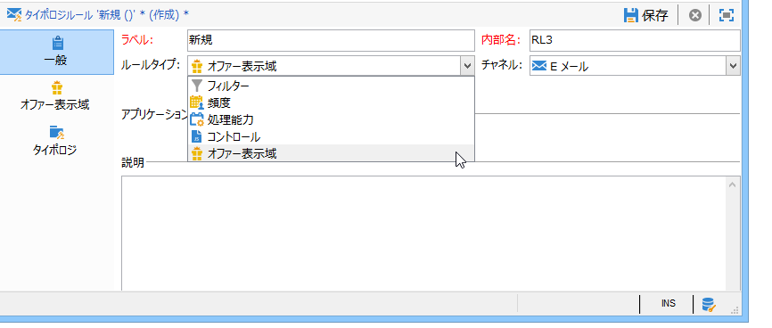

1. 必要に応じて、ラベルと説明を変更します。

   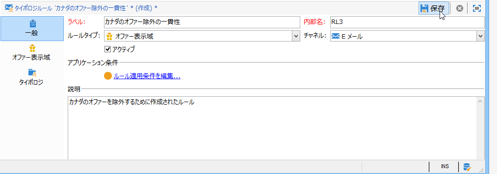

1. 「**[!UICONTROL すべてのチャネル]**」オプションを選択して、ルールをすべてのチャネルに拡大します。

   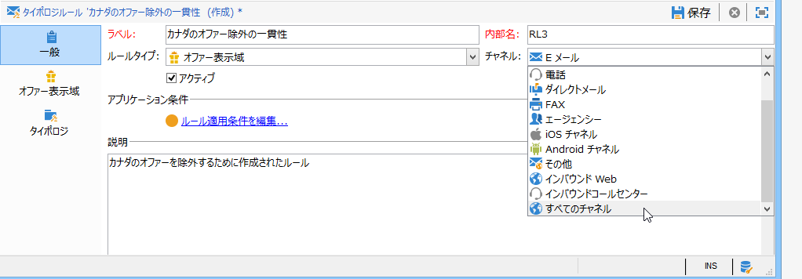

1. 「**[!UICONTROL 式を編集]**」リンクをクリックし、式として「**[!UICONTROL カテゴリ]**」ノードを選択します。

   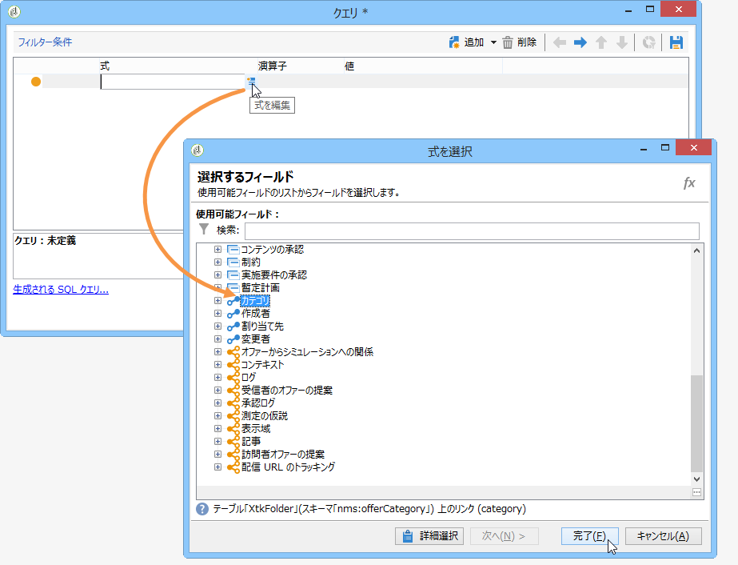

1. カナダ行き旅行のオファーに該当するカテゴリを選択し、「**[!UICONTROL OK]**」をクリックしてクエリウィンドウを閉じます。

   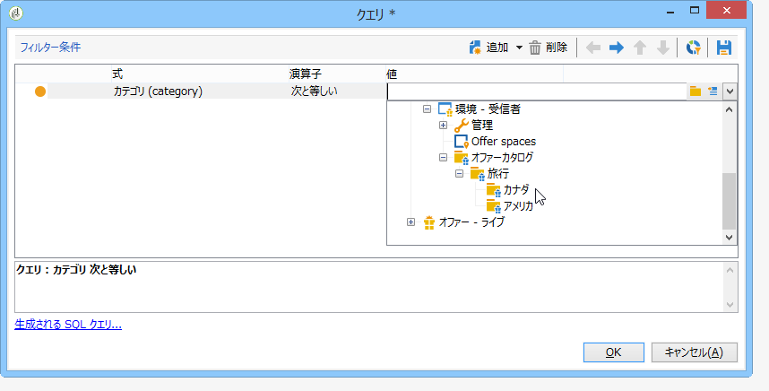

1. 「**[!UICONTROL オファーのプレゼンテーション]**」タブで、環境内に設定されているのと同じディメンションを選択します。

   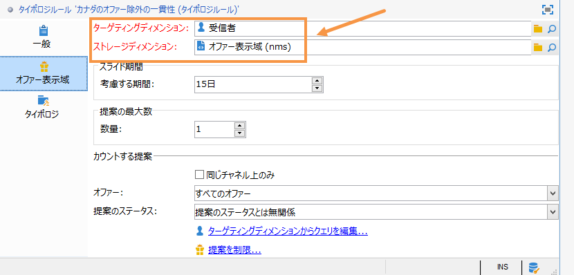

1. ルールを適用する期間を指定します。

   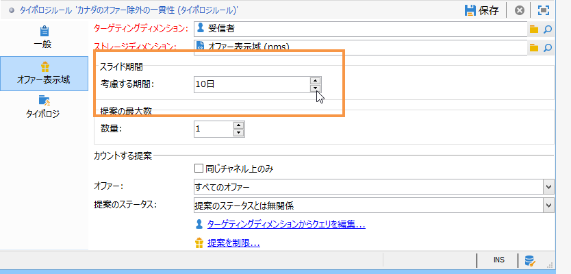

1. 提案数を 1 つに制限して、既にカナダ旅行のオファーを拒否した受信者に同様のオファーが送られるのを防ぎます。

   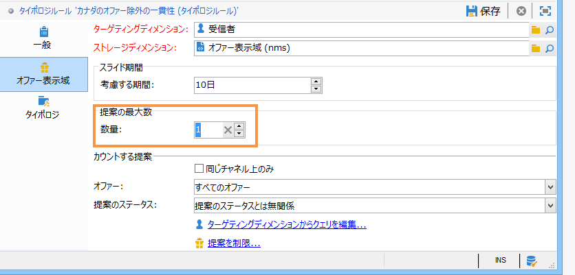

1. 「**[!UICONTROL 同じカテゴリのオファー]**」を選択して、「**Canada**」（カナダ）カテゴリに属するすべてのオファーを除外します。

   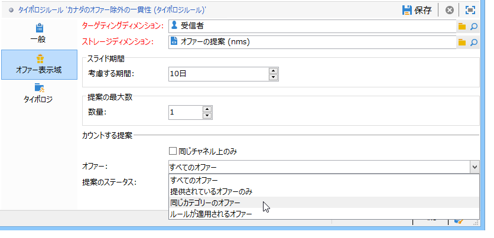

1. 「**[!UICONTROL 却下された提案]**」フィルターを選択して、受信者に拒否された提案のみが考慮されるようにします。

   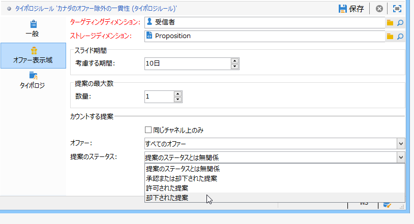

1. ルールを適用する受信者を指定します。

   この例では、受信者として「**Frequent travelers**」（よく旅行する人）を選択します。

   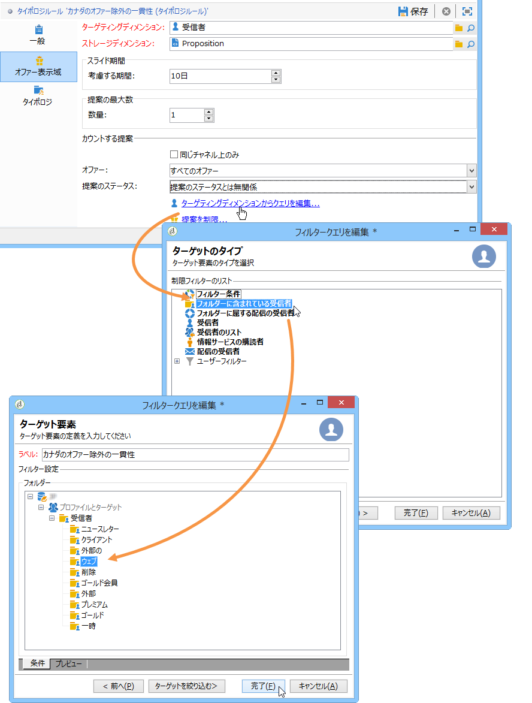

1. オファーのタイポロジ内で、ルールを参照します。

   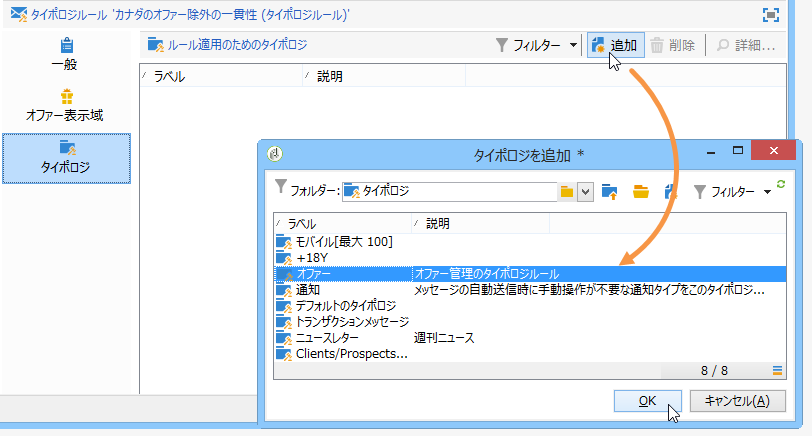

1. オファー環境に移動し（この例では「**環境 - 受信者**」）、「**[!UICONTROL 実施要件]**」タブのドロップダウンリストで、先ほど作成した新しいタイポロジを参照します。

   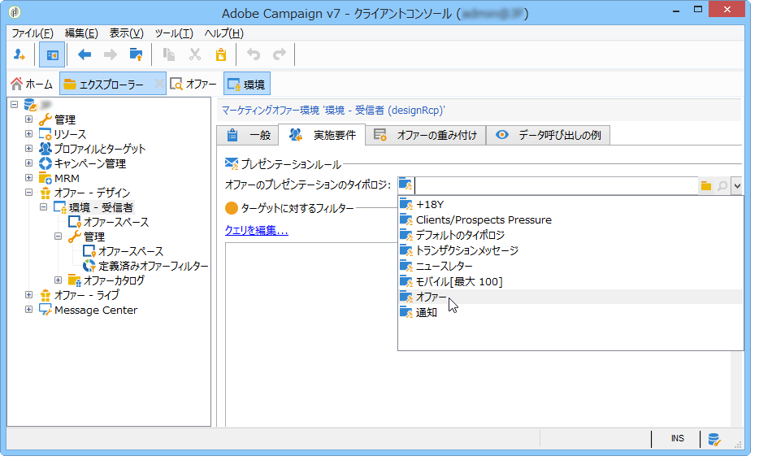

## プレゼンテーションルールの適用 {#applying-the-presentation-rule}

ここでは、先ほど作成したタイポロジルールを適用する手順の例を示します。

これから、カナダのカテゴリに属する最初のオファー提案を送信しようとしています。ただし、このオファーを既に拒否したことがある受信者には再送しません。

1. 受信者フォルダー「**Frequent travelers**」からプロファイルを 1 つ選択します。実施要件を満たすオファーをチェックするために、「**[!UICONTROL 提案]**」タブをクリックし、「**[!UICONTROL プレビュー]**」タブをクリックします。

   この例の場合、**Tim Ramsey** というプロファイルは、「**Americas**」（南北アメリカ）カテゴリに属するオファーの実施要件を満たしています。

   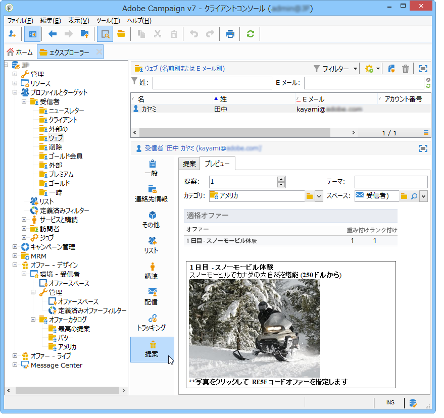

1. 最初に、**よく旅行する人**&#x200B;をターゲットにしたオファーの E メール配信を作成します。
1. オファーエンジン呼び出しパラメーターを選択します。

   この例では、「**Travel in America**」（アメリカ旅行）カテゴリを選択します。このカテゴリには、サブカテゴリの「**Canada**」（カナダ）および「**United States**」（米国）が含まれています。

   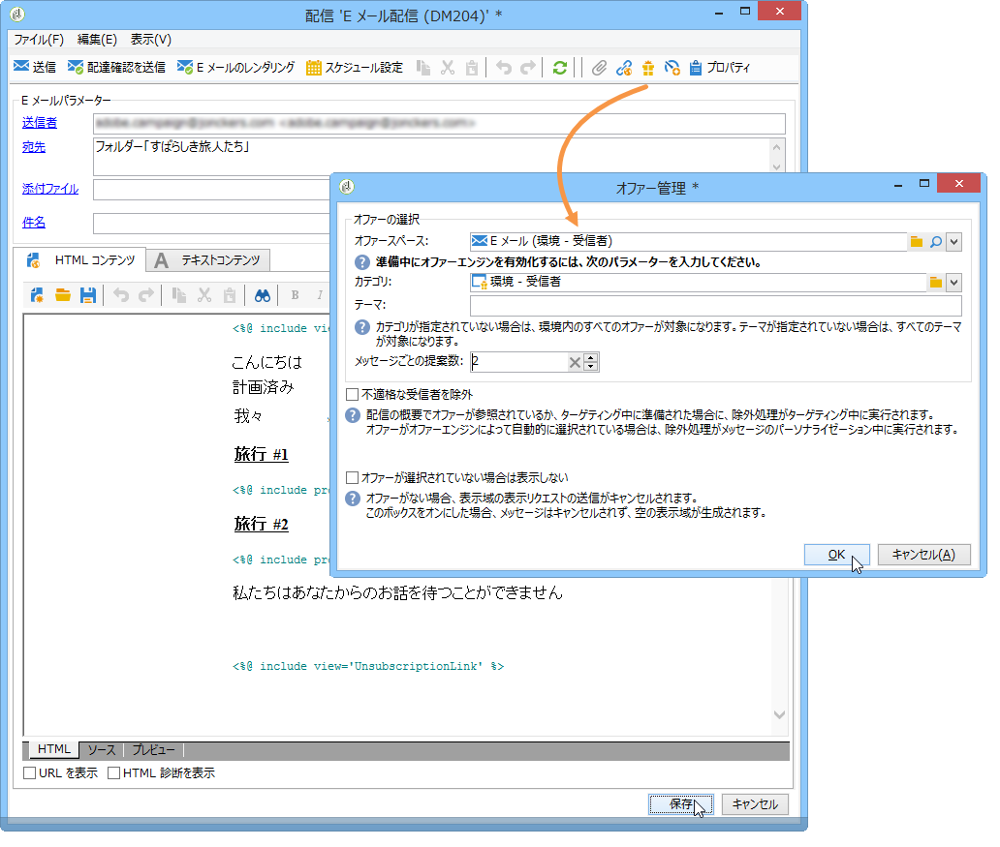

1. メッセージの本文にオファーを挿入し、配信を送信します。詳しくは、[アウトバウンドチャネルについて](../../interaction/using/about-outbound-channels.md)を参照してください。

   受信者に、実施要件を満たすオファーが届きます。

1. 提案履歴を見ると、この受信者はカナダのオファーを拒否しています。

   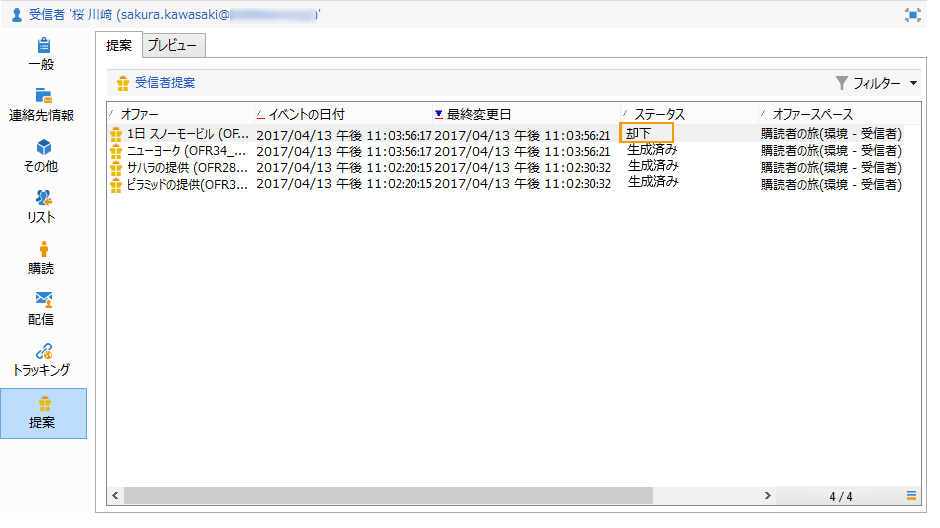

1. この受信者の現在の実施要件に合ったオファーをチェックします。

   カナダ行きのオファーは選択されなくなりました。

   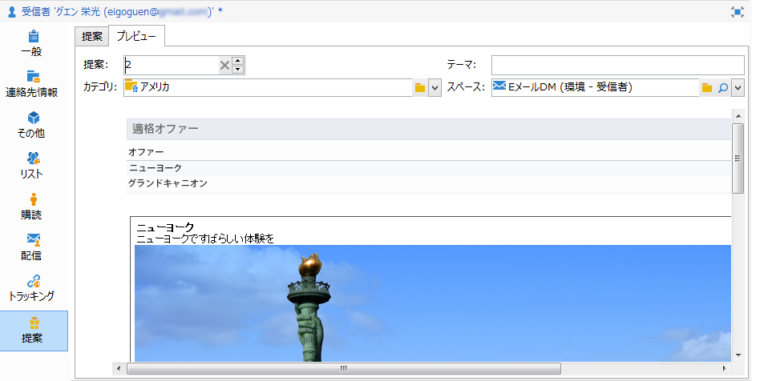

**関連トピック**

* [チャネル間のオファーおよびコントロールの冗長性の管理](https://helpx.adobe.com/jp/campaign/kb/simplifying-campaign-management-acc.html#Manageoffersandcontrolredundancyacrosschannels)