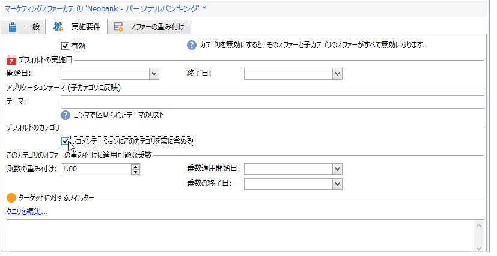

# カテゴリのレコメンデーション{#recommending-a-category}

場合によっては、受信者は、すべてのオファーを受ける資格があるわけではないと見なされることがあります。すべての受信者がオファーの提案を受け取れるように、システムで 1 つまたは様々なオファーカテゴリをレコメンデーションに追加できます。メインオファーとは異なり、それらの「バックアップ」オファーには、資格のある重み付けの大きいオファーがない場合にのみ提示されるように、小さい（ただし 0 ではない）重み付けを設定する必要があります。また、レコメンデーションに必ず含められるよう、バックアップオファーにはプレゼンテーションルールが何も適用されていない状態にしておく必要があります。これにより、提案中に重みの大きいオファーがない場合でも、受信者は、このカテゴリのオファーを少なくとも 1 つ受け取ります。

カテゴリが常にレコメンデーションに含められるようにするには、次の手順に従います。

1. エクスプローラーを開き、ツリー構造のオファーカタログをクリックします。
1. 「**[!UICONTROL 実施要件]**」タブをクリックし、「**[!UICONTROL レコメンデーションにこのカテゴリを常に含める]**」チェックボックスをオンにします。
1. 「**[!UICONTROL 保存]**」をクリックして確定し、操作を完了します。

   

