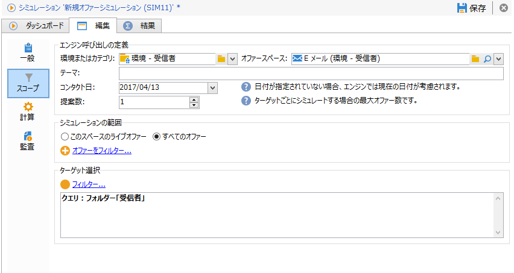
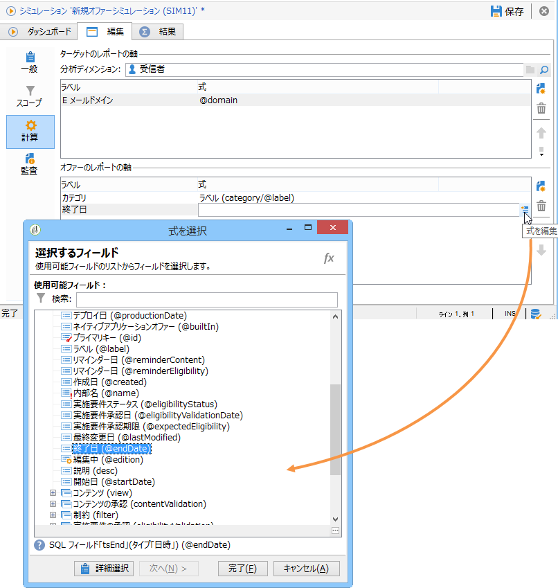

# シミュレーションのスコープ{#simulation-scope}

## スコープの定義 {#definition-of-the-scope}

Open the **[!UICONTROL Scope]** tab to choose your settings.

次の項目は必須です。

* 環境またはオファーカテゴリ。
* オファースペース。
* コンタクト日. コンタクト日に実施要件を満たしていないオファーは、考慮されません。
* ターゲット母集団。

   ターゲットにフィルターを設定しない場合、受信者テーブル全体が考慮されます。

* ターゲットごとにシミュレーションされる提案数。

   受信者は、この多くの提案を受け取ります。例えば、5 と入力すると、各受信者が受け取るオファーの提案の数は最大 5 件になります。

   

シミュレーションについて考慮に入れるようにオファーを調整するために、1 つまたは複数のテーマ（事前にカテゴリで指定されたもの）を追加できます。

また、シミュレーションをすべてのオファーについて実行するか、オンライン状態のオファーについてのみ実行するかを選択することもできます。一部のフィルターは、必要に応じて選択を変更できます。

>[!NOTE]
>
>コンタクト日の指定は必須です。これによって、インタラクションエンジンは選択した環境またはカテゴリのオファーを並べ替えることができます。日付を設定していない場合、シミュレーションを実行するとエラーが発生します。

## レポートの軸の追加 {#adding-reporting-axes}

You can enhance the simulation analysis by adding reporting axes on the target or the offers themselves via the **[!UICONTROL Calculations]** tab.

To do this, click the **[!UICONTROL Add]** button and choose the appropriate fields. 軸は、シミュレーションの計算に使用され、分析レポートに表示されます。For more on this, refer to [Simulation tracking](../../interaction/using/simulation-tracking.md).

