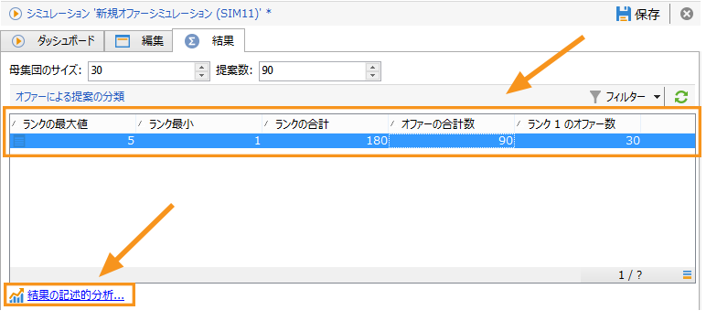
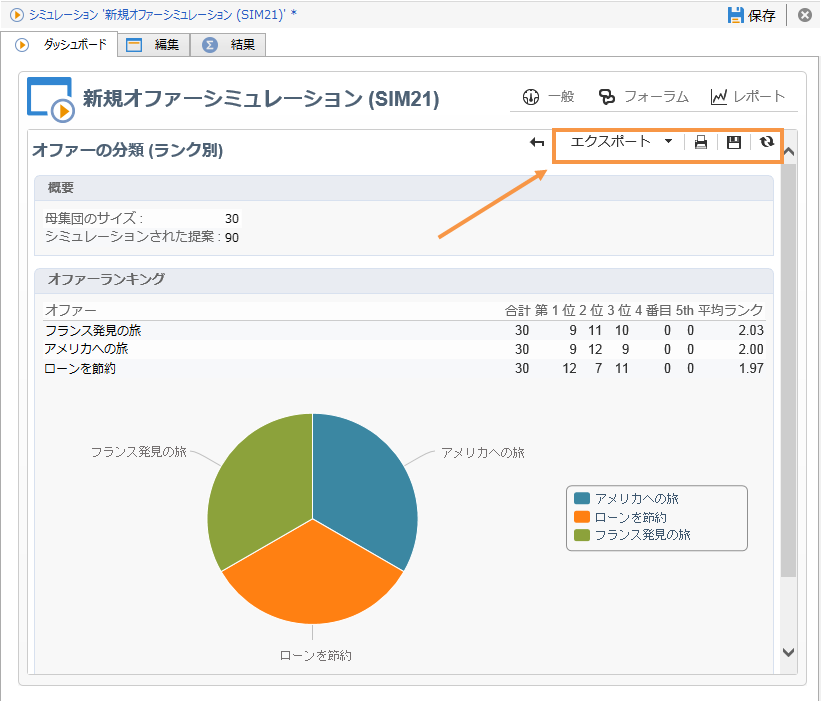

# シミュレーショントラッキング{#simulation-tracking}

Once the simulation is finished, you can analyze its result via the **[!UICONTROL Results]** tab which is added to the simulation window and the **[!UICONTROL Breakdown of offers by rank]** report, available via in the simulation dashboard.

シミュレーションの結果には、提案のランク別および受信者別の分類が含まれています。また、レポートの軸も考慮されて、このタブに表示されます。

必要に応じて、結果の記述的分析を作成することで、シミュレーションの結果を保存して書き出すことができます。それには、結果ウィンドウで適切なリンクをクリックします。

記述的分析ウィザードについて詳しくは、[この節](../../reporting/using/about-descriptive-analysis.md)を参照してください。

ピボットテーブルを使用すると、オファーのランクごとの分類をすばやく確認できます。Adobe Campaign のすべてのレポートと同じように、書き出し、印刷、アーカイブまたは Web ブラウザーでの表示が可能です。

詳しくは、[この節](../../reporting/using/actions-on-reports.md)を参照してください。

