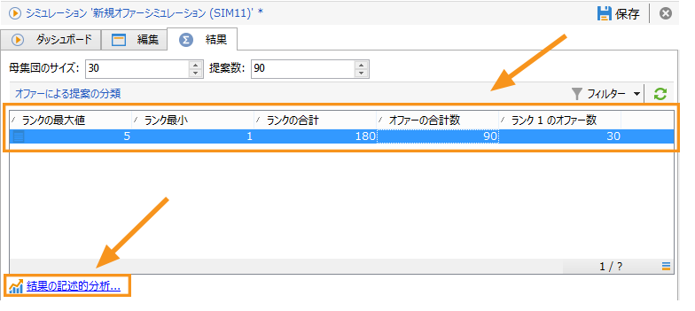
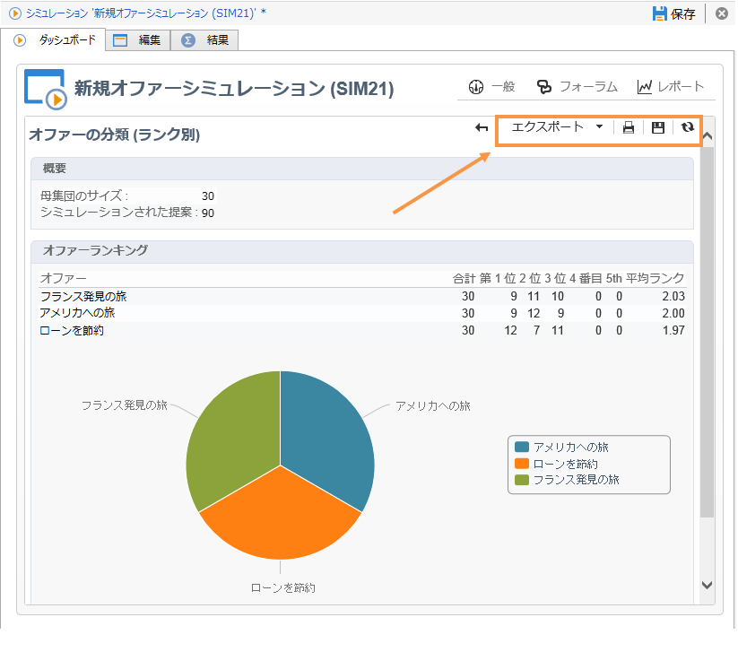

# シミュレーションのトラッキング{#simulation-tracking}

シミュレーションが完了したら、シミュレーションウィンドウに追加される「**[!UICONTROL 結果]**」タブと、シミュレーションダッシュボードで利用できる&#x200B;**[!UICONTROL オファーの分類（ランク別）]**&#x200B;レポートを使用して、実行結果を分析できます。

シミュレーションの結果には、提案のランク別および受信者別の分類が含まれています。 また、レポートの軸も考慮されて、このタブに表示されます。

必要に応じて、結果の記述的分析を作成することで、シミュレーションの結果を保存してエクスポートできます。 それには、結果ウィンドウで適切なリンクをクリックします。

記述的分析アシスタントについて詳しくは、[この節](../../reporting/using/about-descriptive-analysis.md)を参照してください。

ピボットテーブルを使用すると、オファーのランキングごとの分類をすばやく確認できます。 Adobe Campaign のすべてのレポートと同じように、エクスポート、印刷、アーカイブまたは web ブラウザーでの表示が可能です。

詳しくは、[この節](../../reporting/using/actions-on-reports.md)を参照してください。

