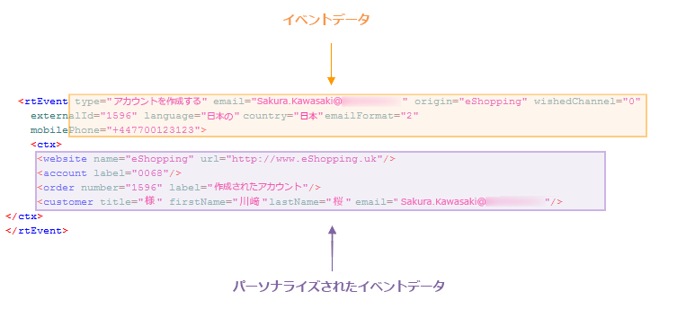

# イベントの処理について{#about-event-processing}

In the context of transactional messaging, an event is generated by an external information system and is sent to Adobe Campaign via the **[!UICONTROL PushEvent]** and **[!UICONTROL PushEvents]** methods (refer to [Event description](../../message-center/using/event-description.md)). イベントには、イベントのタイプ（例えばオーダー確認や Web サイトにおけるアカウント作成）、E メールアドレスまたは電話番号、その他の情報など、そのイベントに関連したデータが含まれており、エンリッチメントやパーソナライズをおこなってからトランザクションメッセージを配信できるようになります。イベントデータとしては、顧客の連絡先情報、メッセージの言語または E メールのフォーマットなどが挙げられます。

イベントデータの例：

トランザクションメッセージイベントを処理するには、次の手順を適用する必要があります。

1. イベントの収集
1. メッセージテンプレートに転送される前のイベントのエンリッチメント（Campaign のトランザクションメッセージモジュールで使用できるエンリッチメントオプションを入手している場合）
1. イベントのメッセージテンプレートへの転送
1. パーソナライゼーションデータを使用したイベントのエンリッチメント
1. 配信の実行
1. リンクした配信に失敗したイベントの再利用（この手順は Adobe Campaign ワークフロー経由で実行することができます）

## イベントのステータス {#event-statuses}

The **Event history**, under **[!UICONTROL Message Center]** > **[!UICONTROL Event history]** , groups all the processed events into one single view. イベントは、イベントタイプまたは&#x200B;**ステータス**&#x200B;ごとに分類することができます。イベントのステータスは以下のとおりです。

* **保留中**：該当するのは次のいずれかです。

   * 収集されたばかりで処理されていないイベント列に **[!UICONTROL Number of errors]** は値0が表示されます。 E メールテンプレートはまだリンクされていません。
   * 処理されたが、確認でエラーになったイベント列に **[!UICONTROL Number of errors]** は0以外の値が表示されます。 To know when this event will be processed again, consult the **[!UICONTROL Process requested on]** column.

* **配信待ち**：イベントは処理され、配信テンプレートがリンクされています。E メールは配信待ちとなり、標準的な配信処理が適用されます。詳しい情報を見るには、該当する配信を開いてください。[配信](../../delivery/using/about-message-tracking.md)を参照してください。
* **送信済み**、**無視**、**配信エラー**：これらの配信ステータスは、**updateEventsStatus** ワークフローで復元します。詳しい情報を見るには、該当する配信を開いてください。
* **対象外のイベント**：Message Center のルーティングフェーズが失敗しました。例えば、Adobe Campaign がこのイベントのテンプレートとなる E メールを見つけられなかった場合などです。
* **期限切れのイベント**：送信試行の最大数を超えました。このイベントは空とみなされます。
