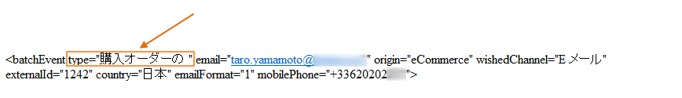

# イベントの処理 {#about-event-processing}

トランザクションメッセージのコンテキストでは、イベントは外部の情報システムによって生成され、**[!UICONTROL PushEvent]** および **[!UICONTROL PushEvents]** メソッドを介して Adobe Campaign に送信されます（[イベントの説明](../../message-center/using/event-description.md)を参照）。

このイベントには、[タイプ](../../message-center/using/creating-event-types.md)（注文確認、web サイトでのアカウント作成など）、メールアドレスや携帯電話番号、配信前にトランザクションメッセージをエンリッチメントおよびパーソナライズする情報（顧客連絡先情報、メッセージの言語、メールフォーマット）など、イベントにリンクしたデータが含まれています。

イベントデータの例：

## イベントの処理手順 {#event-processing}

トランザクションメッセージのイベントを処理するには、次の手順を実行インスタンスに適用します。

1. [イベントの収集](#event-collection)
1. [メッセージテンプレートへのイベントの転送](#routing-towards-a-template)
1. パーソナライゼーションデータを使用したイベントのエンリッチメント
1. [配信の実行](../../message-center/using/delivery-execution.md)
1. リンクされた配信に失敗した[イベントの再利用](#event-recycling)（Adobe Campaign ワークフロー経由）

上記のすべての手順が実行インスタンスを通じて実行されると、ターゲットの各受信者にパーソナライズされたメッセージが届きます。

>[!NOTE]
>
>トランザクションメッセージのインスタンスについて詳しくは、[トランザクションメッセージのアーキテクチャ](../../message-center/using/transactional-messaging-architecture.md)を参照してください。

## イベントの収集 {#event-collection}

情報システムが生成したイベントは、次の 2 つのモードを使用して収集できます。

* SOAP メソッドの呼び出しでは、Adobe Campaign 内でイベントをプッシュできます。PushEvent メソッドを使用するとイベントを 1 つずつ送信し、PushEvents メソッドを使用すると複数のイベントを一度に送信します。詳しくは、[イベントの説明](../../message-center/using/event-description.md)を参照してください。

* ワークフローの作成では、ファイルのインポートまたは SQL ゲートウェイ経由（「[Federated Data Access](../../installation/using/about-fda.md)」オプションを使用）でイベントを回復することができます。

収集したイベントは、テクニカルワークフローによって実行インスタンスのリアルタイムキューとバッチキューに分別され、メッセージテンプレートにリンクされるのを待つことになります。

>[!NOTE]
>
>実行インスタンス上では、**[!UICONTROL リアルタイムイベント]**&#x200B;フォルダーまたは&#x200B;**[!UICONTROL バッチイベント]**&#x200B;フォルダーをビューとして設定しないでください。アクセス権の問題が発生するおそれがあるからです。 フォルダーをビューとして設定する方法について詳しくは、[この節](../../platform/using/access-management-folders.md)を参照してください。

## テンプレートへのルーティング {#routing-towards-a-template}

メッセージテンプレートが実行インスタンスにパブリッシュされると、2 つのテンプレートが自動的に生成されます。1 つはリアルタイムイベントにリンクし、もう 1 つはバッチイベントにリンクします。

ルーティングの手順では、以下に基づいてイベントを適切なメッセージテンプレートにリンクします。

* イベント自体のプロパティで指定されたイベントタイプ。

   

* メッセージテンプレートのプロパティで指定されたイベントタイプ。

   

デフォルトでは、ルーティングは次の情報に基づいておこなわれます。

* イベントタイプ
* 使用するチャネル（デフォルトは E メール）
* 公開日に基づく最新の配信テンプレート

## イベントのステータス {#event-statuses}

**イベント履歴**（**[!UICONTROL Message Center]**／**[!UICONTROL イベント履歴]**）は、処理されたすべてのイベントを 1 つのビューにまとめます。イベントは、イベントタイプまたは&#x200B;**ステータス**&#x200B;ごとに分類することができます。イベントのステータスは以下のとおりです。

* **保留中**：イベントは次のいずれかになります。

   * 収集されたばかりで、まだ処理していないイベント。**[!UICONTROL エラー数]**&#x200B;の列には 0 の値が表示されます。メールテンプレートはまだリンクされていません。
   * 処理されたが、確認でエラーになったイベント。**[!UICONTROL エラー数]**&#x200B;列に 0 以外の値が表示されます。このイベントが再処理される日付については、**[!UICONTROL 処理リクエスト日]**&#x200B;の列を参照してください。

* **配信待ち**：イベントは処理され、配信テンプレートがリンクされています。メールは配信待ちとなり、標準的な配信処理が適用されます。詳細を確認するには、該当する配信を開きます。
* **送信済み**、**無視**、**配信エラー**：これらの配信ステータスは、**updateEventsStatus** ワークフローで回復します。詳細を確認するには、該当する配信を開きます。
* **対象外のイベント**：トランザクションメッセージのルーティングフェーズで失敗しました。たとえば、Adobe Campaign がこのイベントのテンプレートとなるメールを見つけられなかった場合などです。
* **期限切れのイベント**：送信試行の最大数に達しました。このイベントは空とみなされます。

## イベントの再利用 {#event-recycling}

特定のチャネルでのメッセージ配信に失敗した場合、Adobe Campaign は別のチャネルでメッセージを再送信することができます。例えば、SMS チャネルでの配信に失敗した場合、E メールチャネルを利用してメッセージを再送信します。

これには、ステータスが **Delivery error** であるすべてのイベントを再度作成し、異なるチャネルを割り当てるワークフローを設定する必要があります。

>[!CAUTION]
>
>この手順の実行は、ワークフローを使用する必要があるので、エキスパートユーザー向けの操作となります。詳しくは、アドビのアカウント担当者にお問い合わせください。