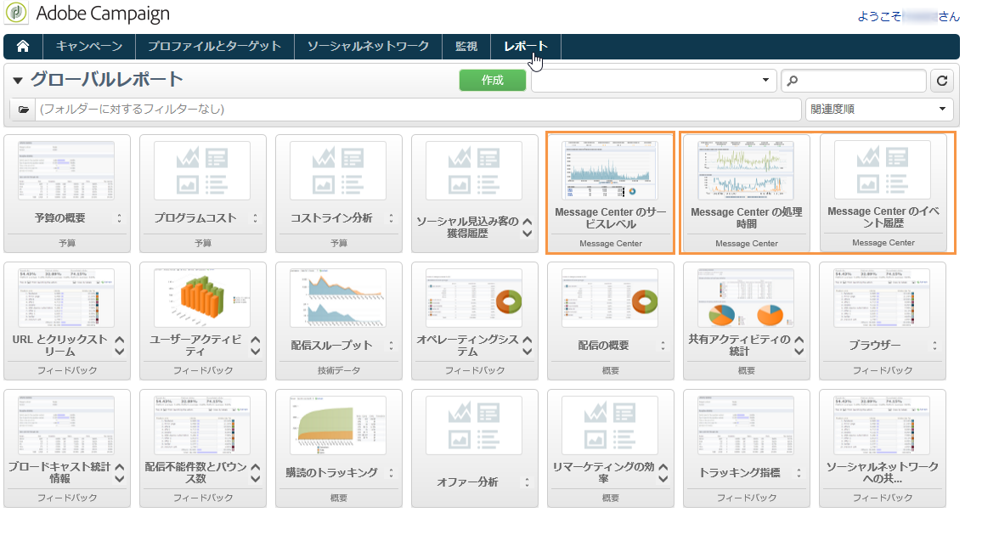

# トランザクションメッセージレポートについて{#about-transactional-messaging-reports}

Adobe Campaign では、実行インスタンスのスムーズな運用とアクティビティのコントロールを可能にするレポートが複数用意されています。これらの Message Center レポートは、コントロールインスタンスの「**[!UICONTROL レポート]**」タブからアクセスすることができます。

