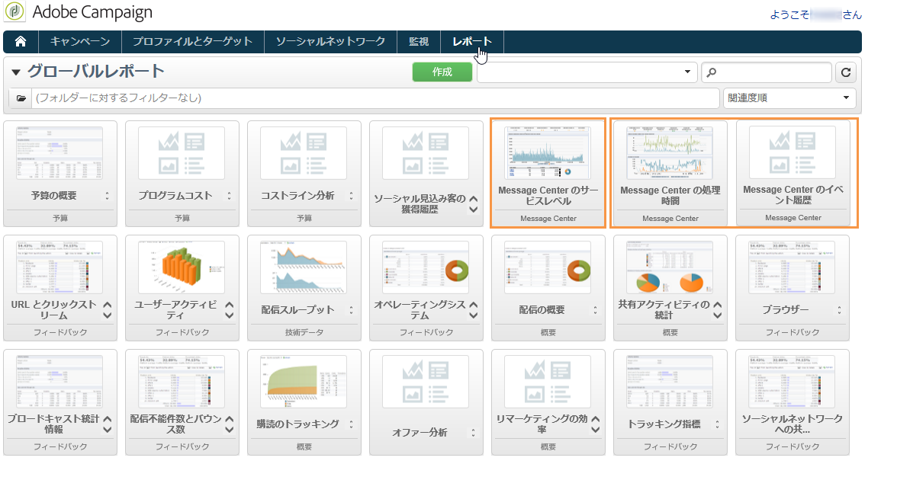

# トランザクションメッセージレポートへのアクセス {#about-transactional-messaging-reports}

Adobe Campaign では、実行インスタンスのアクティビティとスムーズな運用をコントロールできるように、複数のレポートを用意しています。

これらの Message Center レポートは、**コントロールインスタンス**&#x200B;の「**[!UICONTROL レポート]**」タブからアクセスできます。

