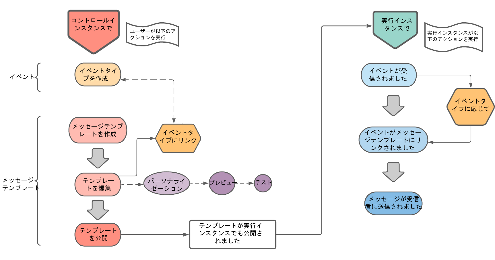

# トランザクションメッセージの基本を学ぶ {#about-transactional-messaging}

## 概要 {#overview}

**トランザクションメッセージ**（Message Center）は、カスタムトリガー通知を管理するためにデザインされたキャンペーンモジュールです。カスタムトリガー通知は、外部の情報システムが送信したイベントから生成されます。

トランザクションメッセージは web サイトなどのプロバイダーがリアルタイムに送信する、個々に向けたユニークなコミュニケーションです。受信者が確認したい重要な情報が含まれているので、早い送信が特に期待されます。

トランザクションメッセージ機能は、拡張性を備え、毎日 24 時間サービスを提供するように設計されています。

* **いつまでに必要か？**&#x200B;メッセージには重要な情報が含まれているので、ユーザーはリアルタイムで送信されることを求めています。そのため、イベントがトリガーされてからメッセージが届くまでの時間を、非常に短縮する必要があります。

* **なぜ重要なのか？**&#x200B;一般に、トランザクションメッセージは高い比率で開封されます。顧客との関係を定め、顧客の行動に強い影響を与える可能性があるので、慎重に設計する必要があります。

* **メッセージ例：** アカウント作成後のウェルカムメッセージ、注文の発送確認、請求書、パスワード変更の確認メッセージ、顧客が web サイトを閲覧した後の通知、製品が利用できないことの連絡、取引明細などが考えられます。

>[!IMPORTANT]
>
>トランザクションメッセージを利用するには特定のライセンスが必要です。使用許諾契約書を確認してください。

<!--Before starting with transactional messaging, make sure you read the corresponding [best practices and limitations]().-->

## トランザクションメッセージの動作原理 {#transactional-messaging-operating-principle}

Adobe Campaign のトランザクションメッセージモジュールは情報システムに組み込まれ、システムはパーソナライズされたトランザクションメッセージに変換するイベントを返します。これらのメッセージはメール、SMS、プッシュ通知などを介して、個別に送信することも、まとめて送信することもできます。

この機能は、独立した&#x200B;**実行インスタンス**&#x200B;と&#x200B;**コントロールインスタンス**&#x200B;から成る、特有のアーキテクチャで提供されます。インスタンスを分けることにより、高い可用性と優れた負荷管理を実現します。詳しくは、[トランザクションメッセージのアーキテクチャ](../../message-center/using/transactional-messaging-architecture.md)を参照してください。

>[!NOTE]
>
>Adobe Cloud が提供する Message Center の実行インスタンス用の新しいユーザーを作成する場合は、[アドビのカスタマーサポート](https://helpx.adobe.com/jp/enterprise/admin-guide.html/enterprise/using/support-for-experience-cloud.ug.html)に連絡してください。Message Center のユーザーは、**[!UICONTROL リアルタイムイベント（nmsRtEvent）]**&#x200B;フォルダーにアクセスできる専用の権限が必要な特定のオペレーターです。

トランザクションメッセージの全体的なプロセスは、次のように記述できます。

例えば、顧客が製品を購入できる ｗeb サイトを持つ会社の例で考えてみます。

Adobe Campaign を使用すると、買い物かごに製品を追加した顧客に通知メールを送信できます。Web サイトを訪れた人が購入せずにサイトを離れると（キャンペーンイベントをトリガーする外部イベント）、買い物かごの放棄に伴うメールを自動的に送信できます（トランザクションメッセージ配信）。

これを実現する主な手順は、[この節](#key-steps)で説明します。

>[!NOTE]
>
>Adobe Campaign は、トランザクションメッセージの処理を他のどの配信よりも優先します。

## 主な手順 {#key-steps}

パーソナライズされたトランザクションメッセージを Adobe Campaign で作成し、管理する主な手順は以下の通りです。

### コントロールインスタンスで実行する手順

**コントロールインスタンス**&#x200B;で、次の操作を実行する必要があります。

1. [イベントタイプの作成](../../message-center/using/creating-event-types.md)。
1. [メッセージテンプレートの作成とデザイン](../../message-center/using/creating-the-message-template.md)。この手順で、イベントをメッセージにリンクします。
1. [メッセージのテスト](../../message-center/using/testing-message-templates.md)。
1. [メッセージテンプレートのパブリッシュ](../../message-center/using/publishing-message-templates.md)。

>[!NOTE]
>
>上記の手順はすべて&#x200B;**コントロールインスタンス**&#x200B;で実行します。コントロールインスタンスでテンプレートをパブリッシュすると、すべての&#x200B;**実行インスタンス**&#x200B;もパブリッシュされます。トランザクションメッセージのインスタンスについては、[トランザクションメッセージのアーキテクチャ](../../message-center/using/transactional-messaging-architecture.md)を参照してください。

### 実行インスタンスでのイベント処理

トランザクションメッセージテンプレートを設計してパブリッシュして、対応するイベントがトリガーされた場合、以下の主な手順が&#x200B;**実行インスタンス**&#x200B;で実行されます。

1. 外部の情報システムでイベントが生成されると、**PushEvent** および **PushEvents** メソッドを介して関連データが Campaign に送信されます。[イベントの収集](../../message-center/using/about-event-processing.md#event-collection)を参照してください。
1. 適切なメッセージテンプレートにイベントがリンクされます。[テンプレートへのルーティング](../../message-center/using/about-event-processing.md#routing-towards-a-template)を参照してください。
1. エンリッチメントステージが完了すると、配信が送信されます。[配信の実行](../../message-center/using/delivery-execution.md)を参照してください。ターゲットの各受信者は、パーソナライズされたメッセージを受信します。

## 関連トピック {#related-topics}

* [コミュニケーションチャネルの概要](../../delivery/using/communication-channels.md)
* [配信の作成に関する主な手順](../../delivery/using/steps-about-delivery-creation-steps.md)
* [トランザクションメッセージのアーキテクチャ](../../message-center/using/transactional-messaging-architecture.md)
* [トランザクションメッセージレポートへのアクセス](../../message-center/using/about-transactional-messaging-reports.md)
