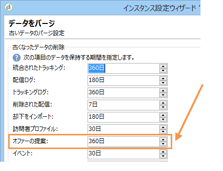

# その他の設定 {#mc-additional-configurations}


## しきい値の監視 {#monitoring-thresholds}

**Message Center のサービスレベル**&#x200B;と **Message Center の処理時間**&#x200B;のレポートに表示される指標について、警告しきい値（オレンジ）とアラートしきい値（赤）を設定できます。[トランザクションメッセージレポートへのアクセス](../../message-center/using/about-transactional-messaging-reports.md)を参照してください。

これを行うには、次の手順に従います。

1. **実行インスタンス**&#x200B;でデプロイウィザードを開きます。

1. **[!UICONTROL Message Center]** ページに移動します。

1. 矢印でしきい値を変更します。

   

>[!NOTE]
>
>キュー内の保留中のイベント数が、Adobe Campaign のプロセス監視ページの「[システム指標](../../production/using/monitoring-processes.md#system-indicators)」セクションに表示されます。デプロイウィザードについて詳しくは、[この節](../../installation/using/deploying-an-instance.md#deployment-wizard)を参照してください。

## イベントのパージ {#purging-events}

[デプロイメントウィザード](../../production/using/database-cleanup-workflow.md#deployment-wizard)を使用し、データをデータベース上に保存する期間を設定できます。

イベントのパージは、[データベースクリーンアップワークフロー](../../production/using/database-cleanup-workflow.md)によって自動的に実行されます。このワークフローは、実行インスタンスが受信し保存したイベントおよびコントロールインスタンスがアーカイブしたイベントをパージします。

矢印を使用し、必要に応じてパージの設定を変更します。

コントロールインスタンスのイベントパージ設定：



実行インスタンスのイベントパージ設定：


データベースのクリーンアップワークフローについて詳しくは、[この節](../../production/using/database-cleanup-workflow.md)を参照してください。


## テクニカルワークフロー {#technical-workflows}

トランザクションメッセージテンプレートをデプロイする前に、コントロールインスタンスおよびそれぞれの実行インスタンス上にてテクニカルワークフローが作成され、開始されていることを確認する必要があります。

トランザクションメッセージ（Message Center）に関連する様々なテクニカルワークフローは、コントロールインスタンスと実行インスタンスとに分類されます。

### コントロールインスタンスのワークフロー {#control-instance-workflows}

コントロールインスタンスで、登録されている実行インスタンスが 1 つか複数かにかかわらず、**[!UICONTROL Message Center の実行インスタンス]**&#x200B;外部アカウントごとに 1 つのアーカイブワークフローを作成する必要があります。「**[!UICONTROL アーカイブワークフローを作成]**」ボタンをクリックし、ワークフローを作成して開始します。


これらのワークフローは、**管理／プロダクション／Message Center** フォルダーからアクセスできます。アーカイブワークフローは作成されると自動的に開始されます。

<!--**Minimal architecture**

Once the control and execution modules are installed on the same instance, you must create the archiving workflow using the deployment wizard. Click the **[!UICONTROL Create the archiving workflow]** button to create and start the workflow.

-->

### 実行インスタンスのワークフロー {#execution-instance-workflows}

実行インスタンスでは、**管理／プロダクション／Message Center** フォルダーからトランザクションメッセージのテクニカルワークフローにアクセスできます。必要な操作は、ワークフローを開始することだけです。リストに含まれるワークフローは以下のとおりです。

* **[!UICONTROL バッチイベントの処理]**（内部名：**[!UICONTROL batchEventsProcessing]**）：このワークフローは、メッセージテンプレートにリンクされる前にキュー内のバッチイベントを分類することができます。
* **[!UICONTROL リアルタイムイベントの処理]**（内部名：**[!UICONTROL rtEventsProcessing]**）：このワークフローは、メッセージテンプレートにリンクされる前にキュー内のリアルタイムイベントを分類することができます。
* **[!UICONTROL イベントステータスを更新]**（内部名：**[!UICONTROL updateEventStatus]**）：このワークフローは、ステータスをイベントに関連付けることができます。

  イベントステータスには以下のものがあります。

   * **[!UICONTROL 保留中]**：イベントはキューの中です。イベントにはまだメッセージテンプレートが割り当てられていません。
   * **[!UICONTROL 配信待ち]**：イベントはキューの中で、メッセージテンプレートが割り当てられ、配信による処理中です。
   * **[!UICONTROL 送信済み]**：このステータスは配信ログからコピーされます。配信が送信されたことを示します。
   * **[!UICONTROL 配信で無視]**：このステータスは配信ログからコピーされます。配信が無視されたことを意味しています。
   * **[!UICONTROL 配信に失敗]**：このステータスは配信ログからコピーされます。配信が失敗したことを意味しています。
   * **[!UICONTROL 処理不可なイベント]**：イベントをメッセージテンプレートにリンクすることができませんでした。イベントの処理はおこなわれません。

## マルチブランディングの設定 {#configuring-multibranding}

この節では、Adobe Campaign でのトランザクションメッセージのために、トラッキングとミラーページの URL をブランドごとに設定するソリューションの 1 つを説明します。

### 前提条件 {#prerequisites}

* すべてのホストをインスタンスの設定ファイル（`config-<instance>.xml`）に追加する必要があります。
* 各ブランドはそれぞれ 1 つのサブドメインに割り当てられていなければなりません。
* HTTPS ページで Web トラッキングをしている場合、すべてのブランドについて HTTPS 証明証を持っていなければなりません。

マルチブランディングを設定するには、実行インスタンスとコントロールインスタンスの両方を設定する必要があります。

### 実行インスタンス {#execution-instance}

実行インスタンスでは、次の手順に従います。

1. ブランドごとに 1 つの外部アカウントを作成します。

   >[!NOTE]
   >
   >実行インスタンスタイプの外部アカウントを作成する方法については、[この節](../../message-center/using/configuring-instances.md#control-instance)を参照してください。

1. nms:extAccount スキーマを拡張し、トラッキング URL を追加します。

   ```
   <attribute advanced="true" desc="URL of the tracking servers" label="Tracking server URL"
   length="100" name="trackingURL" type="string"/>
   ```

   >[!NOTE]
   >
   >既存のスキーマを拡張する方法については、[スキーマの拡張](../../configuration/using/extending-a-schema.md)の節を参照してください。

1. nms:extAccount フォームを変更します。

   ```
   <container label="Message domain branding" type="frame">
        <static type="help"> These parameters are used to override the DNS alias and addresses used during message delivery. When not populated, the values of the 'NmsServer_MirrorPageUrl' and 'NmsEmail_DefaultErrorAddr' options are used.</static>
        <input xpath="@mirrorURL"/>
        <input xpath="@trackingURL"/>
        <input img="nms:sendemail.png" menuId="deliveryMenuBuilder" type="scriptEdit">
               xpath="errorAddress"/>
      </container>
   ```

1. NmsTracking_OpenFormula および NmsTracking_ClickFormula オプションを変更し、グローバルオプションの代わりに外部アカウントを使用するようにします。

   これには、

   ```
   <%@ include option='NmsTracking_ServerUrl' %>
   ```

   を以下で置き換えます。

   ```
   <%@ value object="provider" xpath="@trackingURL" %>
   ```

   >[!IMPORTANT]
   >
   >これらの変更は、アップグレードの際に競合を引き起こすことがあります。これらの数式と新しいバージョンの数式とを手動で統合させなければならない可能性があります。

### コントロールインスタンス {#control-instance}

コントロールインスタンスでは、配信テンプレートと外部アカウントをリンクします。

これを行うには、次の手順に従います。

1. [実行インスタンス](#execution-instance)で定義したもの（手順 1）と同じ内部名で、ブランドごとに 1 つの外部アカウントを作成します。

1. ブランドごとに 1 つのデフォルトの配信テンプレートを作成します。

   >[!NOTE]
   >
   >    配信テンプレートを作成する方法については、[この節](../../delivery/using/creating-a-delivery-template.md#creating-a-new-template)を参照してください。

1. 配信テンプレートの&#x200B;**[!UICONTROL プロパティ]**&#x200B;で、ブランドの外部アカウントへのルーティングを設定します。
