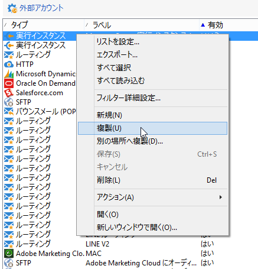
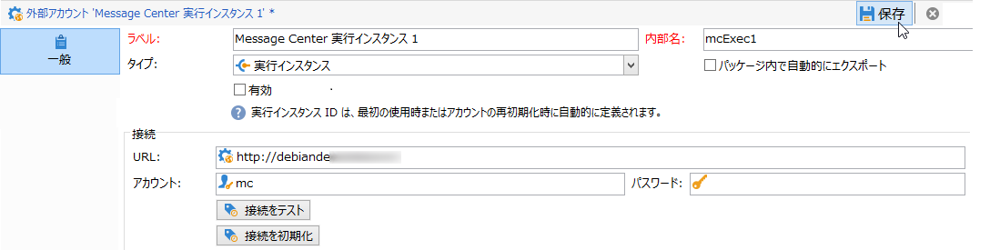
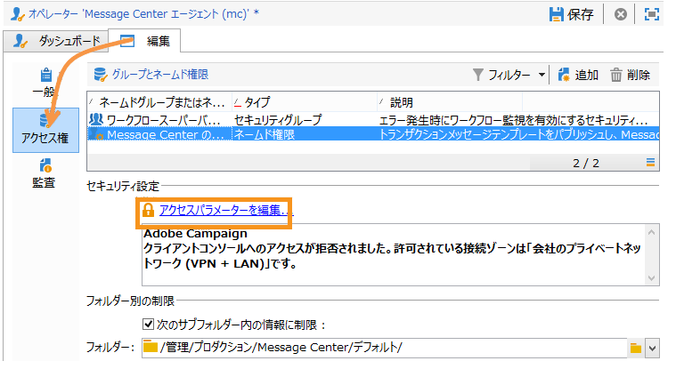
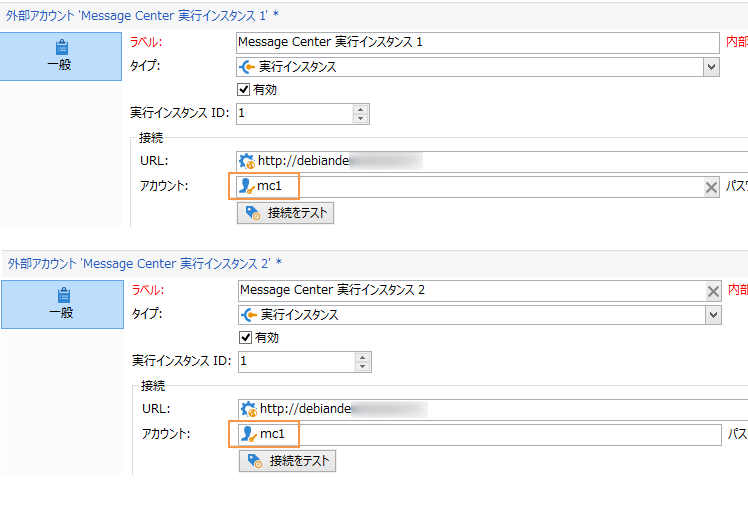
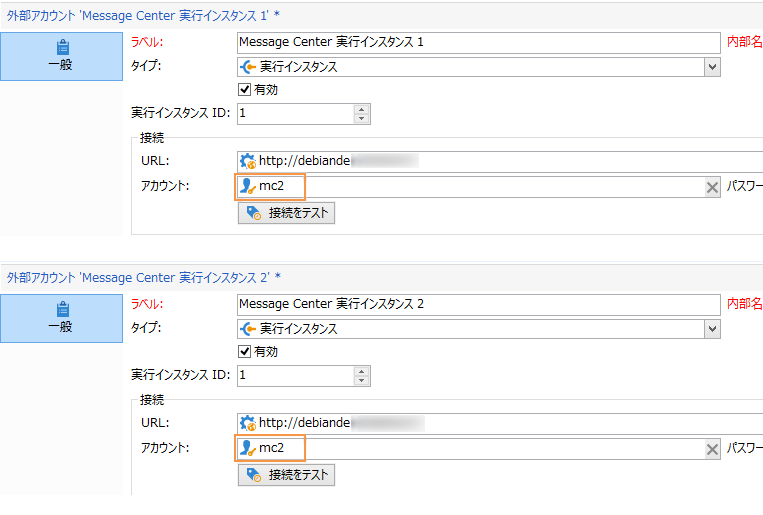
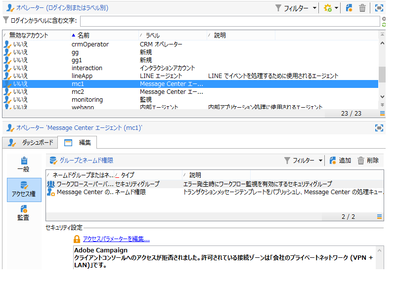
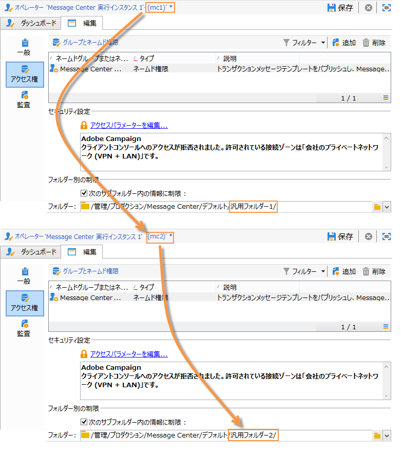
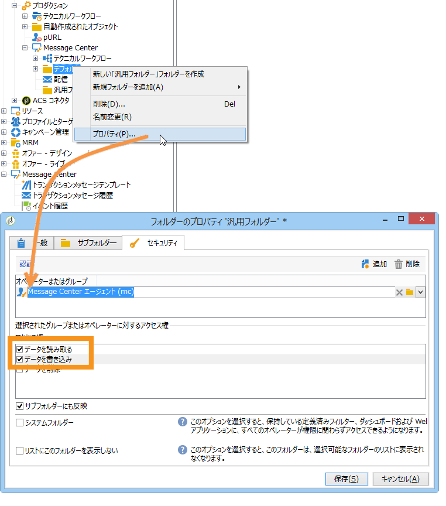

# インスタンスの設定 {#creating-a-shared-connection}

トランザクションメッセージ機能を使用するには、コントロールインスタンスと実行インスタンスを設定する必要があります。次のいずれかを使用できます。
* 1 つまたは複数の実行インスタンスに関連付けられた [ 1 つのコントロールインスタンス](#control-instance) 
* 複数の実行インスタンスに関連付けられた[複数のコントロールインスタンス](#using-several-control-instances)

>[!IMPORTANT]
>
>コントロールインスタンスまたは実行インスタンスで [Message Center のテクニカルワークフロー](../../message-center/using/additional-configurations.md#technical-workflows)が使用するリソースに影響を与えるスキーマ拡張は、トランザクションメッセージのモジュールが使用するその他のインスタンスでは複製する必要があります。

また、実行インスタンスを指定し、コントロールインスタンスに接続する必要があります。

コントロールインスタンスと実行インスタンスの設定と接続に必要な手順について、この節で説明します。

>[!IMPORTANT]
>
>コントロールインスタンスおよび実行インスタンスは、異なるマシンにインストールする必要があります。同じ Campaign インスタンスを共有できなくなります。

## コントロールインスタンスの設定 {#control-instance}

コントロールインスタンスと実行インスタンスを接続するには、まず&#x200B;**[!UICONTROL 実行インスタンス]**&#x200B;タイプの外部アカウントを&#x200B;**コントロールインスタンス**&#x200B;上に作成して設定する必要があります。これにより、[パブリッシュ](../../message-center/using/publishing-message-templates.md#template-publication)すると、トランザクションメッセージテンプレートを実行インスタンスにデプロイできます。

複数の実行インスタンスを使用する場合は、実行インスタンスと同じ数だけ外部アカウントを作成する必要があります。

>[!NOTE]
>
>複数のコントロールインスタンスで実行インスタンスを使用する場合、フォルダーおよびオペレーターごとにデータを分けることができます。詳しくは、[複数のコントロールインスタンスの使用](#using-several-control-instances)を参照してください。

### 外部アカウントの作成

>[!NOTE]
>
>以下の手順は、**コントロールインスタンスで**&#x200B;実行する必要があります。

**[!UICONTROL 実行インスタンス]**&#x200B;タイプの外部アカウントを作成するには、次の手順に従います。

1. **[!UICONTROL 管理／プラットフォーム／外部アカウント]**&#x200B;フォルダーに移動します。
1. Adobe Campaign にデフォルトで用意されている、実行インスタンスタイプの外部アカウントのうちの 1 つを選択し、右クリックして「**[!UICONTROL 複製]**」を選択します。

   

1. 必要に応じて、ラベルを変更します。

   

1. 「**[!UICONTROL 有効]**」オプションを選択し、外部アカウントを運用可能にします。

   

1. 実行インスタンスがインストールされているサーバーのアドレスを指定します。

   

1. アカウントにはオペレーターフォルダーで定義されている Message Center エージェントを指定します。デフォルトで Adobe Campaign に指定されているアカウントは **[!UICONTROL mc]** です。

   

1. オペレーターフォルダーで定義されたアカウントのパスワードを入力します。

   >[!NOTE]
   >
   >インスタンスにログオンするたびにパスワードを入力しなくても済むように、実行インスタンス内でコントロールインスタンスの IP アドレスを指定することができます。詳しくは、[実行インスタンスの設定](#execution-instance)を参照してください。

1. 実行インスタンスで使用する回復メソッドを指定します。復元するデータは、実行インスタンスによりコントロールインスタンスへと転送され、トランザクションメッセージとイベントアーカイブに追加されます。

   

   データ収集は、HTTP/HTTPS アクセスを使用する Web サービス経由または Federated Data Access（FDA） モジュール経由のいずれかでおこなわれます。

   >[!NOTE]
   >
   >FDA over HTTP を使用する場合、PostgreSQL データベースを使用する実行インスタンスのみがサポートされます。MSSQL および Oracle データベースはサポートしていません。

   コントロールインスタンスが実行インスタンスのデータベースへ直接接続できる場合は、2 つ目のメソッド（FDA）を推奨します。直接接続できない場合は、Web サービス経由の接続を選択します。FDA アカウントには、コントロールインスタンス上に作成した個々の実行インスタンスのデータベースに接続する場合と同じアカウントを指定します。

   

   Federated Data Access（FDA）の詳細については、[この節](../../installation/using/about-fda.md)を参照してください。

1. 「**[!UICONTROL 接続をテスト]**」をクリックし、コントロールインスタンスと実行インスタンスがリンクされたことを確認します。

   

複数の実行インスタンスを使用する場合は、これらの手順を繰り返して、実行インスタンスと同じ数だけ外部アカウントを作成します。

### 実行インスタンスの特定 {#identifying-execution-instances}

各実行インスタンスは、コントロールインスタンスで表示する際に各実行インスタンスの履歴を区別するために、一意の識別子に関連付ける必要があります。

この識別子は、各実行インスタンスに&#x200B;**手動で**&#x200B;割り当てることができます。その際、この手順は&#x200B;**各実行インスタンスで**&#x200B;実行する必要があります。これをおこなうには、次のようにデプロイウィザードを使用します。

1. 実行インスタンスでデプロイウィザードを開きます。
1. **[!UICONTROL Message Center]** ウィンドウに移動します。
1. 識別子を選択してインスタンスに割り当てます。

   

1. 各実行インスタンスで上記の手順を繰り返します。

識別子は、**自動的に**&#x200B;属性にすることもできます。これをおこなうには、**コントロールインスタンス**&#x200B;に移動し、「**[!UICONTROL 接続を初期化]**」ボタンをクリックします。

## 実行インスタンスの設定  {#execution-instance}

>[!NOTE]
>
>以下の手順は、**実行インスタンスで**&#x200B;実行する必要があります。

実行インスタンスをコントロールインスタンスに接続するには、次の手順に従います。

パスワードの入力なしでコントロールインスタンスから実行インスタンスに接続できるようにするには、**Message Center** の「アクセス権」セクションでコントロールインスタンスの IP アドレスを入力します。ただし、デフォルトでは空のパスワードを使用することは禁止されています。

空のパスワードを使用するには、実行インスタンスに移動し、イベントを配信する情報システムの IP アドレスに限定したセキュリティゾーンを定義します。このセキュリティゾーンは、空のパスワードと `<identifier> / <password>` タイプの接続を許可している必要があります。詳しくは、[この節](../../installation/using/security-zones.md)を参照してください。

>[!NOTE]
>
>複数のコントロールインスタンスで実行インスタンスを使用する場合、フォルダーおよびオペレーターごとにデータを分けることができます。詳しくは、[複数のコントロールインスタンスの使用](#using-several-control-instances)を参照してください。

1. 実行インスタンスで、オペレーターフォルダー（**[!UICONTROL 管理／アクセス管理／オペレーター]**）に移動します。
1. **Message Center** エージェントを選択します。

   

1. 「**[!UICONTROL 編集]**」タブを選択し、「**[!UICONTROL アクセス権]**」をクリックし、「**[!UICONTROL アクセスパラメーターを編集...]**」リンクをクリックします。

   

1. **[!UICONTROL アクセス設定]**&#x200B;ウィンドウで、「**[!UICONTROL 信頼済み IP マスクを追加]**」リンクをクリックし、コントロールインスタンスの IP アドレスを追加します。

   

複数の実行インスタンスを使用する場合は、各実行インスタンスに対してこれらの手順を繰り返します。

## 複数のコントロールインスタンスの使用 {#using-several-control-instances}

1 つの実行クラスターは複数のコントロールインスタンスで共有することができます。このタイプのアーキテクチャでは次の設定が必要です。

たとえば、会社が 2 つのブランドを管理していて、それぞれに独自のコントロールインスタンス（**コントロール 1** と&#x200B;**コントロール 2**）があるとします。実行インスタンスも 2 つ使用します。それぞれのコントロールインスタンスには、異なる Message Center オペレーターを入力する必要があります。**コントロール 1** インスタンスには **mc1** オペレーター、**コントロール 2** インスタンスには **mc2** オペレーターを入力します。

すべての実行インスタンスのツリーにて、オペレーターにつきフォルダーを 1 つずつ作成し（**フォルダー 1** と&#x200B;**フォルダー 2**）、各オペレーターのフォルダーに対するお互いのデータアクセスを制限します。

### コントロールインスタンスの設定 {#configuring-control-instances}

>[!NOTE]
>
>以下の手順は、**コントロールインスタンスで**&#x200B;実行する必要があります。

1. **コントロール 1**&#x200B;コントロールインスタンスで、実行インスタンスごとに 1 つの外部アカウントを作成し、それぞれの外部アカウントに **mc1** オペレーターを入力します。すべての実行インスタンスに **mc1** オペレーターが作成されます（[実行インスタンスの設定](#configuring-execution-instances)を参照してください）。

   

1. **コントロール 2** コントロールインスタンスで、実行インスタンスごとに 1 つの外部アカウントを作成し、それぞれの外部アカウントに **mc2** オペレーターを入力します。すべての実行インスタンスに **mc2** オペレーターが作成されます（[実行インスタンスの設定](#configuring-execution-instances)を参照してください）。

   

   >[!NOTE]
   >
   >コントロールインスタンスの設定については、[この節](#control-instance)を参照してください。

### 実行インスタンスの設定 {#configuring-execution-instances}

>[!NOTE]
>
>以下の手順は、**実行インスタンスで**&#x200B;実行する必要があります。

複数のコントロールインスタンスを使用するには、この設定をすべての実行インスタンスで実行する必要があります。

1. **[!UICONTROL 管理／プロダクション／Message Center]** ノードにて、各オペレーターにつき 1 つのフォルダーを作成します。ここでは、**フォルダー 1** および&#x200B;**フォルダー 2** とします。フォルダーやビューの作成について詳しくは、[このページ](../../platform/using/access-management-folders.md)を参照してください。

   

1. デフォルトで用意されている Message Center のオペレーター（**mc**）を複製して、**mc1** と **mc2** オペレーターを作成します。オペレーターの作成について詳しくは、[この節](../../platform/using/access-management-operators.md)を参照してください。

   

   >[!NOTE]
   >
   >**mc1** と **mc2** オペレーターには、**[!UICONTROL Message Center の実行]**&#x200B;権限を与える必要があり、Adobe Campaign クライアントコンソールへのアクセス権は与えてはなりません。オペレーターは、必ずセキュリティゾーンにリンクされていなければなりません。詳しくは、[この節](../../installation/using/security-zones.md)を参照してください。

1. 各オペレーターで、「**[!UICONTROL 次のサブフォルダー内の情報に制限]**」ボックスをオンにし、該当フォルダー（**mc1** オペレーターは&#x200B;**フォルダー 1**、**mc2** オペレーターは&#x200B;**フォルダー 2**）を選択します。

   

1. 各オペレーターには、各自のフォルダーへの読み取り／書き込みの権限を与えます。これをおこなうには、フォルダーを右クリックして「**[!UICONTROL プロパティ]**」を選択します。次に「**[!UICONTROL セキュリティ]**」タブを選択し、該当オペレーター（**フォルダー 1** では **mc1**、**フォルダー 2** では **mc2**）を追加します。**[!UICONTROL 「データを読み取る」／「データを書き込み」]**&#x200B;ボックスの両方が選択されていることを確認します。

   
