# 共有接続の作成{#creating-a-shared-connection}

>[!CAUTION]
>
>* コントロールインスタンスまたは実行インスタンスで [Message Center テクニカルワークフロー](../../message-center/using/technical-workflows.md)によって使用されるスキーマで作成されたスキーマ拡張は、Adobe Campaign トランザクションメッセージモジュールによって使用される別のインスタンスに複製する必要があります。
>* コントロールインスタンスおよび実行インスタンスは、異なるマシンにインストールする必要があります。同じ Campaign インスタンスを共有できなくなります。
>

## コントロールインスタンス {#control-instance}

分割アーキテクチャを使用している場合、コントロールインスタンスにリンクする実行インスタンスを指定し、両者を接続する必要があります。トランザクションメッセージテンプレートは実行インスタンスにデプロイされます。The connection between the control instance and the execution instances is created by configuring the **[!UICONTROL Execution instance]** type external accounts. 外部アカウントは実行インスタンスの数だけ作成する必要があります。

>[!NOTE]
>
>実行インスタンスを複数のコントロールインスタンスで使用する場合、フォルダーおよびオペレーターごとにデータを分けることができます。詳しくは、複数のコントロールインスタンスの使 [用を参照してください](#using-several-control-instances)。

実行インスタンスタイプの外部アカウントを作成するには、次の手順に従います。

1. フォルダに移動 **[!UICONTROL Administration > Platform > External accounts]** します。
1. Select one of the execution instance type external accounts provided out-of-the-box with Adobe Campaign, right-click and choose **[!UICONTROL Duplicate]** .

   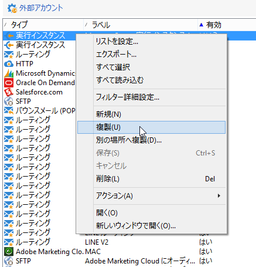

1. 必要に応じて、ラベルを変更します。

   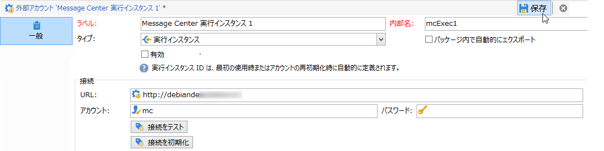

1. Select the **[!UICONTROL Enabled]** option to make the external account operational.

   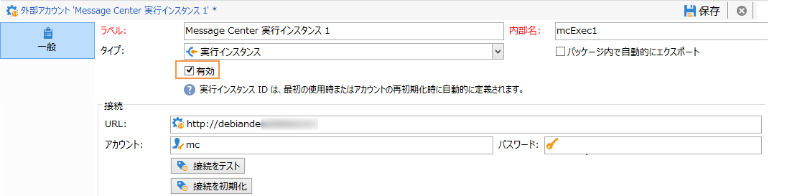

1. 実行インスタンスがインストールされているサーバーのアドレスを指定します。

   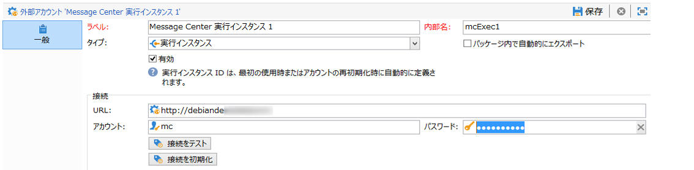

1. アカウントにはオペレーターフォルダーで定義されている Message Center エージェントを指定します。デフォルトで Adobe Campaign に指定されているアカウントは **[!UICONTROL mc]** です。

   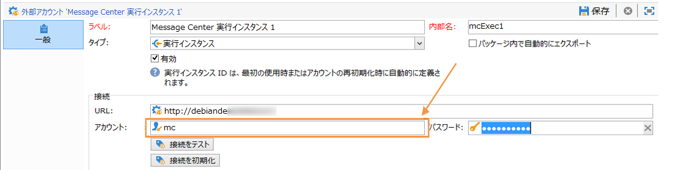

1. オペレーターフォルダーで定義されたアカウントのパスワードを入力します。

   >[!NOTE]
   >
   >インスタンスにログオンするたびにパスワードを入力しなくても済むように、実行インスタンス内でコントロールインスタンスの IP アドレスを指定することができます。For more on this, refer to [Execution instance](#execution-instance).

1. 実行インスタンスで使用する復元方法を指定します。

   復元するデータは、実行インスタンスによりコントロールインスタンスへと転送され、トランザクションメッセージとイベントアーカイブに追加されます。

   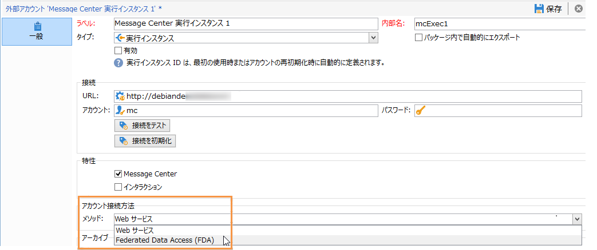

   データ収集は、HTTP/HTTPS アクセスを使用する Web サービス経由または Federated Data Access（FDA） モジュール経由のいずれかでおこなわれます。

   >[!NOTE]
   >
   >HTTP経由でFDAを使用する場合、Postgresデータベースを使用する実行インスタンスのみがサポートされることに注意してください。 MSSQLまたはOracleデータベースはサポートされていません。

   コントロールインスタンスから実行インスタンスのデータベースへ直接接続できる場合には、後者の接続方法を推奨します。直接接続できない場合は、Web サービス経由の接続を選択します。FDA アカウントには、コントロールインスタンス上に作成した個々の実行インスタンスのデータベースに接続する場合と同じアカウントを指定します。

   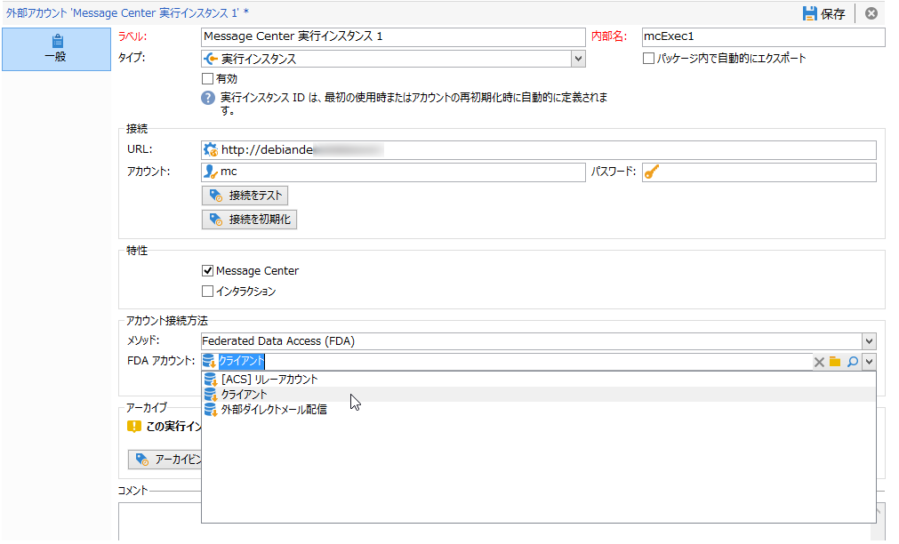

   Federated Data Access（FDA） について詳しくは、[外部データベースへのアクセス](../../platform/using/about-fda.md)を参照してください。

1. Click **[!UICONTROL Test the connection]** to make sure the control instance and the execution instance are linked up.

   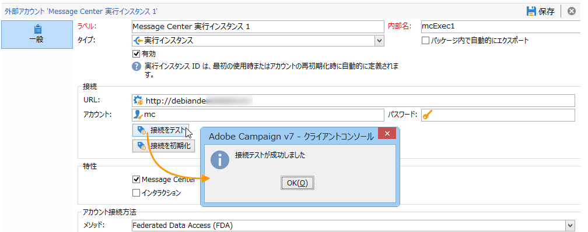

1. 各実行インスタンスには識別子を関連付ける必要があります。This identifier can be attributed on each execution instance either manually, by using the deployment wizard (refer to [Identifying execution instances](../../message-center/using/identifying-execution-instances.md)), or automatically, by clicking the **Initialize connection** button from the control instance.

   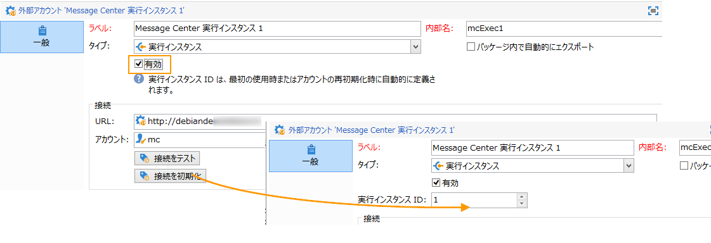

## 実行インスタンス {#execution-instance}

パスワードの入力なしでコントロールインスタンスから実行インスタンスに接続できるようにするには、**Message Center** の「アクセス権」セクションでコントロールインスタンスの IP アドレスを入力します。ただし、デフォルトでは空のパスワードを使用することは禁止されています。

空のパスワードを使用するには、実行インスタンスに移動し、イベントを配信する情報システムの IP アドレスに限定したセキュリティゾーンを定義します。This security zone must allow empty passwords and accept `<identifier> / <password>` type connections. 詳しくは、[この節](../../installation/using/configuring-campaign-server.md#defining-security-zones)を参照してください。

>[!NOTE]
>
>実行インスタンスを複数のコントロールインスタンスで使用する場合、フォルダーおよびオペレーターごとにデータを分けることができます。詳しくは、複数のコントロールインスタンスの使 [用を参照してください](#using-several-control-instances)。

1. 実行インスタンス( **[!UICONTROL Administration > Access management > Operators]** )内のoperatorフォルダーに移動します。
1. **Message Center** エージェントを選択します。

   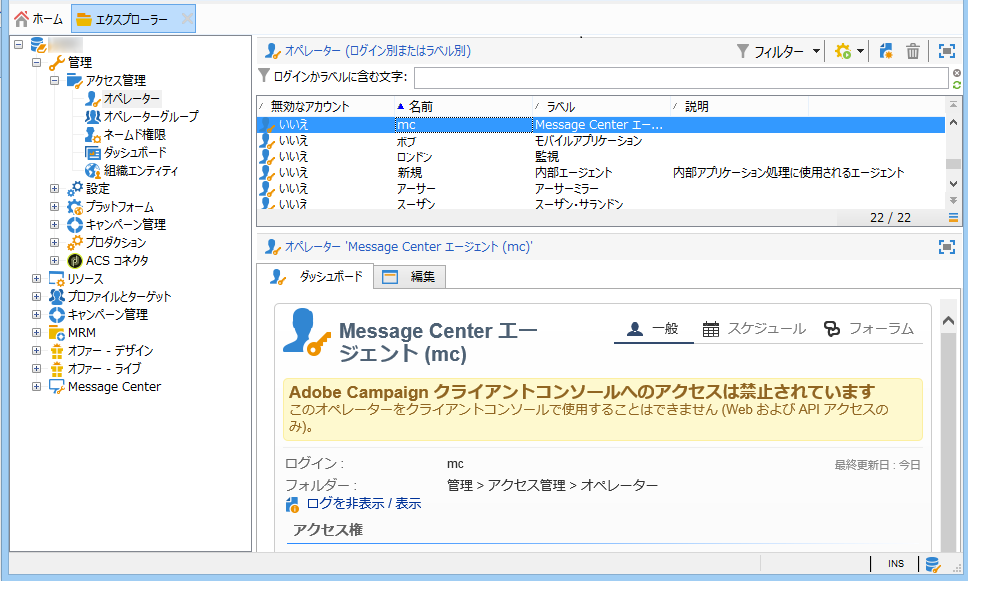

1. タブを選択 **[!UICONTROL Edit]** し、をクリッ **[!UICONTROL Access rights]** クして、リンクをクリックし **[!UICONTROL Edit the access parameters...]** ます。

   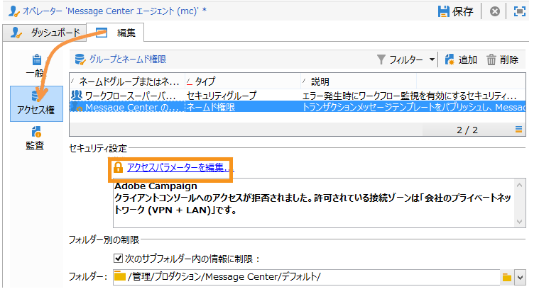

1. ウィンドウ **[!UICONTROL Access settings]** で、リンクをク **[!UICONTROL Add a trusted IP mask]** リックし、コントロールインスタンスのIPアドレスを追加します。

   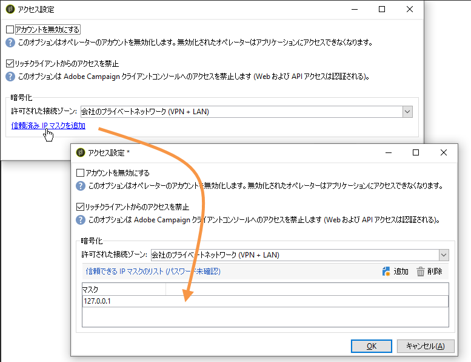

## 複数のコントロールインスタンスの使用 {#using-several-control-instances}

1 つの実行クラスターは複数のコントロールインスタンスで共有することができます。このタイプのアーキテクチャでは次の設定が必要です。

For example if your company manages two brands, each with its own control instance: **Control 1** and **Control 2**. 実行インスタンスも 2 つ使用します。それぞれのコントロールインスタンスには、異なる Message Center オペレーターを入力する必要があります。**コントロール 1** インスタンスには **mc1** オペレーター、**コントロール 2** インスタンスには **mc2** オペレーターを入力します。

すべての実行インスタンスのツリーにて、オペレーターにつきフォルダーを 1 つずつ作成し（**フォルダー 1** と&#x200B;**フォルダー 2**）、各オペレーターのフォルダーに対するお互いのデータアクセスを制限します。

### コントロールインスタンスの設定 {#configuring-control-instances}

1. **コントロール 1** コントロールインスタンス内では、各実行インスタンスにつき 1 つの外部アカウントを作成し、それぞれの外部アカウントに **mc1** オペレーターを入力します。The **mc1** operator will thereafter be created on all the execution instances (refer to [Configuring execution instances](#configuring-execution-instances)).

   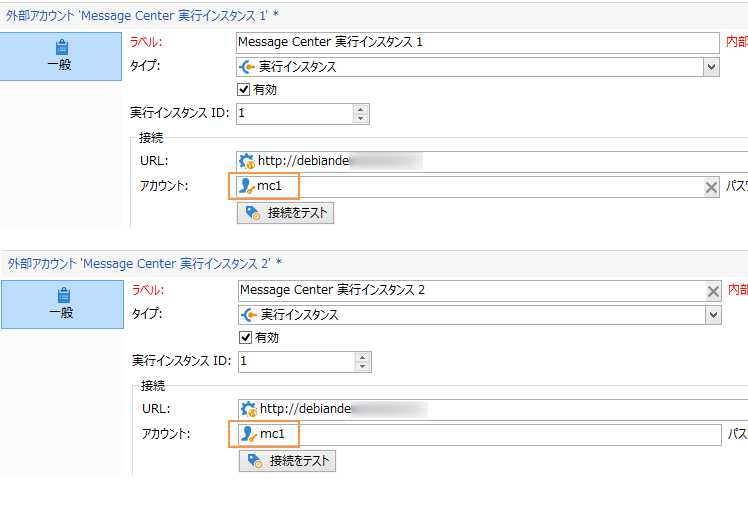

1. **コントロール 2** コントロールインスタンス内では、各実行インスタンスにつき 2 つの外部アカウントを作成し、それぞれの外部アカウントに **mc1** オペレーターを入力します。The **mc2** operator will thereafter be created on all the execution instances (refer to [Configuring execution instances](#configuring-execution-instances)).

   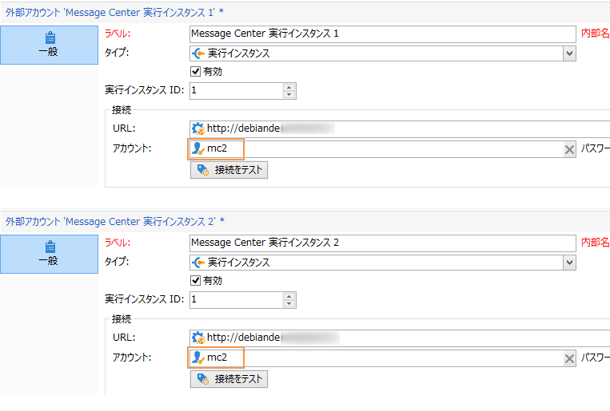

   >[!NOTE]
   >
   >For more on configuring a control instance, refer to [Control instance](#control-instance).

### 実行インスタンスの設定 {#configuring-execution-instances}

複数のコントロールインスタンスを使用するには、この設定をすべての実行インスタンスで実行する必要があります。

1. ノード内の演算子ごとに1つのフォルダーを作成 **[!UICONTROL Administration > Production > Message Center]** します。 **Folder 1** and **Folder 2**. フォルダーやビューの作成について詳しくは、[プラットフォーム](../../platform/using/access-management.md#folders-and-views)を参照してください。

   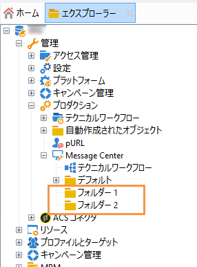

1. デフォルトで用意されている Message Center のオペレーター（**mc**）を複製して、**mc1** と **mc2** オペレーターを作成します。オペレーターの作成について詳しくは、[この節](../../platform/using/access-management.md#operators)を参照してください。

   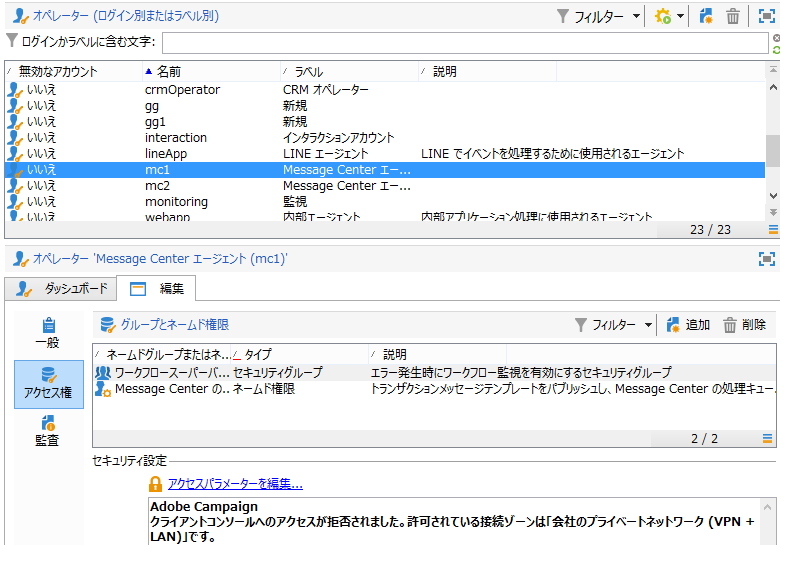

   >[!NOTE]
   >
   >**mc1および** mc2 **演算子は権限を持っ****[!UICONTROL Message Center execution]** ている必要があり、Adobe Campaignクライアントコンソールにアクセスできません。 オペレーターは、必ずセキュリティゾーンにリンクされていなければなりません。詳しくは、[この節](../../installation/using/configuring-campaign-server.md#defining-security-zones)を参照してください。

1. For each operator, check the **[!UICONTROL Restrict to information found in sub-folders of]** box, and select the relevant folder (**Folder 1** for the **mc1** operator and **Folder 2** for the **mc2** operator).

   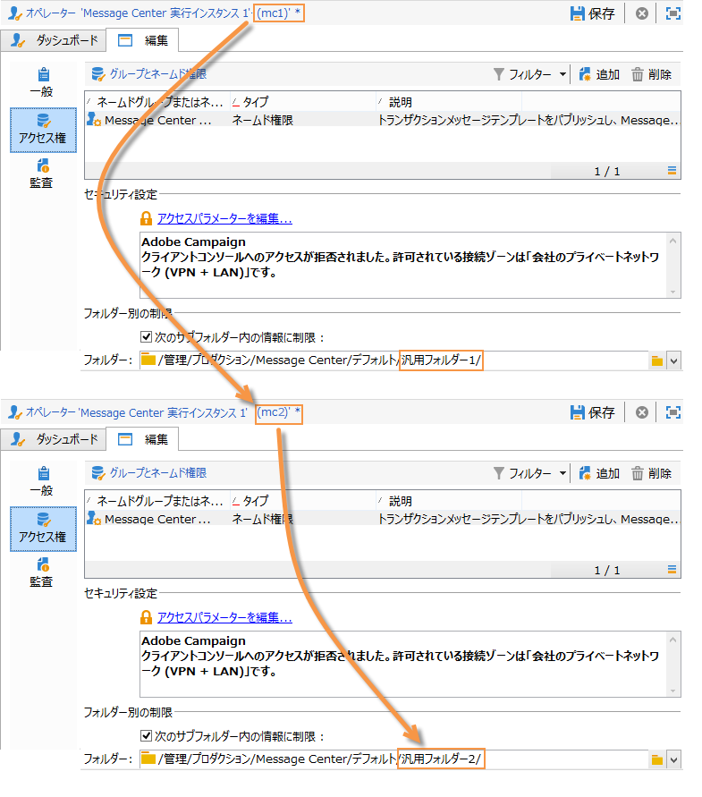

1. 各オペレーターには、各自のフォルダーへの読み取り／書き込みの権限を与えます。To do this, right-click the folder and select **[!UICONTROL Properties]** . Then select the **[!UICONTROL Security]** tab and add the relevant operator (**mc1** for **Folder 1** and **mc2** for **Folder 2**). ボックスがチェックされ **[!UICONTROL Read/Write data]** ていることを確認します。

   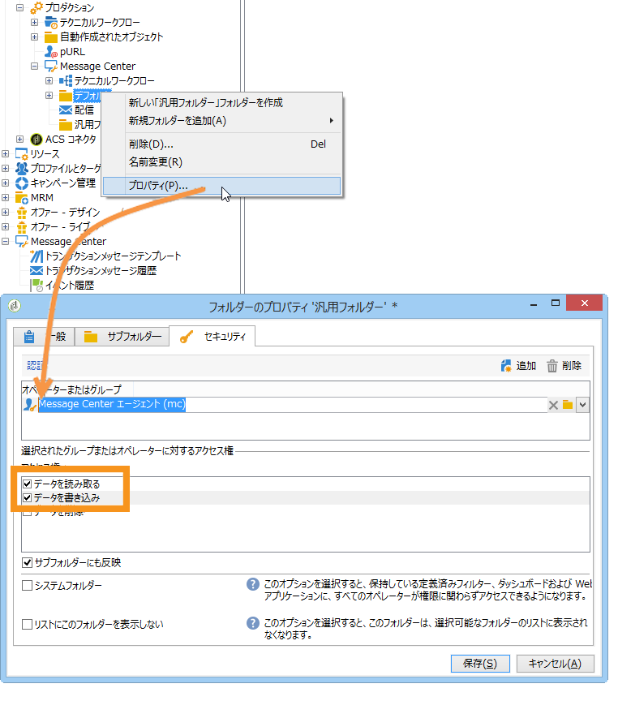

