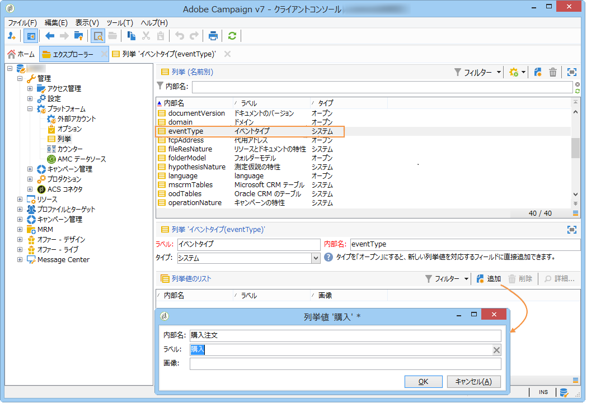

# イベントタイプの作成{#creating-event-types}

Adobe Campaign が処理するイベントのタイプは、コントロールインスタンスで作成する必要があります。This can be done via the **[!UICONTROL Administration > Platform > Enumerations]** folder of the tree. **[!UICONTROL eventType]** 列挙の値が、各イベントタイプに該当します。オーダー確認、パスワード変更またはオーダー配送変更などがイベントタイプとして考えられます。

項目別リストについて詳しくは、[列挙管理](../../platform/using/managing-enumerations.md)を参照してください。

項目別リストの値を作成した後、作成事項を反映させるためには、一旦インスタンスからログオフし、再度ログオンします。
