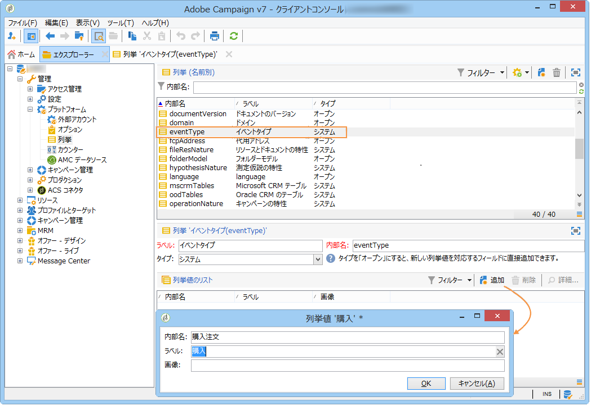

# イベントタイプの作成 {#creating-event-types}

各イベントをパーソナライズされたメッセージに変更するには、まず&#x200B;**イベントタイプ**&#x200B;を作成します。

[メッセージテンプレートを作成](../../message-center/using/creating-the-message-template.md)する際、送信するメッセージに一致するイベントのタイプを選択します。

>[!IMPORTANT]
>
>イベントタイプをメッセージテンプレートで使用するには、事前に作成しておく必要があります。

Adobe Campaign で処理されるイベントタイプを作成するには、次の手順に従います。

1. **コントロールインスタンス**&#x200B;にログオンします。

1. ツリーの&#x200B;**[!UICONTROL 管理／プラットフォーム／列挙]**&#x200B;フォルダーに移動します。

1. リストから&#x200B;**[!UICONTROL イベントタイプ]**&#x200B;を選択します。

1. 「**[!UICONTROL 追加]**」をクリックして、列挙の値を作成します。 注文の確認、パスワードの変更、注文の配送変更などがイベントタイプとして考えられます。

   

   >[!IMPORTANT]
   >
   >各イベントタイプは、**[!UICONTROL イベントタイプ]**&#x200B;の列挙の値と一致する必要があります。

1. 項目別リストの値を作成した後、作成事項を反映させるためには、一旦インスタンスからログオフし再度ログオンします。

>[!NOTE]
>
>**定義済みリストの操作**&#x200B;方法について詳しくは、[Adobe Campaign v8 （コンソール）ドキュメント](https://experienceleague.adobe.com/ja/docs/campaign/campaign-v8/config/settings/enumerations){target=_blank}を参照してください。

