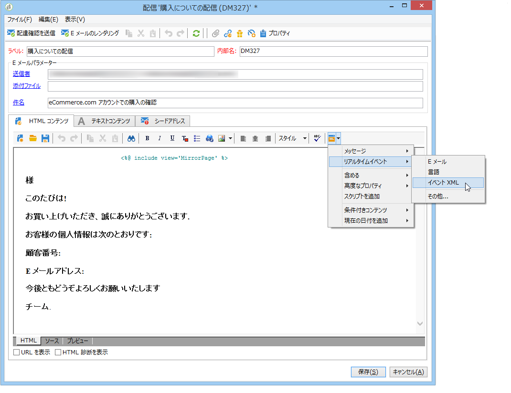
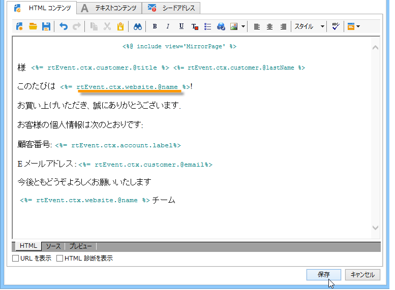

# メッセージコンテンツの作成{#creating-message-content}

トランザクションメッセージコンテンツの定義は、Adobe Campaign の通常の配信と同様です。例えば、E メール配信では、HTML またはテキストフォーマットでコンテンツを作成したり、添付ファイルを追加したり、配信オブジェクトをパーソナライズすることができます。詳しくは、[E メールの配信](../../delivery/using/about-email-channel.md)の章を参照してください。

>[!CAUTION]
>
>メッセージに含まれる画像は、公的にアクセス可能でなければなりません。Adobe Campaign には、トランザクションメッセージ用の画像アップロードのメカニズムがありません。\
>Unlike in JSSP or webApp, `<%=` doesn’t have any default escaping.
>
>こうした場合は、イベントから取得されるそれぞれのデータを適切にエスケープする必要があります。このエスケープ方法は、このフィールドの使用方法によって異なります。例えば、URL 内では、encodeURIComponent を使用します。HTML に表示する場合は、escapeXMLString を使用できます。

メッセージのコンテンツを定義したら、メッセージ本文にイベントの情報を取り入れ、パーソナライズすることができます。イベントの情報は、パーソナライゼーションタグを使用してテキスト本文に挿入します。

* すべてのパーソナライゼーションフィールドはペイロードから取得されます。
* トランザクションメッセージ内の1つまたは複数のパーソナライゼーションブロックを参照できます。 ブロックコンテンツは、パブリケーション中に実行インスタンスに追加されます。

パーソナライゼーションタグを E メールメッセージの本文に挿入するには、次の手順に従います。

1. メッセージのテンプレートで、E メールのフォーマットに合うタブをクリックします（HTML またはテキスト）。
1. メッセージの本文を入力します。
1. テキストの本文に、メニューを使用してタグを挿入し **[!UICONTROL Real time events>Event XML]** ます。

   

1. Fill in the tag using the following syntax: **element name**.@**attribute name** （以下に示す）。

   

