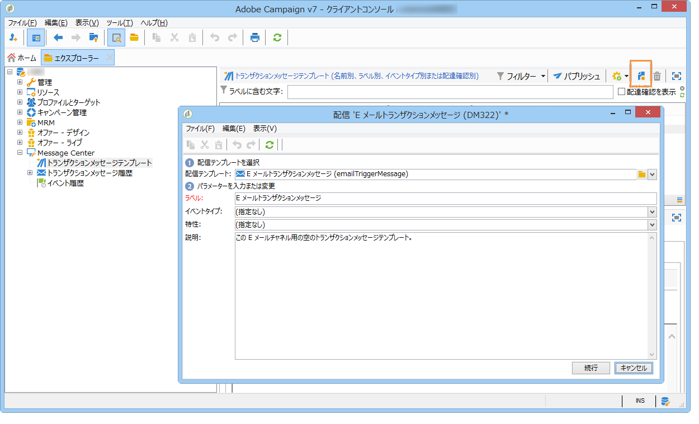
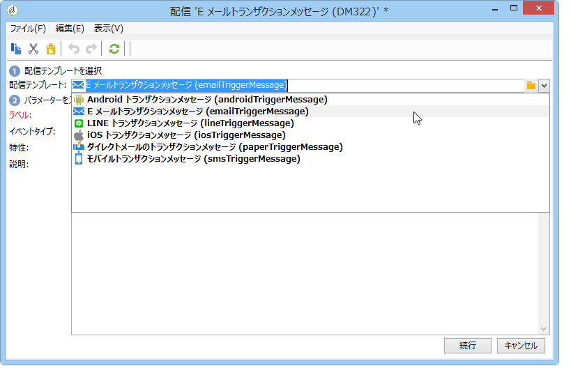
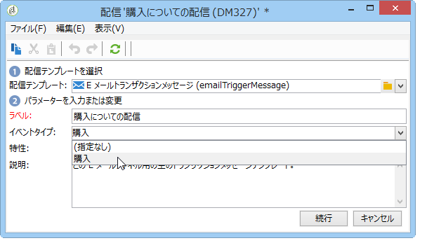
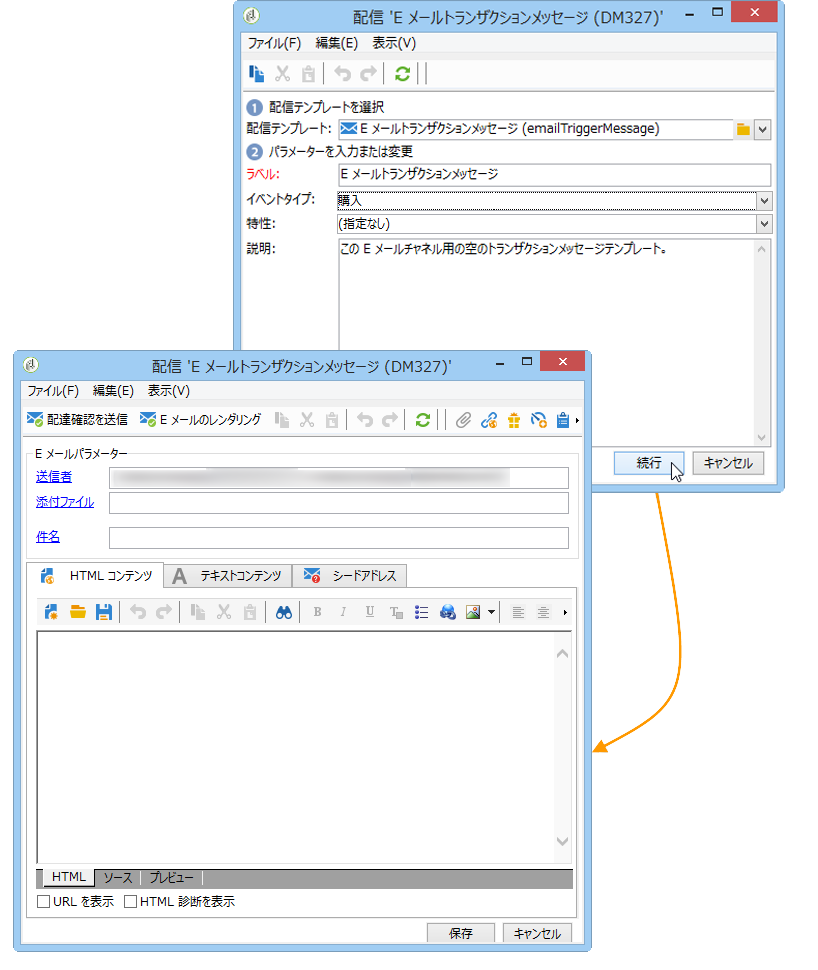

# メッセージテンプレートの作成{#creating-the-message-template}

1. Adobe Campaignツリー **[!UICONTROL Message Center >Transactional message templates]** 内のフォルダーに移動します。
1. In the list of transactional message templates, right-click and select **[!UICONTROL New]** in the drop-down menu or click the **[!UICONTROL New]** button above the list of transactional message templates.

   

1. 配信ウィンドウで、使用したいチャネルに適した配信テンプレートを選択します。

   

1. 必要に応じて、ラベルを変更します。
1. 送信したいメッセージに合うイベントのタイプを選択します。

   

   イベントタイプはコンソールで事前に作成しておく必要があります。For more on this, refer to [Creating event types](../../message-center/using/creating-event-types.md).

   >[!NOTE]
   >
   >イベントタイプを複数のテンプレートにリンクすることはできません。

1. Enter a nature and a description, then click **[!UICONTROL Continue]** to create the message body (refer to [Creating message content](../../message-center/using/creating-message-content.md)).

   

