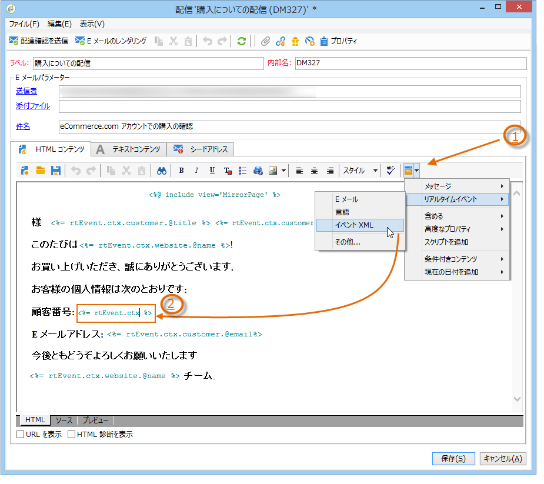

# トランザクションメッセージテンプレートのデザイン {#creating-the-message-template}

各イベントをパーソナライズされたメッセージに変えるには、各イベントタイプに一致するメッセージテンプレートを作成する必要があります。

>[!IMPORTANT]
>
>イベントタイプは事前に作成しておく必要があります。詳しくは、[イベントタイプの作成](../../message-center/using/creating-event-types.md)を参照してください。

テンプレートには、トランザクションメッセージをパーソナライズするために必要な情報が含まれています。テンプレートを使用すると、メッセージのプレビューを検証したり、最終的なターゲットへ配信する前にシードアドレスを使用した配達確認を送信することもできます。詳しくは、[トランザクションメッセージテンプレートのテスト](../../message-center/using/testing-message-templates.md)を参照してください。

## メッセージテンプレートの作成 {#creating-message-template}

1. Adobe Campaign のツリーにて、**[!UICONTROL Message Center／トランザクションメッセージテンプレート]**&#x200B;フォルダーに移動します。

1. トランザクションメッセージテンプレートのリスト内を右クリックし、ドロップダウンメニューで「**[!UICONTROL 新規]**」を選択するか、トランザクションメッセージテンプレートのリストの上部にある「**[!UICONTROL 新規]**」ボタンをクリックします。

   

1. 配信ウィンドウで、使用したいチャネルに適した配信テンプレートを選択します。

   

1. 必要に応じて、ラベルを変更します。

1. 送信したいメッセージに合うイベントのタイプを選択します。

   

   イベントタイプはコンソールで事前に作成しておく必要があります。詳しくは、[イベントタイプの作成](../../message-center/using/creating-event-types.md)を参照してください。

   >[!IMPORTANT]
   >
   >イベントタイプを複数のテンプレートにリンクすることはできません。

1. 特性と説明を入力したら、「**[!UICONTROL 続行]**」をクリックしてメッセージ本文を作成します。[メッセージコンテンツの作成](#creating-message-content)を参照してください。

   

## メッセージコンテンツの作成 {#creating-message-content}

トランザクションメッセージコンテンツの定義は、Adobe Campaign の通常の配信と同様です。例えば、E メール配信では、HTML またはテキストフォーマットでコンテンツを作成したり、添付ファイルを追加したり、配信オブジェクトをパーソナライズすることができます。詳しくは、[メール配信](../../delivery/using/about-email-channel.md)の章を参照してください。

>[!IMPORTANT]
>
>メッセージに含まれる画像は、公的にアクセス可能でなければなりません。Adobe Campaign には、トランザクションメッセージ用の画像アップロードのメカニズムがありません。\
>JSSP や Web アプリとは異なり、`<%=` にはデフォルトのエスケープ機能がありません。
>
>こうした場合は、イベントから取得されるそれぞれのデータを適切にエスケープする必要があります。このエスケープ方法は、このフィールドの使用方法によって異なります。例えば、URL 内では、encodeURIComponent を使用します。HTML に表示する場合は、escapeXMLString を使用できます。

メッセージのコンテンツを定義したら、メッセージ本文にイベントの情報を取り入れ、パーソナライズすることができます。イベントの情報は、パーソナライゼーションタグを使用してテキスト本文に挿入します。

* すべてのパーソナライゼーションフィールドはペイロードから取得されます。
* トランザクションメッセージ内では、1 つまたは複数のパーソナライゼーションブロックを参照できます。ブロックコンテンツは、実行インスタンスへのパブリッシュ中に配信コンテンツに追加されます。

パーソナライゼーションタグを E メールメッセージの本文に挿入するには、次の手順に従います。

1. メッセージのテンプレートで、E メールのフォーマットに合うタブをクリックします（HTML またはテキスト）。

1. メッセージの本文を入力します。

1. **[!UICONTROL リアルタイムイベント／イベント XML]** メニューを使用して、テキスト本文にタグを挿入します。

   

1. 下記に示すように、タグの入力には次の構文を利用します。**要素名**.@**属性名**

   

1. コンテンツを保存します。

これで、メッセージを[テスト](../../message-center/using/testing-message-templates.md)する準備が整いました。
