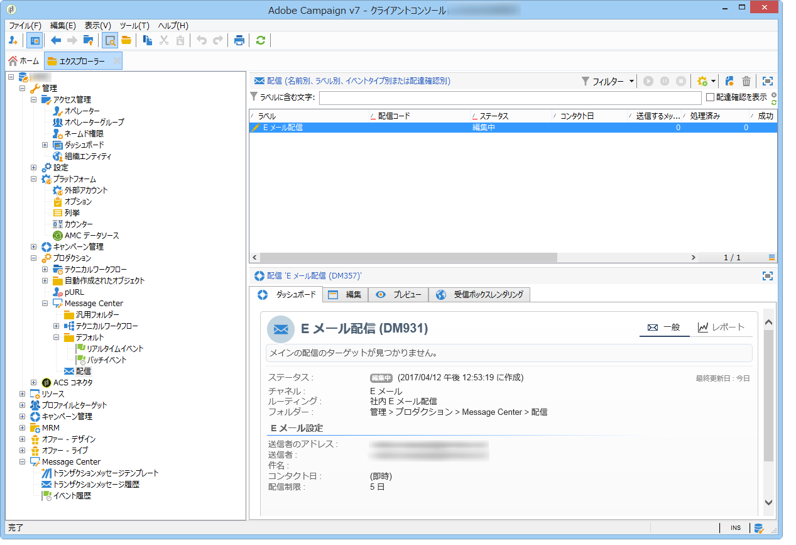
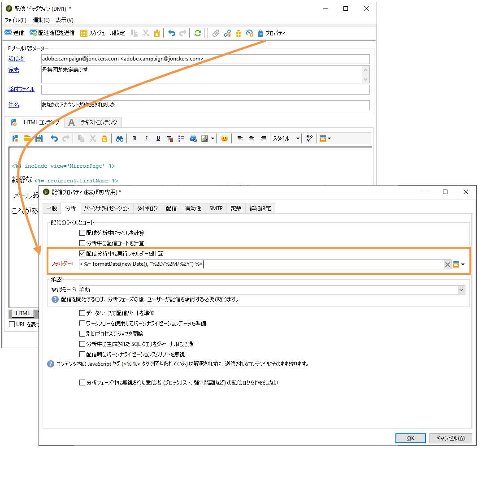

# 配信の実行{#delivery-execution}

>[!NOTE]
>
>MTA は、トランザクションメッセージの処理を他のどの配信よりも優先します。

実行インスタンスで、エンリッチメントステージが完了し、配信テンプレートがイベントにリンクされると、配信が送信されます。 すべての配信がフォルダーにグループ化さ **[!UICONTROL Administration > Production > Message Center > Default > Deliveries]** れます。

デフォルトでは、配信は配信月ごとにサブフォルダーに並べ替えられます。

この並べ替えは、以下に示されるように、メッセージテンプレートのプロパティで変更することができます。

>[!NOTE]
>
>ホスト型またはハイブリッド型のインストールの場合、拡張MTAにアップグレードした場合、配信品質、スループットおよびバウンス処理を向上させるために、すべてのトランザクションメッセージがAdobe Campaign拡張MTAと共に送信される場合があります。 すべての影響は、標準のマーケティングメッセージと同じで、 [Adobe Campaign Enhanced MTAドキュメントで詳しく説明しています](https://helpx.adobe.com/campaign/kb/campaign-enhanced-mta.html) 。