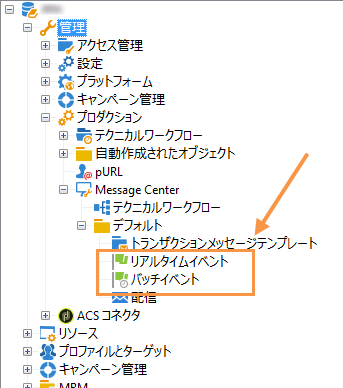

# イベントの収集{#event-collection}

情報システムによって生成されたイベントは、次の 2 つのモードを使用して収集できます。

* SOAP メソッドの呼び出しでは Adobe Campaign 内でイベントをプッシュすることができます。PushEvent メソッドはイベントを 1 つずつ送信し、PushEvents メソッドは複数のイベントを一度に送信します。イベントの説 [明を参照](../../message-center/using/event-description.md)。
* ワークフローを作成すると、ファイルのインポートまたは SQL ゲートウェイ経由（「**Federated Data Access**」オプションを使用）でイベントを復元することができます。

回収されたイベントは、テクニカルワークフローによって実行インスタンスのリアルタイムキューとバッチキューに分別され、メッセージテンプレートにリンクされるのを待つことになります。

