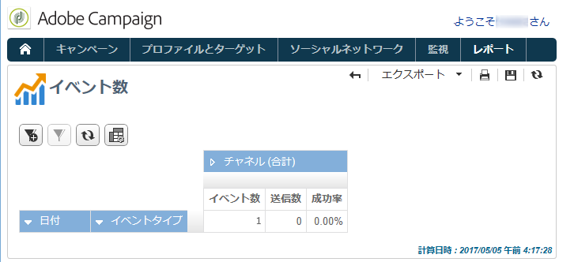

# Message Center のイベント履歴{#history-of-message-center-events}

The **[!UICONTROL History of Message Center events]** report provides you with an overview of the Message Center activity, i.e. the number of events processed and delivered as transactional messages.

レポートを開いた際にデフォルトで表示される情報は、送信に成功したトランザクションメッセージの割合を示します。その他のレベルを閲覧するには、各ノードを開き、適切なレベルにカーソルを合わせて選択します。

各イベントタイプのデータを一定期間ごとに表示することができます。The **[!UICONTROL Events]** column corresponds to the number of events received per control instance. The number of events transformed into personalized transactional messages is detailed in the **[!UICONTROL Sent]** column.

このレポ **[!UICONTROL History of Message Center events]** ートはピボットテーブルタイプのレポートです。 詳しくは、[母集団の分析](../../reporting/using/about-descriptive-analysis.md)の節を参照してください。
