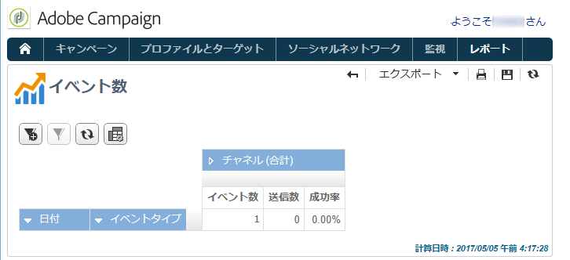

# Message Center のイベント履歴{#history-of-message-center-events}

**[!UICONTROL Message Center のイベント履歴]**&#x200B;レポートは、処理したイベント数やトランザクションメッセージとして配信したイベント数など、Message Center のアクティビティの概要を示します。

レポートを開いた際にデフォルトで表示される情報は、送信に成功したトランザクションメッセージの割合を示します。 その他のレベルを閲覧するには、各ノードを開き、適切なレベルにカーソルを合わせて選択します。

各イベントタイプのデータを一定期間ごとに表示することができます。 「**[!UICONTROL イベント数]**」の列は、それぞれのコントロールインスタンスが受信したイベントの数を示します。 パーソナライズされたトランザクションメッセージに変換済みのイベントの数は、「**[!UICONTROL 送信数]**」の列に表示されます。

**[!UICONTROL Message Center のイベント履歴]**&#x200B;レポートはピボットテーブルタイプのレポートです。 詳しくは、[母集団の分析](../../reporting/using/about-descriptive-analysis.md)の節を参照してください。
