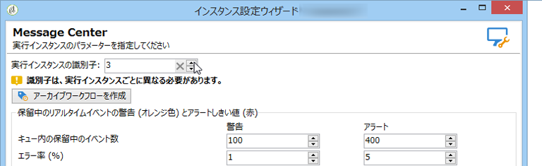

# 実行インスタンスの識別{#identifying-execution-instances}

コントロールインスタンスから各実行インスタンスの履歴を閲覧した際にそれぞれを区別できるよう、各実行インスタンスには一意の識別子を割り当てなければなりません。コントロールインスタンスと実行インスタンスが同じマシンにインストールされている場合でもこの手順は必須です。This identifier can be manually attributed on each execution instance, via the deployment wizard, or automatically by clicking the **Initialize connection** button from the control instance (see [Control instance](../../message-center/using/creating-a-shared-connection.md#control-instance)).

手動で識別子を割り当てるには、各実行インスタンスにてデプロイウィザードを開き、**[!UICONTROL Message Center]** ウィンドウに移動し、インスタンスに任意の識別子を指定します。

