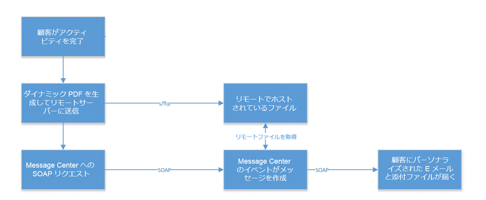
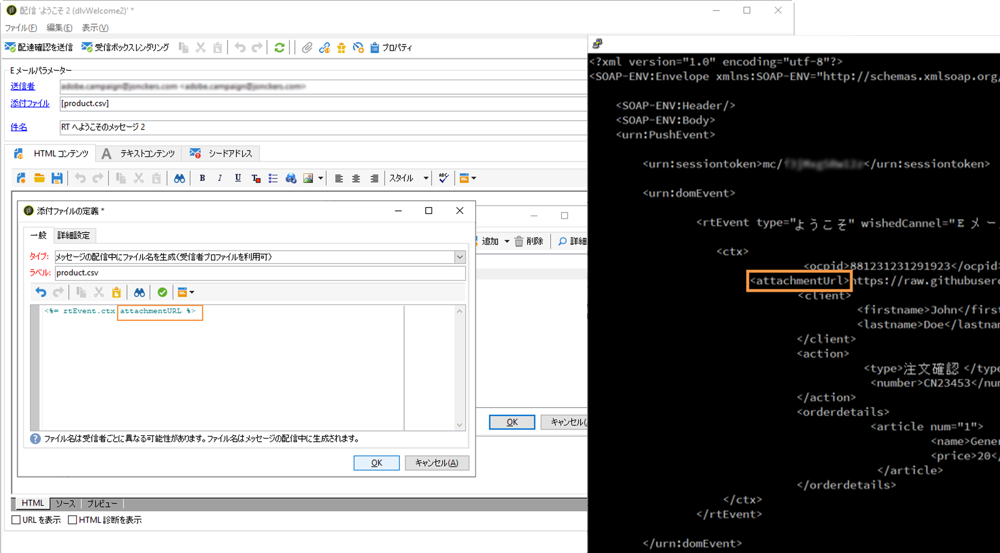

# 実装{#implementation}

次のダイアグラムに、このシナリオに含まれる様々なステップを示します。



最初に、添付ファイルのデザインから開始します。この[記事](../../delivery/using/attaching-files.md#attach-a-personalized-file)を参照してください。こうすることで、実行インスタンスでホストされていなくても、ファイルを E メールに添付できます。

SOAP メッセージトリガーを介して E メールを送信できます。For more information on SOAP requests, see [Event description](../../message-center/using/event-description.md). SOAP 呼び出しには、URL パラメーター（attachmentURL）があります。

When designing your email, click on **[!UICONTROL Attachment]** . In the **[!UICONTROL Attachment definition]** screen, enter the SOAP attachment parameter:

```
<%= rtEvent.ctx.attachementUrl %>
```

メッセージの処理またはデプロイ中、システムによってリモートの場所（サードパーティサーバー）からファイルが取得され、個々のメッセージに添付されます。

このパラメーターには変数を使用できるので、目的のファイルの完全な形のリモート URL 変数を指定し、SOAP 呼び出しを介して送信できます。



