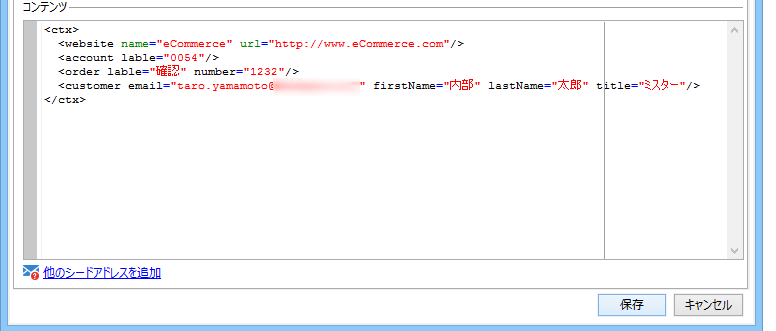

# トランザクションメッセージ内のシードアドレスの管理{#managing-seed-addresses-in-transactional-messages}

シードアドレスを使用すると、E メールまたは SMS 配信の前に、メッセージのプレビューを表示したり、配達確認を送信したり、メッセージのパーソナライゼーションを検証したりすることができます。シードアドレスは配信に関連付けられ、その他の配信に利用することはできません。

## シードアドレスの作成 {#creating-a-seed-address}

1. トランザクションメッセージテンプレートで、「**[!UICONTROL シードアドレス]**」タブをクリックします。

   

1. 後で容易に選択できるよう、ラベルを割り当てます。

   

1. シードアドレス（通信チャネルにより E メールまたは携帯電話）を入力します。

   

1. 外部識別子を入力します。このオプションのフィールドには、web サイト上のすべてのアプリケーションに共通し、プロファイルを識別するのに利用できるビジネスキー（一意の識別子、名前 + E メールなど）を入力することができます。Adobe Campaign マーケティングデータベースにもこのフィールドが存在する場合、データベース内のプロファイルとイベントとを照合することができます。

   

1. テストデータを挿入します（[パーソナライゼーションデータ](../../message-center/using/personalization-data.md)を参照）。

   

   <!--## Creating several seed addresses {#creating-several-seed-addresses}-->
1. 「**[!UICONTROL 他のシードアドレスを追加]**」リンクをクリックし、「**[!UICONTROL 追加]**」ボタンをクリックします。

   

   <!--1. Follow the configuration steps for a seed address detailed in the [Creating a seed address](#creating-a-seed-address) section.-->
1. この手順を繰り返して、必要な数のアドレスを作成します。

   

アドレスを作成したら、プレビューとパーソナライゼーションを表示することができます。[トランザクションメッセージのプレビュー](../../message-center/using/transactional-message-preview.md)を参照してください。
