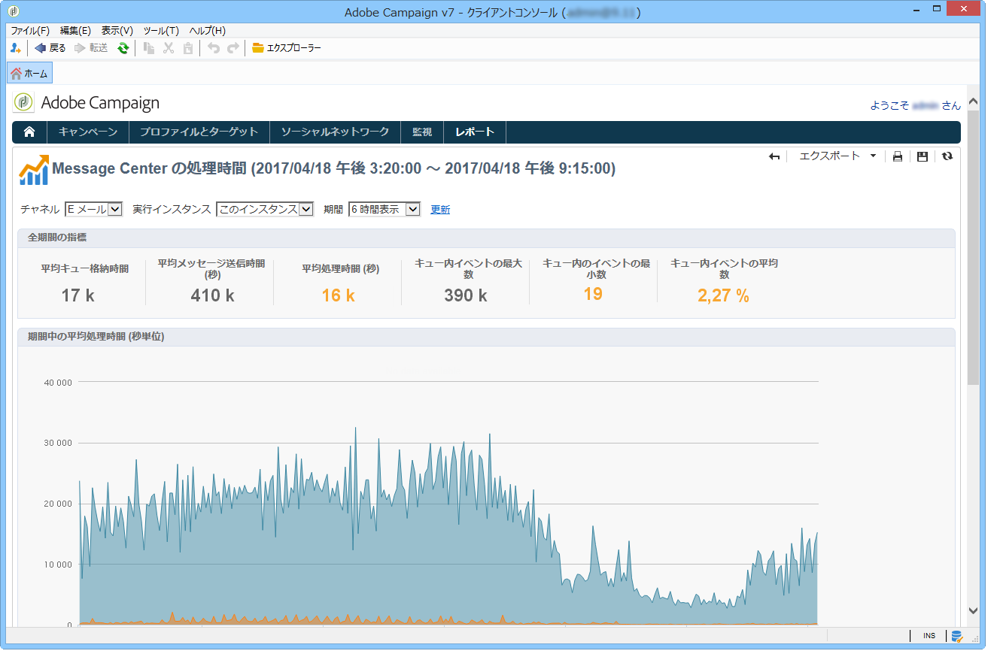

# Message Center の処理時間 {#message-center-processing-time}

このレポートでは、リアルタイムキューに関する主な指標が表示されます。

技術管理者向けのこのレポートには、コントロールインスタンスの「**[!UICONTROL 監視]**」タブからもアクセスできます。

**[!UICONTROL Message Center サービスレベル]**&#x200B;のレポートと同じように、総合的な統計か、特定の実行インスタンスに関する統計のいずれかを選択して表示することができます。チャネル別や、特定の期間でデータをフィルタリングすることもできます。

「**[!UICONTROL 全期間の指標]**」セクションに表示される指標は、選択した期間を対象に計算されます。

* **[!UICONTROL 平均キュー格納時間]**：Message Center が処理に成功したイベントに費やした時間。処理時間のみが考慮されます。
* **[!UICONTROL 平均メッセージ送信時間（秒）]**：Message Center が処理に成功したイベントに費やした時間。MTA 配信時間のみが考慮されます。
* **[!UICONTROL 平均処理時間（秒）]**：Message Center が処理に成功したイベントに費やした時間。この計算では処理時間および MTA 送信時間が考慮されます。
* **[!UICONTROL キュー内イベントの最大数]**：任意の時点で Message Center 内に存在したイベント数の最大値。
* **[!UICONTROL キュー内イベントの最小数]**：任意の時点で Message Center 内に存在したイベント数の最小値。
* **[!UICONTROL キュー内イベントの平均数]**：任意の時点で Message Center 内に存在したイベント数の平均値。

>[!NOTE]
>
>警告（オレンジ）およびアラート（赤）指標のしきい値は、Adobe Campaign デプロイウィザードで設定することができます。[しきい値の監視](../../message-center/using/additional-configurations.md#monitoring-thresholds)を参照してください。
