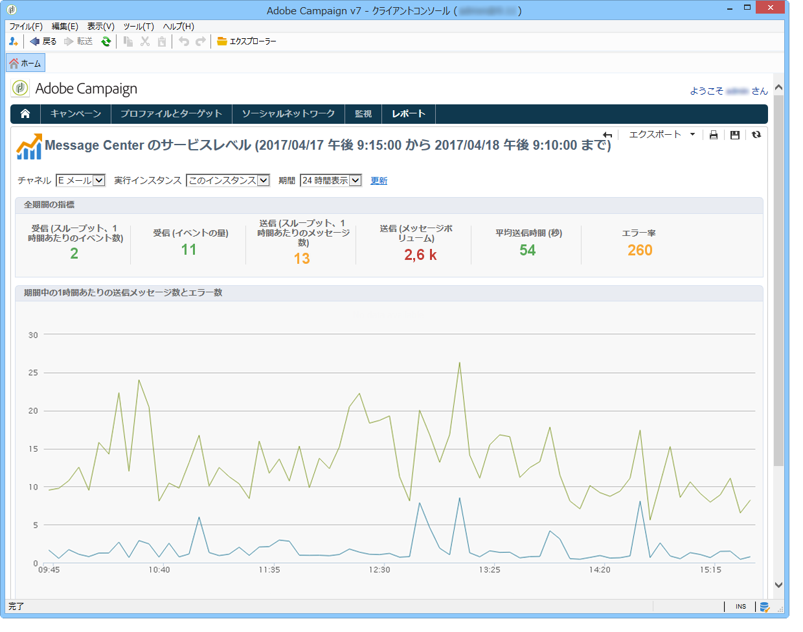

# Message Center サービスレベル{#message-center-service-level}

このレポートでは、トランザクションメッセージに関する配信の統計およびエラーの分類が表示されます。エラータイプをクリックするとエラーの詳細を表示することができます。This report, aimed at technical administrators, can also be accessed via the **[!UICONTROL Monitoring]** universe in the control instance.

このレポートでは、総合的な統計または特定の実行インスタンスに関する統計のいずれかを選択して表示することができます。また、チャネルおよび一定期間の検索条件を追加することもできます。セクションに表示されるインジケ **[!UICONTROL Indicators over the period]** ーターは、選択した期間に対して計算されます。

* **[!UICONTROL Incoming (throughput event/h)]** :message centerキューに入力された平均時間別イベント数。
* **[!UICONTROL Incoming (event vol)]** :message Centerキューに入力されたイベントの数。
* **[!UICONTROL Outgoing (throughput msg/h)]** :成功した発信Message Centerイベント（配信によって送信された）の平均時間別数。
* **[!UICONTROL Outgoing (msg vol)]** :成功した送信メッセージセンターイベント（配信によって送信）の数。
* **[!UICONTROL Average sending time (seconds)]** :正常に処理されたイベントに対するMessage Centerでの平均滞在時間。 この計算では処理時間および MTA 送信時間が考慮されます。
* **[!UICONTROL Error rate]** :メッセージセンターキューに入ったイベントの数と比較した、エラーのあるイベントの数。 考慮されるエラーは、ルーティングエラー、期限切れのイベント（期限を超えてキューに残っていたイベント）、配信エラー、配信で無視（強制隔離など）です。

>[!NOTE]
>
>警告（オレンジ）およびアラート（赤）指標のしきい値は、デプロイウィザードで設定することができます。「監視しきい値 [」を参照](../../message-center/using/monitoring-thresholds.md)。

