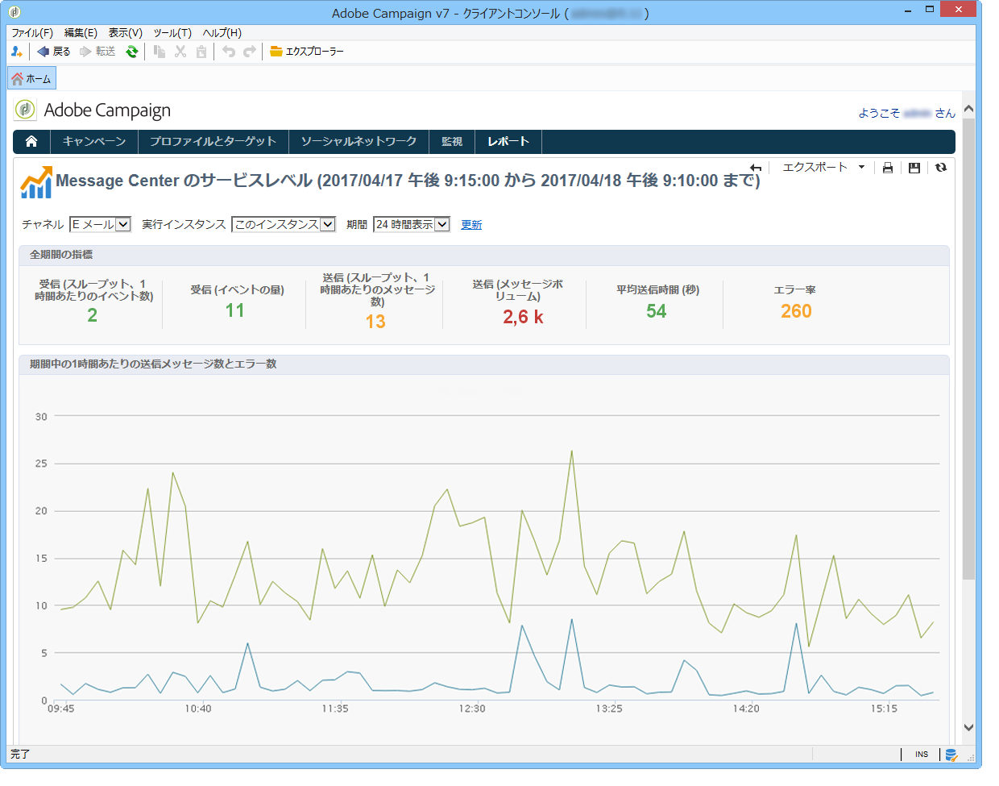

# Message Center のサービスレベル {#message-center-service-level}

このレポートでは、トランザクションメッセージに関する配信の統計およびエラーの分類が表示されます。 エラーのタイプをクリックするとエラーの詳細を表示できます。

技術管理者向けのこのレポートには、コントロールインスタンスの「**[!UICONTROL 監視]**」タブからもアクセスできます。

このレポートでは、全体的な統計を表示するか、特定の実行インスタンスに関連する統計を表示するかを選択できます。 チャネル別や、特定の期間でデータをフィルタリングすることもできます。

「**[!UICONTROL 全期間の指標]**」セクションに表示される指標は、選択した期間を対象に計算されます。

* **[!UICONTROL 受信 (スループット、1 時間あたりのイベント数)]**：Message Center のキューに入ったイベントの 1 時間あたりの平均数。
* **[!UICONTROL 受信 (イベントの量)]**：Message Center のキューに入ったイベントの数。
* **[!UICONTROL 送信 (スループット、1 時間あたりのメッセージ数)]**：送信に成功した Message Center のイベントの 1 時間あたりの平均数（配信による送信）。
* **[!UICONTROL 送信（メッセージの量）]**：送信に成功した Message Center のイベントの数（配信による送信）。
* **[!UICONTROL 平均送信時間（秒）]**：Message Center が処理に成功したイベントに費やした平均時間。 この計算では処理時間および MTA 送信時間が考慮されます。
* **[!UICONTROL エラー率]**：Message Center のキューに入ったイベント数に対する、エラーとなったイベント数、 考慮されるエラーは、ルーティングエラー、期限切れのイベント（期限を超えてキューに残っていたイベント）、配信エラー、配信で無視（強制隔離など）です。

>[!NOTE]
>
>警告（オレンジ）およびアラート（赤）指標のしきい値は、デプロイウィザードで設定することができます。 [しきい値の監視](../../message-center/using/additional-configurations.md#monitoring-thresholds)を参照してください。
