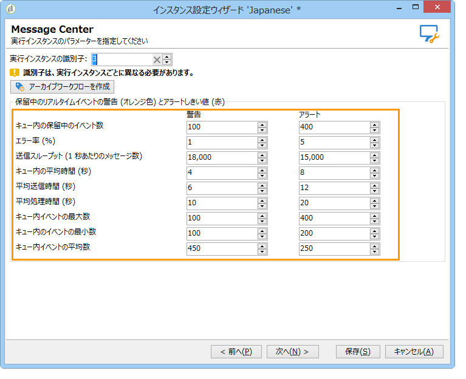

# しきい値の監視{#monitoring-thresholds}

**Message Centerのサービスレベルおよび** Message Centerの処理時間レポートに表示されるインジケータの警告しきい値（オレンジ色）とアラートしきい値（赤色）を設定できます **(トランザクションメッセージレポート** についてを参照 )。 これには、実行インスタンスのデプロイウィザードを開き、**[!UICONTROL Message Center]** のページに移動し、矢印を使用してしきい値を変更します。

>[!NOTE]
>
>キュー内の保留中のイベント数が、Adobe Campaign のプロセス監視ページの「[システム指標](../../production/using/monitoring-processes.md#system-indicators)」セクションに表示されます。デプロイウィザードについて詳しくは、[この節](../../installation/using/deploying-an-instance.md#deployment-wizard)を参照してください。

