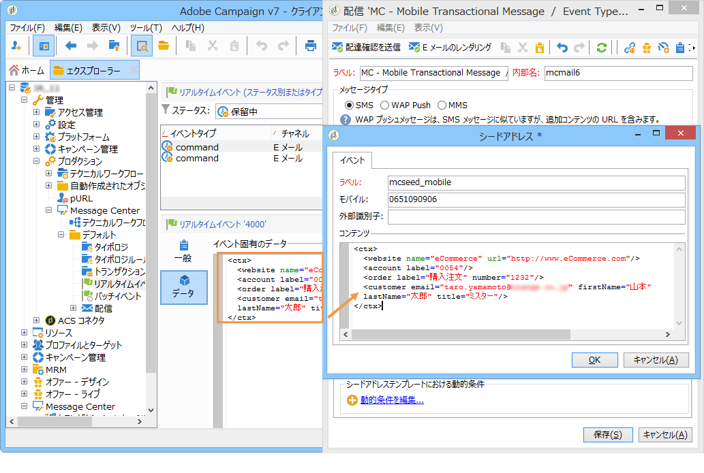
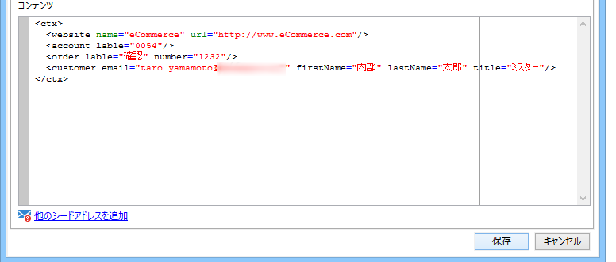

# データのパーソナライゼーション{#personalization-data}

メッセージテンプレート内のデータを使い、トランザクションメッセージのパーソナライゼーションをテストできます。この機能は、プレビューを生成したり、配達確認を送信するために使用されます。**配信品質**&#x200B;モジュールをインストールすると、このデータを使用して様々なインターネットアクセスプロバイダー用メッセージのレンダリングを表示できます（**受信トレイのレンダリング**：詳しくは、[この節](../../delivery/using/about-deliverability.md)を参照）。

このデータの目的は、最終配信の前にメッセージを検証することです。このメッセージは、Message Center が処理する実際のデータとは一致しません。ただし以下に示すように、XML 構造は、実行インスタンスに保存されているイベントの構造と同一でなければなりません。

This information enables you to personalize message content using personalization tags (for more on this, refer to [Creating message content](../../message-center/using/creating-message-content.md)).

1. In the message template, click the **[!UICONTROL Seed addresses]** tab.
1. イベントコンテンツに、XML フォーマットでテスト情報を入力します。

   

