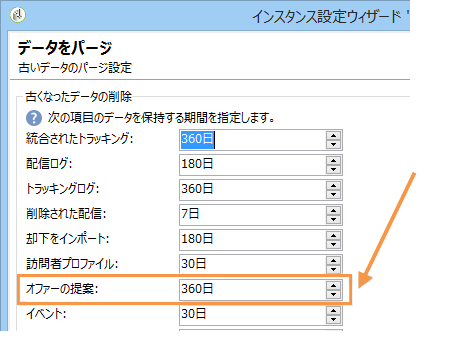
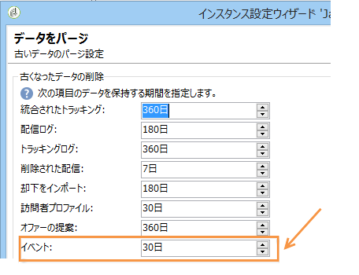

# イベントのパージ{#purging-events}

デプロイウィザードを使用し、データをデータベース上に保存する期間の設定をおこなうことができます。

イベントのパージは、**[!UICONTROL データベースクリーンアップ]**&#x200B;ワークフローによって自動的に実行されます。このワークフローは、実行インスタンスが受信し保存したイベントおよびコントロールインスタンスがアーカイブしたイベントをパージします。

矢印を使用し、必要に応じてパージの設定を変更します。

コントロールインスタンスのイベントパージ設定：

実行インスタンスのイベントパージ設定：

データベースクリーンアップワークフローについて詳しくは、[この節](../../production/using/database-cleanup-workflow.md)を参照してください。
