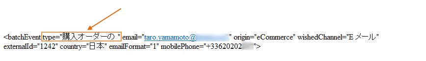
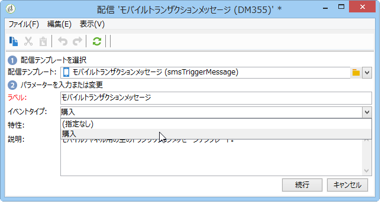

# テンプレートへのルーティング{#routing-towards-a-template}

メッセージテンプレートが実行インスタンスにパブリッシュされると、リアルタイムイベントまたはバッチイベントにリンクされる 2 つのテンプレートが自動的に生成されます。ルーティングの手順では、イベントを適切なメッセージテンプレートにリンクします。リンクは、イベント自身のプロパティおよびテンプレートのプロパティで指定されているイベントタイプに基づいておこなわれます。

イベントプロパティ内のイベントタイプ定義：

メッセージテンプレートプロパティ内のイベントタイプの定義：

デフォルトでは、ルーティングは次の情報に基づいておこなわれます。

* イベントタイプ
* 使用するチャネル（デフォルトは E メール）
* パブリッシュ日に基づく最新の配信テンプレート

