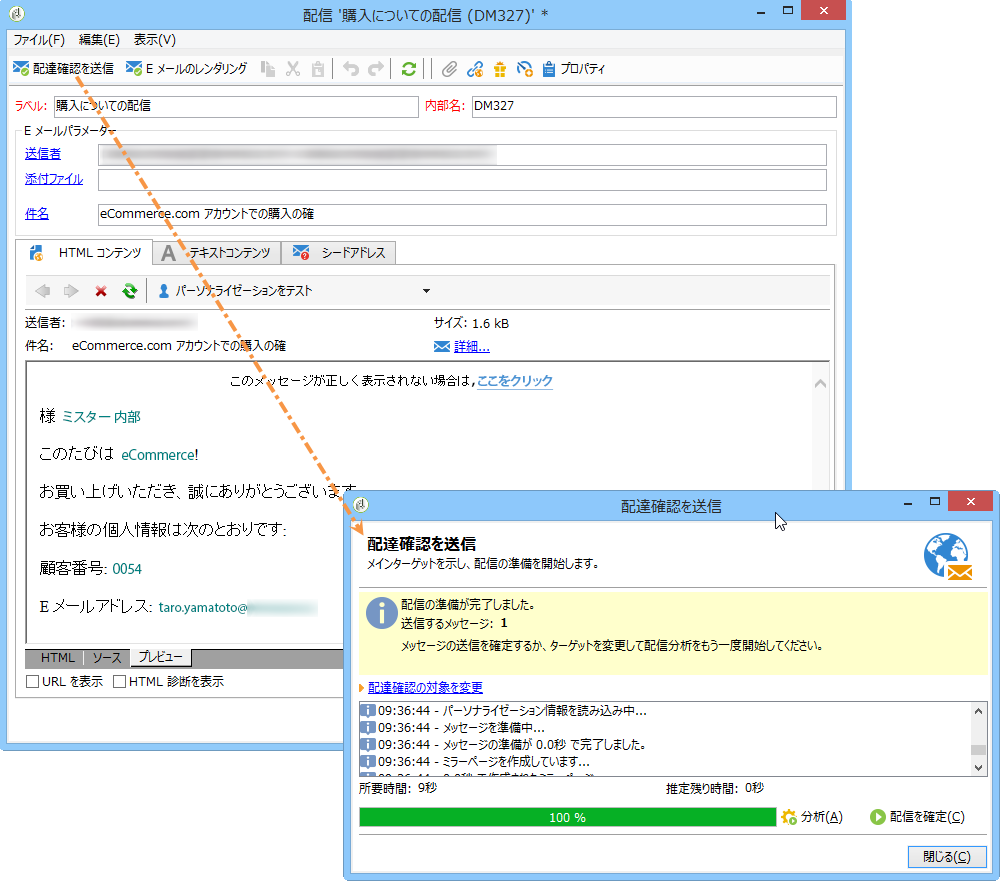
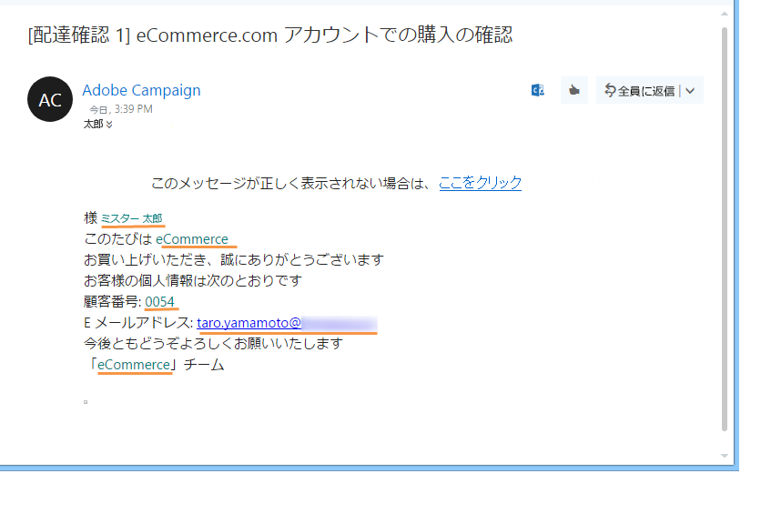
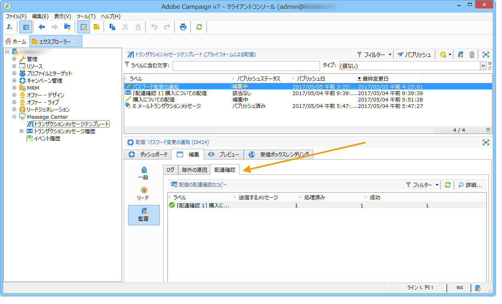

# 配達確認の送信{#sending-a-proof}

作成済みのシードアドレスへ配達確認を送信することで、メッセージ配信をテストできます。

配達確認の送信は、通常の配信と同じ手順となります（詳しくは、[この節](../../delivery/using/steps-validating-the-delivery.md#sending-a-proof)を参照してください）。ただし、Message Center 内から配達確認を送信するためには、事前に次の操作をおこなってください。

* Create one or more seed addresses (refer to [Managing seed addresses in transactional messages](../../message-center/using/managing-seed-addresses-in-transactional-messages.md)) with test data (refer to [Personalization data](../../message-center/using/personalization-data.md)).
* Create the message content (refer to [Creating message content](../../message-center/using/creating-message-content.md)).

配達確認を送信するには：

1. 配信ウィンドウで、「**[!UICONTROL 配達確認を送信]**」ボタンをクリックします。
1. 配信を分析します。
1. エラーを修正し、配信を確認します。

   

1. シードアドレスにメッセージが配信されたこと、およびそのコンテンツが設定どおりであることを確認します。

   

配達確認は、各テンプレートの「**[!UICONTROL 監査]**」タブからアクセスできます。

