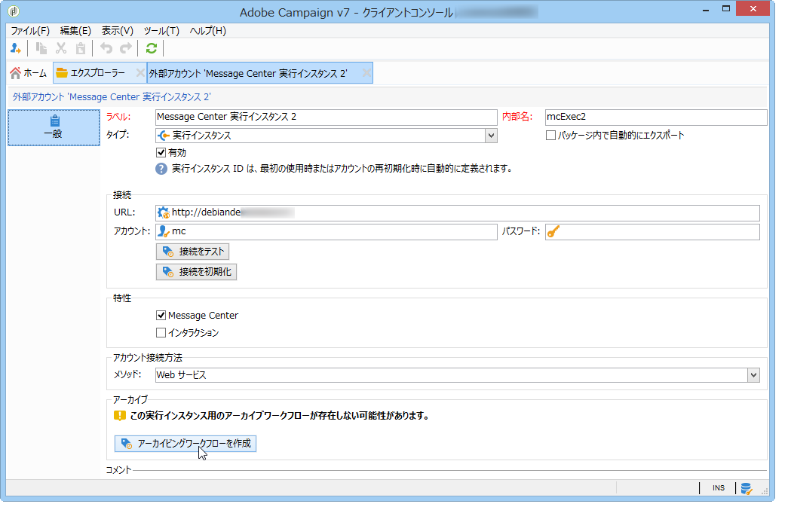
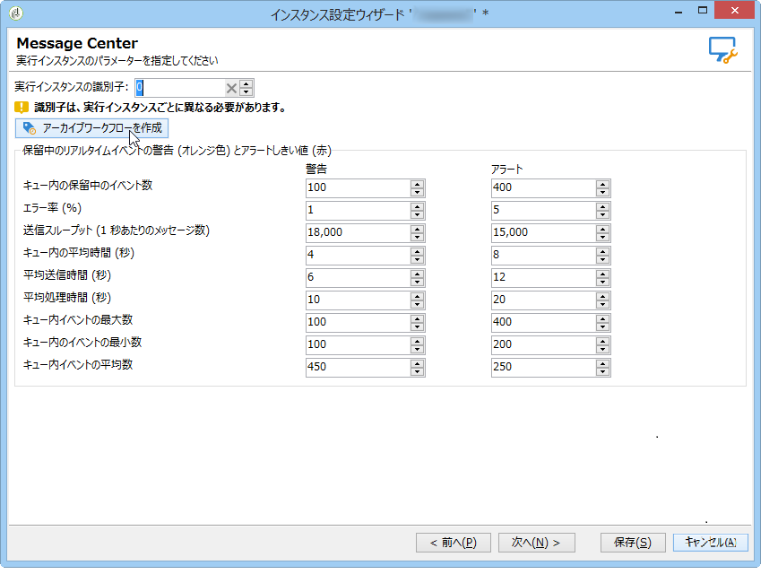

# テクニカルワークフロー{#technical-workflows}

トランザクションメッセージテンプレートをデプロイする前に、コントロールインスタンスおよびそれぞれの実行インスタンス上にてテクニカルワークフローが作成され、開始されていることを確認する必要があります。

トランザクションメッセージ（Message Center）に関連する様々なテクニカルワークフローは、コントロールインスタンスと実行インスタンスとに分類されます。

## コントロールインスタンスのワークフロー {#control-instance-workflows}

コントロールインスタンス上には、実行インスタンスにつき 1 つのアーカイブワークフローを作成する必要があります。作成したアーカイブワークフローは、**管理／プロダクション／Message Center** フォルダーからアクセスできます。アーカイブワークフローは作成されると自動的に開始されます。

**分散アーキテクチャ**

1 つ以上の実行インスタンスが登録されている場合、コントロールインスタンスで、各 **[!UICONTROL Message Center 実行インスタンス]**&#x200B;外部アカウントにつき 1 つのアーカイブワークフローを作成する必要があります。「**[!UICONTROL アーカイブワークフローを作成]**」ボタンをクリックし、ワークフローを作成、開始します。

**最小アーキテクチャ**

同一インスタンス上にコントロールおよび実行インスタンスをインストールしたら、デプロイウィザードを使用してアーカイブワークフローを作成する必要があります。「**[!UICONTROL アーカイブワークフローを作成]**」ボタンをクリックし、ワークフローを作成、開始します。

## 実行インスタンスのワークフロー {#execution-instance-workflows}

実行インスタンスでは、**管理／プロダクション／Message Center** フォルダーからトランザクションメッセージのテクニカルワークフローにアクセスできます。必要な操作は、ワークフローを開始することだけです。リストに含まれるワークフローは以下のとおりです。

* **[!UICONTROL バッチイベントの処理]**（内部名：**[!UICONTROL batchEventsProcessing]**）：このワークフローは、メッセージテンプレートにリンクされる前にキュー内のバッチイベントを分類することができます。
* **[!UICONTROL リアルタイムイベントの処理]**（内部名：**[!UICONTROL rtEventsProcessing]**）：このワークフローは、メッセージテンプレートにリンクされる前にキュー内のリアルタイムイベントを分類することができます。
* **[!UICONTROL イベントステータスを更新]**（内部名：**[!UICONTROL updateEventStatus]**）：このワークフローは、ステータスをイベントに関連付けることができます。

   イベントステータスには以下のものがあります。

   * **[!UICONTROL 保留中]**：イベントはキューの中です。イベントにはまだメッセージテンプレートが割り当てられていません。
   * **[!UICONTROL 配信待ち]**：イベントはキューの中で、メッセージテンプレートが割り当てられ、配信による処理中です。
   * **[!UICONTROL 送信済み]**：このステータスは配信ログからコピーされます。配信が送信されたことを示します。
   * **[!UICONTROL 配信で無視]**：このステータスは配信ログからコピーされます。配信が無視されたことを意味しています。
   * **[!UICONTROL 配信に失敗]**：このステータスは配信ログからコピーされます。配信が失敗したことを意味しています。
   * **[!UICONTROL 処理不可なイベント]**：イベントをメッセージテンプレートにリンクすることができませんでした。イベントの処理はおこなわれません。

