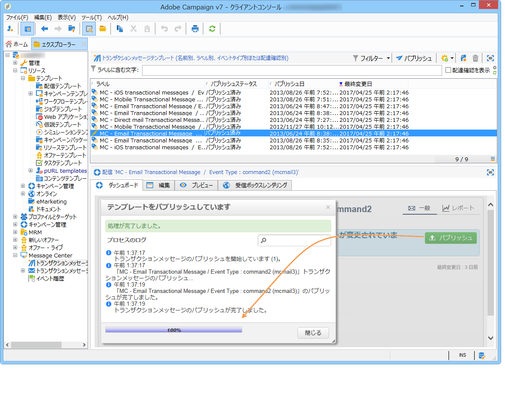
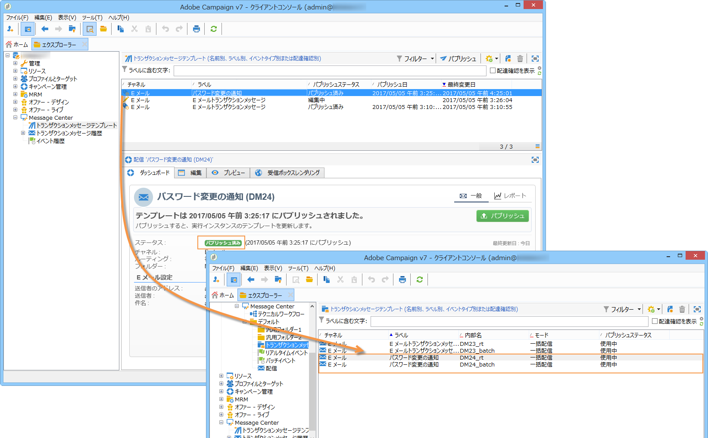

# テンプレートのパブリッシュ{#template-publication}

コントロールインスタンスでメッセージテンプレートを作成したら、そのテンプレートをすべての実行インスタンスにパブリッシュすることができます。パブリッシュすると、自動的に実行インスタンスで 2 つのメッセージテンプレートが作成され、リアルタイムイベントとバッチイベントにリンクされたメッセージを送信することができるようになります。

>[!CAUTION]
>
>テンプレートに変更を加えた場合には、トランザクションメッセージ配信の際に変更内容が反映されるよう、忘れずにテンプレートをパブリッシュしてください。

>[!NOTE]
>
>トランザクションメッセージテンプレートをパブリッシュすると、タイポロジルールが実行インスタンスに自動的にパブリッシュされます。

1. コントロールインスタンス内で、ツリーの **[!UICONTROL Message Center／トランザクションメッセージテンプレート]**&#x200B;フォルダーに移動します。
1. 実行インスタンスにパブリッシュするテンプレートを選択します。
1. 「**[!UICONTROL パブリッシュ]**」をクリックします。

   

パブリッシュが完了すると、本番インスタンスのツリーの&#x200B;**[!UICONTROL 管理／プロダクション／Message Center／デフォルト／トランザクションメッセージテンプレート]**&#x200B;フォルダー内に、バッチタイプのイベントに適用されるメッセージテンプレートとリアルタイムタイプのイベントに適用されるメッセージテンプレートの両方が作成されます。

>[!NOTE]
>
>トランザクションメッセージテンプレートの既存のフィールド（送信者のアドレスなど）を空の値と置き換えた場合、トランザクションメッセージをもう一度パブリッシュすると、既存のインスタンス上にある対応するフィールドは更新されません。引き続き以前の値が含まれます。ただし、空でない値を追加すると、次回のパブリッシュ後に、対応するフィールドが通常どおり更新されます。

