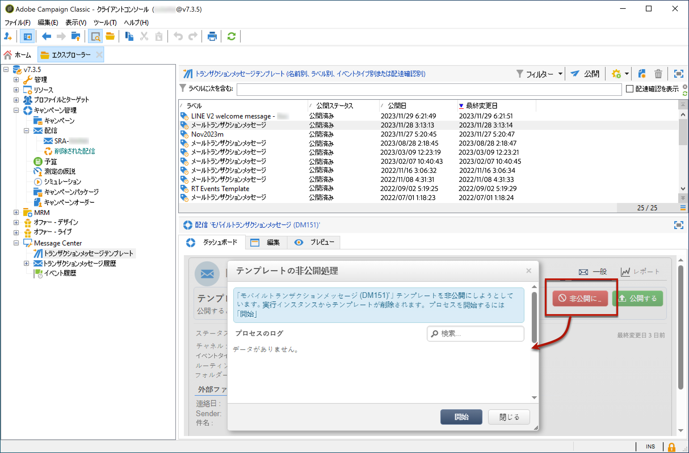

# テンプレートの非公開{#template-unpublication}

メッセージテンプレートは、実行インスタンスで公開した後に非公開にできます。

パブリッシュ済みのテンプレートは、引き続き呼び出すことができます。したがって、メッセージテンプレートを使用しなくなった場合は、非公開にすることをお勧めします。これは、不要なトランザクションメッセージを誤って送信するのを避けるためです。例えば、クリスマスキャンペーンにのみ使用するメッセージテンプレートを公開したとします。クリスマス期間が終わったらテンプレートを非公開にして、来年の同時期に再度パブリッシュすることができます。

また、ステータスが「**[!UICONTROL パブリッシュ済み]**」のトランザクションメッセージテンプレートは削除できません。最初にテンプレートを非公開にする必要があります。

トランザクションメッセージテンプレートを非公開にするには、次の手順に従います。

1. コントロールインスタンス内で、ツリーの **[!UICONTROL Message Center／トランザクションメッセージテンプレート]**&#x200B;フォルダーに移動します。
1. 非公開にするテンプレートを選択します。
1. 「**[!UICONTROL 非公開にする]**」をクリックします。

   <!--1. Fill in the **[!UICONTROL Log of the process]** field.-->

1. 「**[!UICONTROL 開始]**」をクリックします。

トランザクションメッセージテンプレートのステータスが「**[!UICONTROL パブリッシュ済み]**」から「**[!UICONTROL 編集中]**」に変わります。

非公開にした後は、以下のようになります。

* 両方のメッセージテンプレート（バッチイベントおよびリアルタイムイベントに適用）が各実行インスタンスから削除されます。これらのテンプレートは、**[!UICONTROL 管理／プロダクション／Message Center の実行／デフォルト／トランザクションメッセージテンプレート]**&#x200B;フォルダーに表示されなくなります。

* テンプレートを非公開にした後は、必要に応じて、コントロールインスタンスから削除できます。これをおこなうには、リストからテンプレートを選択し、画面の右上にある「**[!UICONTROL 削除]**」ボタンをクリックします。