# トランザクションメッセージテンプレートのテスト {#testing-message-templates}

[メッセージテンプレート](../../message-center/using/creating-the-message-template.md)の準備が整ったら、次の手順に従ってプレビューしテストします。

## トランザクションメッセージでのシードアドレスの管理 {#managing-seed-addresses-in-transactional-messages}

シードアドレスを使用すると、メールまたは SMS 配信の前に、メッセージのプレビューを表示したり、配達確認を送信したり、メッセージのパーソナライゼーションを検証したりすることができます。 シードアドレスは配信に関連付けられ、その他の配信に利用することはできません。

トランザクションメッセージでシードアドレスを作成するには、次の手順に従います。

1. トランザクションメッセージテンプレートで、「**[!UICONTROL シードアドレス]**」タブをクリックします。

   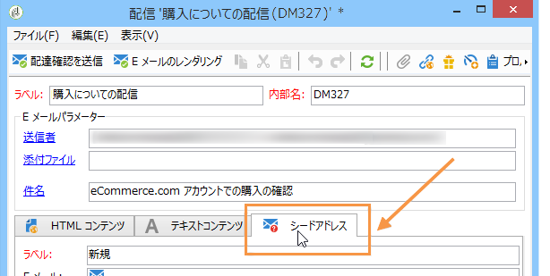

1. 後で容易に選択できるよう、ラベルを割り当てます。

   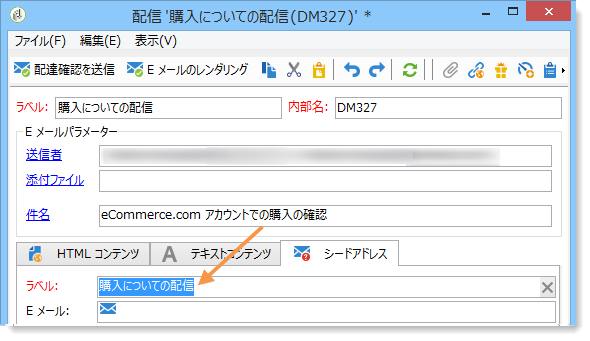

1. シードアドレス（通信チャネルによりメールまたは携帯電話）を入力します。

   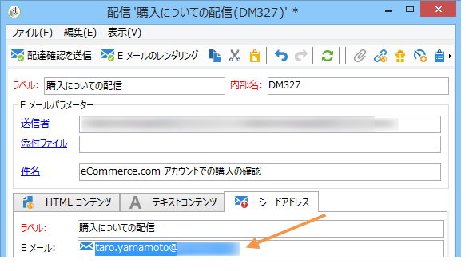

1. 外部識別子を入力します。このオプションのフィールドには、web サイト上のすべてのアプリケーションに共通し、プロファイルを識別するのに利用できるビジネスキー（一意の識別子、名前 + メールなど） を入力することができます。 Adobe Campaign マーケティングデータベースにもこのフィールドが存在する場合、データベース内のプロファイルとイベントを紐付けることができます。

   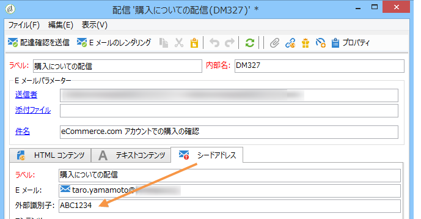

1. テストデータを挿入します（[パーソナライゼーションデータ](#personalization-data)を参照）。

   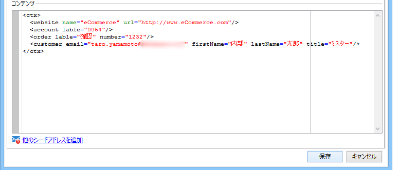

   <!--## Creating several seed addresses {#creating-several-seed-addresses}-->
1. 「**[!UICONTROL 他のシードアドレスを追加]**」リンクをクリックし、「**[!UICONTROL 追加]**」ボタンをクリックします。

   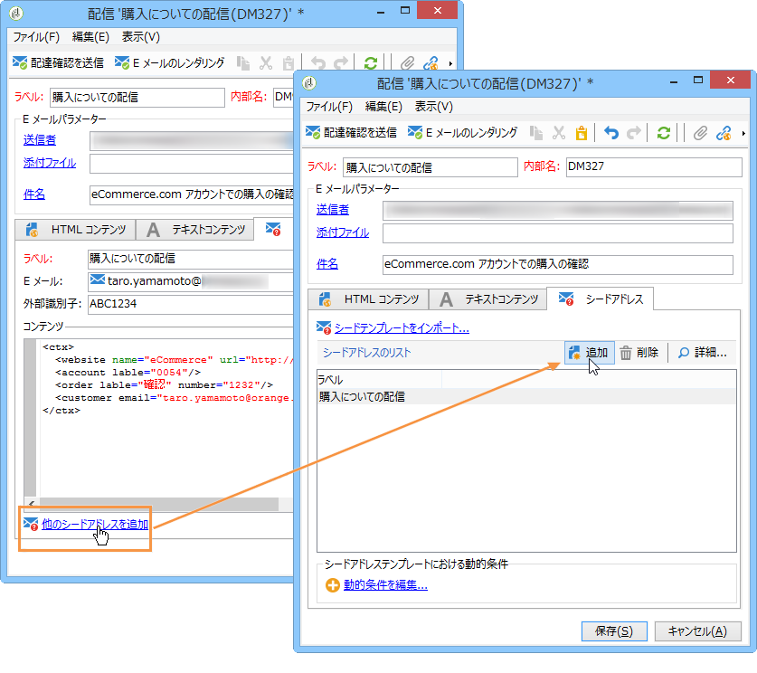

   <!--1. Follow the configuration steps for a seed address detailed in the [Creating a seed address](#creating-a-seed-address) section.-->
1. この手順を繰り返して、必要な数のアドレスを作成します。

   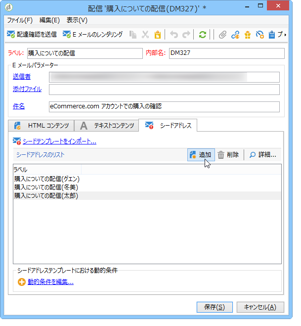

アドレスを作成したら、プレビューとパーソナライゼーションを表示することができます。 [トランザクションメッセージのプレビュー](#transactional-message-preview)を参照してください。

## パーソナライゼーションデータ {#personalization-data}

メッセージテンプレート内のデータを使い、トランザクションメッセージのパーソナライゼーションをテストできます。 この機能は、プレビューを生成したり、配達確認を送信するために使用されます。 さまざまなインターネットアクセスプロバイダーに向けたメッセージのレンダリングを表示することもできます。 詳しくは、[受信ボックスのレンダリング](../../delivery/using/inbox-rendering.md)を参照してください。

このデータの目的は、最終的に配信する前にメッセージをテストすることです。 このメッセージは、処理される実際のデータと同一のものではありません。 ただし以下に示すように、XML 構造は実行インスタンスに保存されているイベントの構造と同一です。

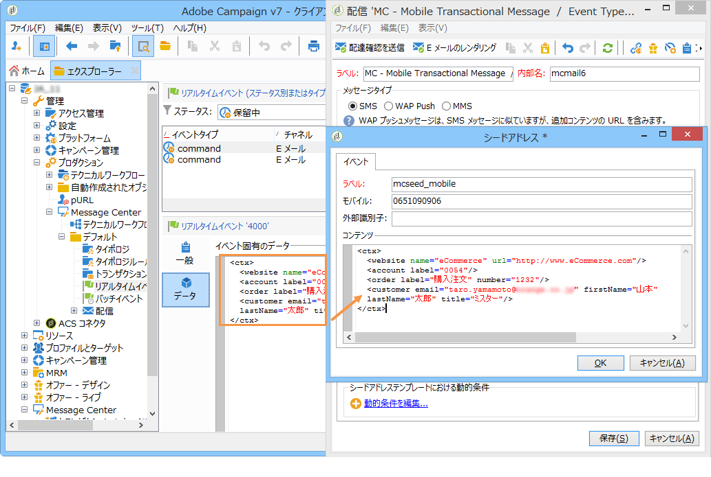

この情報を使用して、パーソナライズ機能のタグを使用してメッセージコンテンツをパーソナライズできます。詳しくは、[メッセージコンテンツの作成](../../message-center/using/creating-the-message-template.md#creating-message-content)を参照してください。

1. トランザクションメッセージテンプレートを選択します。

1. テンプレートで、「**[!UICONTROL シードアドレス]**」タブをクリックします。

1. イベントコンテンツに、XML フォーマットでテスト情報を入力します。

   

1. 「**[!UICONTROL 保存]**」をクリックします。

## トランザクションメッセージのプレビュー {#transactional-message-preview}

1 つまたは複数のシードアドレスとメッセージ本文を作成したら、メッセージをプレビューして、パーソナライゼーションを確認することができます。

1. メッセージテンプレートで、「**[!UICONTROL プレビュー]**」タブをクリックします。

   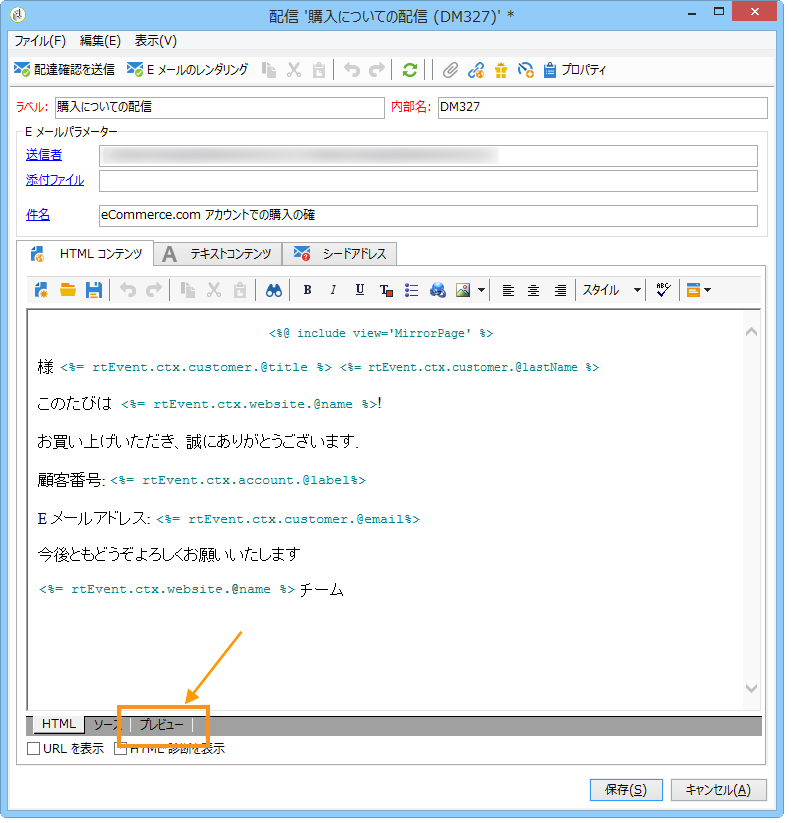

1. ドロップダウンリストから「**[!UICONTROL シードアドレス]**」を選択します。

   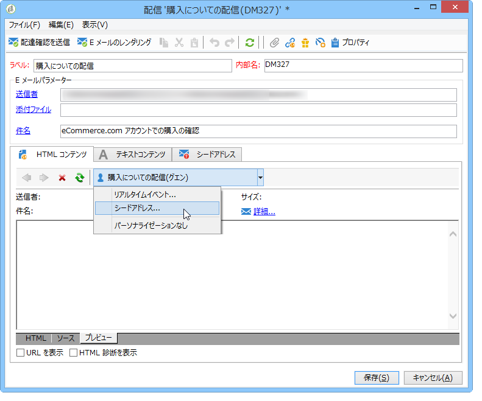

1. 作成済みのシードアドレスを選択してパーソナライズされたメッセージを表示します。

   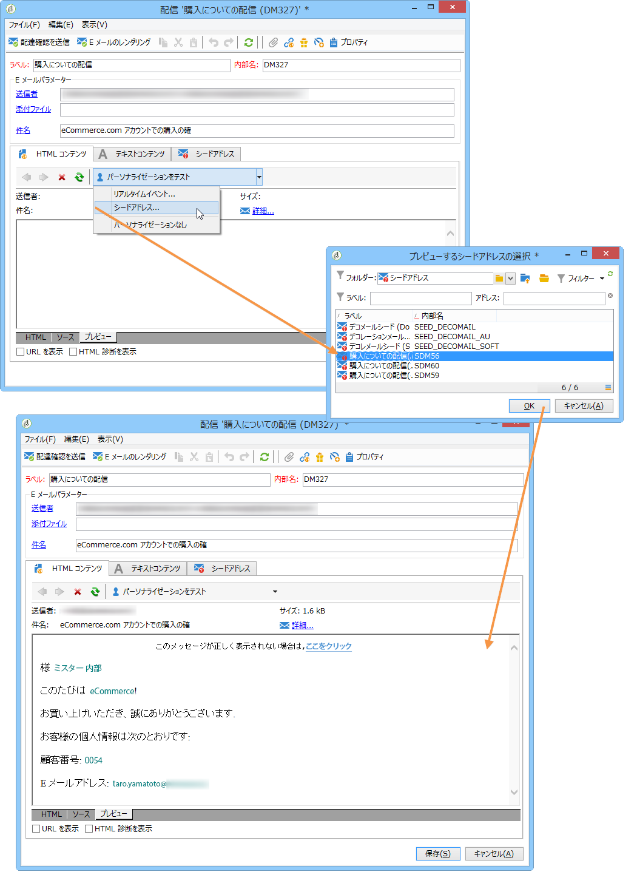

シードアドレスを使用して、さまざまなインターネットアクセスプロバイダーに向けたメッセージのレンダリングを表示することもできます。 詳しくは、[受信ボックスのレンダリング](../../delivery/using/inbox-rendering.md)を参照してください。

## 配達確認の送信 {#sending-a-proof}

作成済みのシードアドレスへ配達確認を送信することで、メッセージ配信をテストできます。

配達確認の送信は、通常の配信の場合と同じプロセスで行います。 [Campaign v8 ドキュメント](https://experienceleague.adobe.com/docs/campaign/campaign-v8/send/validate/preview-and-proof.html?lang=ja){target="_blank"}を参照してください。 ただし、トランザクションメッセージでは、事前に次の操作を実行する必要があります。

* [パーソナライズ機能のデータ](#personalization-data)を使用して、1 つまたは複数の[シードアドレス](#managing-seed-addresses-in-transactional-messages)を作成します。
* [メッセージコンテンツを作成](../../message-center/using/creating-the-message-template.md#creating-message-content)します。

配達確認を送信するには：

1. 配信ウィンドウで、「**[!UICONTROL 配達確認を送信]**」ボタンをクリックします。
1. 配信を分析します。
1. エラーを修正し、配信を確認します。

   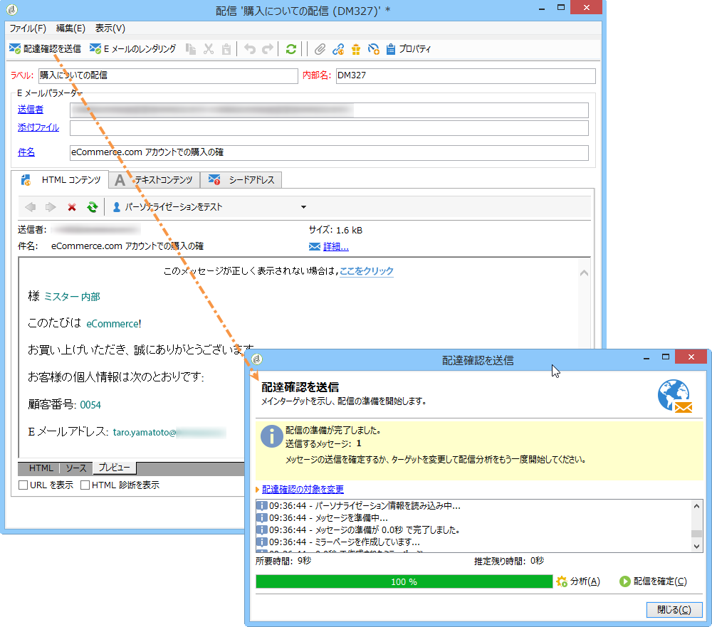

1. シードアドレスにメッセージが配信されたこと、およびそのコンテンツが設定どおりであることを確認します。

   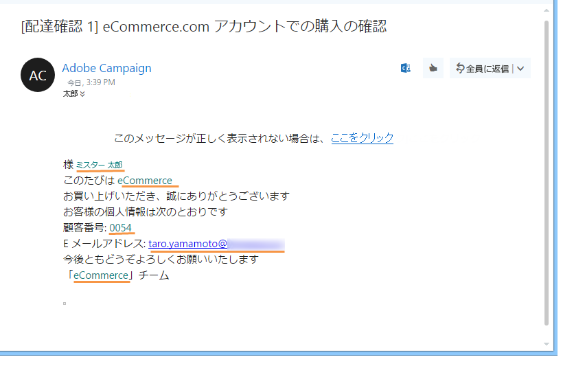

配達確認は、各テンプレートの「**[!UICONTROL 監査]**」タブからアクセスできます。 詳しくは、[Campaign v8 ドキュメント](https://experienceleague.adobe.com/docs/campaign/campaign-v8/send/validate/preview-and-proof.html?lang=ja){target="_blank"}を参照してください。

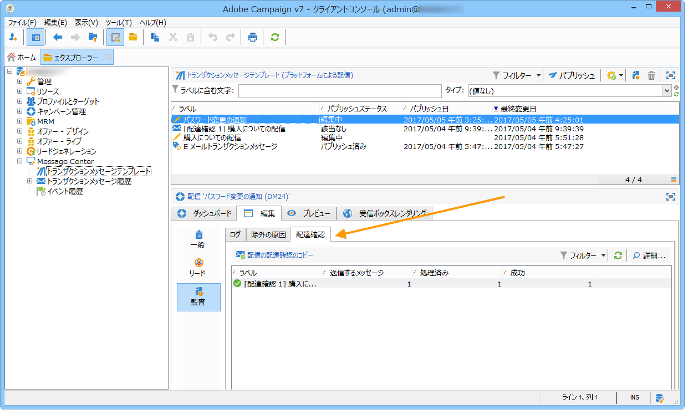

これで、メッセージテンプレートを[パブリッシュ](../../message-center/using/publishing-message-templates.md)する準備が整いました。