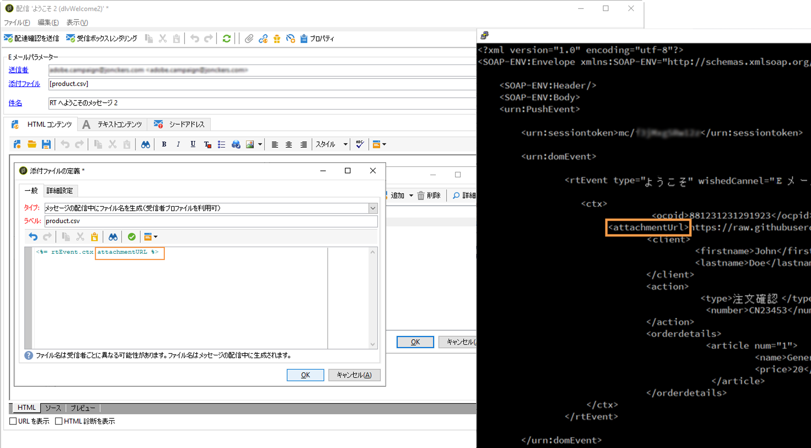

# 使用例：添付ファイルを含むトランザクション E メールの送信{#transactional-email-with-attachments}

この使用例の目的は、アウトバウンドの送信時に E メール添付ファイルを追加することです。

## 主な手順 {#key-steps}

このシナリオでは、個人向けおよび／またはパーソナライズされた添付ファイルと共にトランザクション E メールを送信する方法について説明します。添付ファイルは、トランザクションメッセージサーバーに事前にアップロードされるのではなく、オンザフライで生成されます。

顧客のインタラクションや詳細を記録する場合は、プロセスの最後にこの情報を顧客に送り返すことが必要になる場合があります。例えば、この情報を含めた PDF ファイルを E メールに添付したりします。

このシナリオの主な手順は次のとおりです。

1. 顧客が Web サイトにアクセスし、購入する商品を検索します。
1. 顧客が目的の商品を選択し、いくつかのオプションをカスタマイズします。
1. 顧客がトランザクションを完了します。
1. その顧客にトランザクションの内容を確認する E メールが送信されます。PII（個人を特定できる情報）を E メールで送信することは推奨されないので、安全な PDF が生成され、E メールに添付されます。
1. 顧客が E メールと関連データを含む添付ファイルを受け取ります。

このシナリオでは、添付ファイルは事前に作成されるのではなく、送信 E メールにオンザフライで追加されます。それにより、次のような利点があります。

* この場合、添付ファイルのコンテンツをパーソナライズできます。
* また、上記のシナリオ例のように添付ファイルがトランザクションに関連する場合には、顧客のプロセスの間に生成される動的データを添付ファイルに含めることもあります。
* PDF ファイルを添付すると、PDF ファイルを暗号化して HTTPS 経由で送信できるので、セキュリティが最適化されます。

>[!NOTE]
>
>パフォーマンスの問題を回避するために、パーソナライズされた URL からその場でダウンロードされた画像を添付ファイルとして含める場合は、デフォルトで各画像サイズが 100,000 バイトを超えないようにする必要があります。この推奨しきい値は、[Campaign Classic オプションのリスト](../../installation/using/configuring-campaign-options.md#delivery)から設定できます。

## 推奨事項 {#important-notes}

このシナリオを実装する前に、次のガイドラインをよくお読みください。

* トランザクションメッセージインスタンスは、ファイルまたはデータの保存や、エクスポートまたはアップロードする目的に使用しないでください。イベントデータおよび関連情報にのみ使用できます。トランザクションメッセージインスタンスをファイルストレージシステムと考えないでください。
* アドビ以外のトランザクションメッセージインスタンスまたはサーバーに直接アクセスする方法は存在しないので、これらのサーバー上にあるファイルをプッシュする標準的な方法はありません（FTP でアクセスすることもできません）。
* トランザクションメッセージインスタンス上のディスクスペースでは、いかなるファイルの格納も契約に沿ったものではなく、添付ファイルも例外ではありません。
* 別のオンラインディスクシステムでこれらのファイルをホストする必要があります。このシステムに FTP 経由でアクセスできることに加え、ファイルの書き込みと削除をおこなえる必要があります。

>[!NOTE]
>
>パフォーマンスの問題を回避するために、1 つの E メールに複数の添付ファイルを含めないことをお勧めします。推奨しきい値は、[Campaign Classic オプションのリスト](../../installation/using/configuring-campaign-options.md#delivery)から設定できます。

## 実装 {#implementation}

次のダイアグラムに、このシナリオを実装する際の様々な手順を示します。


E メール添付ファイルをオンザフライでトランザクションメッセージに追加するには、次の手順に従います。

1. 添付ファイルのデザインから開始します。詳しくは、[この節](../../delivery/using/attaching-files.md#attach-a-personalized-file)を参照してください。

   こうすることで、実行インスタンスでホストされていなくても、ファイルを E メールに添付できます。

1. SOAP メッセージトリガーを介して E メールを送信できます。SOAP 呼び出しには、URL パラメーター（attachmentURL）があります。

   SOAP リクエストについて詳しくは、[イベントの説明](../../message-center/using/event-description.md)を参照してください。

1. E メールをデザインするときに、「**[!UICONTROL 添付ファイル]**」をクリックします。

1. **[!UICONTROL 添付ファイルの定義]**&#x200B;画面で、SOAP 添付ファイルパラメーターを入力します。

   ```
   <%= rtEvent.ctx.attachementUrl %>
   ```

1. メッセージの処理中、システムによってリモートの場所（サードパーティサーバー）からファイルが取得され、個々のメッセージに添付されます。

   このパラメーターには変数を使用できるので、目的のファイルの完全な形のリモート URL 変数を指定し、SOAP 呼び出しを介して送信できます。

   
