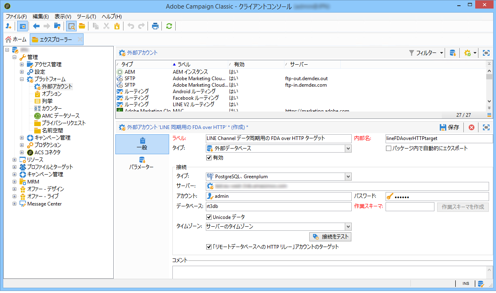

# トランザクションメッセージのアーキテクチャ{#transactional-messaging-architecture}

## 実行およびコントロールインスタンスについて {#about-execution-and-control-instances}

Adobe Campaign のトランザクションメッセージ機能（Message Center とも呼ばれます）は、スケーラビリティをサポートし、365 日 24 時間サービスを提供するように設計されています。Message Center は、以下のいくつかのインスタンスで構成されています。

* 1 つのコントロールインスタンス：メッセージテンプレートを作成します。
* 1 つまたは複数の実行インスタンス：イベントを受け取り、メッセージを配信します。

これらの機能を使用するために、Adobe Campaign のユーザーはコントロールインスタンスにログオンし、トランザクションメッセージテンプレートの作成、シードリストを使用したメッセージプレビューの生成、レポートの表示、実行インスタンスの監視をおこないます。

実行インスタンスは、イベントを受け取り、イベントをトランザクションメッセージテンプレートにリンクし、パーソナライズしたメッセージをそれぞれの受信者に送信します。


## 複数のコントロールインスタンスのサポート {#supporting-several-control-instances}

>[!CAUTION]
>
>複数の制御インスタンスでの実行クラスターの共有は、オンプレミス環境でのみサポートされます。

1 つの実行クラスターを複数のコントロールインスタンスで共有することができます。例えば、複数の専門店舗を管理している場合、ブランドごとにそれぞれ 1 つずつコントロールセンターを設定し、すべてのコントロールセンターを同じ実行クラスターにリンクすることができます。


>[!NOTE]
>
>必要な設定の詳細については、「複数のコントロールインスタ [ンスの使用」を参照してくださ](../../message-center/using/creating-a-shared-connection.md#using-several-control-instances)い。

## インスタンスのインストール {#installing-instances}

トランザクションメッセージパッケージをインストールする際の注意事項がいくつかあります。本番環境で使用する前に、テスト環境で動作させることをお勧めします。また、互換性のある Adobe Campaign のライセンスが必要です。詳しくは、アドビのアカウント担当者にお問い合わせください。

>[!CAUTION]
>
>コントロールインスタンスおよび実行インスタンスは、異なるマシンにインストールする必要があります。同じ Campaign インスタンスを共有できなくなります。

複数のチャネルを使用する場合は、トランザクションメッセージパッケージをインストールする前に関連パッケージをインストールして設定する必要があります。「配信チャ [ネルの追加」を参照](#adding-a-delivery-channel)。

* To install the control instance on your machine, select the **[!UICONTROL Transactional message control]** module.

   

* To install the execution instance on your machine, select the **[!UICONTROL Transactional message execution]** module.

   

## 配信チャネルの追加 {#adding-a-delivery-channel}

配信チャネル（モバイルチャネル、モバイルアプリチャネルなど）の追加は、トランザクションメッセージパッケージのインストール前におこなう必要があります。E メールチャネルのトランザクションメッセージプロジェクトを開始し、プロジェクトの最中に新規でチャネルを追加することにした場合は、次の手順に従います。

1. Install the channel you need, for example the **Mobile channel**, using the package import wizard ( **[!UICONTROL Tools > Advanced > Import package... > Adobe Campaign Package]** ).
1. ファイルのインポート( **[!UICONTROL Tools > Advanced > Import package... > File]** )を実行し、datakitnmspacemessageCenter.xml ****`[Your language]`**ファイルを選択します** 。
1. では、追加 **[!UICONTROL XML content of the data to import]** したチャネルに対応する配信テンプレートのみを保持します。 For example, if you have added the **Mobile channel**, keep only the **entities** element that corresponds to the **[!UICONTROL Mobile transactional message]** (smsTriggerMessage). **モバイルアプリチャネル**&#x200B;を追加した場合は、**iOS トランザクションメッセージ**（iosTriggerMessage）と **Android トランザクションメッセージ**（androidTriggerMessage）のみを残します。

   

## トランザクションメッセージおよびインバウンドインタラクション {#transactional-messages-and-inbound-interaction}

トランザクションメッセージでは、インバウンドインタラクションモジュールと組み合わせることで、その受信者専用のマーケティングオファーをメッセージに挿入することができます。

>[!NOTE]
>
>インタラクションモジュールについて詳しくは、[インタラクション](../../interaction/using/interaction-and-offer-management.md)を参照してください。

トランザクションメッセージをインタラクションと一緒に使用するには、以下の設定をおこなう必要があります。

* コントロールインスタンス上に&#x200B;**インタラクション**&#x200B;パッケージをインストールし、オファーカタログを設定します。

   >[!CAUTION]
   >
   >オファーは実行インスタンス上に複製しないでください。

* オファーのパーソナライズには、受信者にリンクされた識別子がイベントに含まれている必要があります。この識別子の値は **@externalId** 属性に記載されている必要があります。**インタラクション**&#x200B;は、プライマリキーで受信者を識別するようデフォルトで設定されています。

   ```
   <rtEvent type="order_confirmation" email="john.doe@adobe.com" externalId="1242"> 
   ```

   例えば E メールアドレスなど、指定したフィールドによる識別がおこなわれるよう、**インタラクション**&#x200B;を設定することもできます。

   ```
   <rtEvent type="order_confirmation" email="john.doe@adobe.com" externalId="john.doe@yahoo.com"> 
   ```

E メールキャンペーン用に作成するのと同様に、配信テンプレートを作成します。

* オファーをトランザクションメッセージテンプレートに追加します。
* プレビューを確認して、配達確認を送信し、テンプレートをパブリッシュします。

また、オファースペースで、単一モードを有効にする必要があります。詳しくは、[この節](../../interaction/using/creating-offer-spaces.md)を参照してください。

## トランザクションメッセージおよびプッシュ通知 {#transactional-messaging-and-push-notifications}

トランザクションメッセージでは、モバイルアプリチャネルモジュールと組み合わせることで、通知を介してモバイルデバイスにトランザクションメッセージをプッシュすることができます。

>[!NOTE]
>
>モバイルアプリチャネルについて詳しくは、[この節](../../delivery/using/about-mobile-app-channel.md)を参照してください。

トランザクションメッセージモジュールをモバイルアプリチャネルと一緒に使用するには、以下の設定をおこなう必要があります。

1. **モバイルアプリチャネル**&#x200B;パッケージをコントロールインスタンスと実行インスタンス上にインストールします。
1. **モバイルアプリチャネル**&#x200B;タイプの Adobe Campaign サービスおよびサービスに含まれるモバイルアプリを実行インスタンスに複製します。

イベントには次の要素が含まれる必要があります。

* モバイルデバイス ID（Android では **registrationId**、iOS では **deviceToken**）。この ID が、通知を送信する宛先の「アドレス」を表します。
* モバイルアプリケーションへのリンクまたは統合キー（**uuid**）。アプリケーション固有の接続情報を復元することができます。
* 通知の送信先のチャネル(**whisedChannel**):iOSの場合41、Androidの場合42
* パーソナライズに役立つすべてのデータ。

以下は、この情報を含むイベントの例です。

```
<SOAP-ENV:Envelope xmlns:xsd="http://www.w3.org/2001/XMLSchema" xmlns:xsi="http://www.w3.org/2001/XMLSchema-instance" xmlns:SOAP-ENV="http://schemas.xmlsoap.org/soap/envelope/">
   <SOAP-ENV:Body>
     <urn:PushEvent>
         <urn:sessiontoken>mc/</urn:sessiontoken>
         <urn:domEvent>

              <rtEvent wishedChannel="41" type="DELIVERY" registrationToken="2cefnefzef758398493srefzefkzq483974">
                <mobileApp _operation=”none” uuid="com.adobe.NeoMiles"/>
                <ctx>
                    <deliveryTime>1:30 PM</deliveryTime>
                    <url>http://www.adobe.com</url>
                </ctx>
              </rtEvent>

         </urn:domEvent>
     </urn:PushEvent>           
   </SOAP-ENV:Body>
</SOAP-ENV:Envelope>
```

>[!NOTE]
>
>メッセージテンプレートの作成に変更はありません。

## トランザクションメッセージと LINE {#transactional-messaging-and-line}

LINE チャネルとトランザクションメッセージを組み合わせると、コンシューマー向けモバイルデバイスにインストールされた LINE アプリでリアルタイムメッセージを送信できます。これは、LINE ユーザーがブランドのページを追加したときに歓迎メッセージを送信するために使用されます。

トランザクションメッセージモジュールを LINE と共に使用するには、**マーケティング**&#x200B;インスタンスと&#x200B;**実行**&#x200B;インスタンスの設定で次の要素が必要になります。

* 両方のインスタンスに **[!UICONTROL LINE Connect]** パッケージをインストールします。
* マーケティング **[!UICONTROL Transactional message control]** インスタンスにパッケージを、実行インスタンス **[!UICONTROL Transactional message execution]** にパッケージをインストールします。
* 両方のインスタンスで LINE の&#x200B;**外部アカウント**&#x200B;と&#x200B;**サービス**&#x200B;を作成します。このとき、同じ名前を使用してこれらが同期されるようにします。LINE の外部アカウントとサービスの作成方法について詳しくは、[この節](../../delivery/using/line-channel.md#creating-a-line-account-and-an-external-account-)を参照してください。

Then, from the **[!UICONTROL Explorer]** , in **[!UICONTROL Platform]** > **[!UICONTROL External account]** , you need to configure different external accounts on both instances:

1. Create an **[!UICONTROL External database]** external account in your **execution** instance with the following configuration:

   

   * **[!UICONTROL Label]** および **[!UICONTROL Internal name]** :必要に応じて外部アカウントに名前を付けます。
   * **[!UICONTROL Type]** :を選択し **[!UICONTROL External database]** ます。
   * **[!UICONTROL Enabled]** ボックスをオンにする必要があります。
   カテゴリか **[!UICONTROL Connection]** ら：

   * **[!UICONTROL Type]** :データベースサーバ（PostgresSQLなど）を選択します。
   * **[!UICONTROL Server]** :データベースサーバーのURLを入力します。
   * **[!UICONTROL Account]** :データベースアカウントを入力します。

      >[!NOTE]
      >
      >データベースユーザーは、FDA接続に関して、次の表の読み取り権限を持っている必要があります。XtkOption、NmsVisitor、NmsVisitorSub、NmsService、NmsBroadLogRtEvent、NmsTrackingLogRtEvent、NmsTrackingLogBatchEvent、NmsNmsVisitorrtEvent、NmsBatchEvent、NmsBroadLogMsg、NmsTrackingUrl、NmsDelivery、NmsWebTrackingLogXtkFolder。

   * **[!UICONTROL Password]** :データベースアカウントのパスワードを入力します。
   * **[!UICONTROL Database]** :実行インスタンスのデータベース名を入力します。
   * **[!UICONTROL Target of an HTTP relay to remote database's account]** ボックスをオンにする必要があります。


1. Create an **[!UICONTROL External Database]** account in your **marketing** instance with the following configuration.

   

   * **[!UICONTROL Label]** および **[!UICONTROL Internal name]** :必要に応じて外部アカウントに名前を付けます。
   * **[!UICONTROL Type]** :を選択し **[!UICONTROL External database]** ます。
   * 「有効」ボックスをオンにする必要があります。
   カテゴリか **[!UICONTROL Connection]** ら：

   * **[!UICONTROL Type]** :を選択し **[!UICONTROL HTTP relay to remote Database]** ます。
   * **[!UICONTROL Server]** :キャンペーンの実行インスタンスのサーバーURLを入力します。
   * **[!UICONTROL Account]** : enter the account used to access your execution instance.
   * **[!UICONTROL Password]** : enter the password for the account used to access your execution instance.
   * **[!UICONTROL Data Source]** :次の構文を入力しま **[!UICONTROL nms:extAccount:ID of your external database account in the execution instance]** す。


1. Create an **[!UICONTROL Execution instance]** external account in your **marketing** instance using the following configuration to create the data synchronization workflow:

   

   * **[!UICONTROL Label]** および **[!UICONTROL Internal name]** :必要に応じて外部アカウントに名前を付けます。
   * **[!UICONTROL Type]** :を選択し **[!UICONTROL Execution instance]** ます。
   * 「有効」ボックスをオンにする必要があります。
   カテゴリか **[!UICONTROL Connection]** ら：

   * **[!UICONTROL URL]**：実行インスタンスの URL を入力します。
   * **[!UICONTROL Account]** :実行インスタンスへのアクセスに使用するアカウントを入力します。
   * **[!UICONTROL Password]** :実行インスタンスへのアクセスに使用するアカウントのパスワードを入力します。
   カテゴリか **[!UICONTROL Account connection method]** ら：

   * **[!UICONTROL Method]** :を選択し **[!UICONTROL Federated Data Access (FDA)]** ます。
   * **[!UICONTROL FDA account]** :ドロップダウンからFDAアカウントを選択します。
   * ボタンをクリッ **[!UICONTROL Create the archiving workflow]** クします。
   * LINEデータ同期ワ **[!UICONTROL Create data synchronization workflow]** ークフローを作成するには、このボタンをクリックします。


1. これで、トランザクションメッセージの作成を開始できる状態になりました。詳しくは、この[ページ](../../message-center/using/introduction.md)を参照してください。
