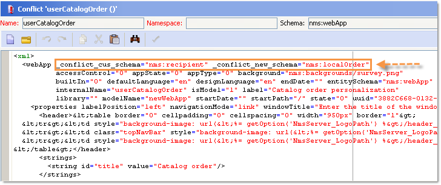
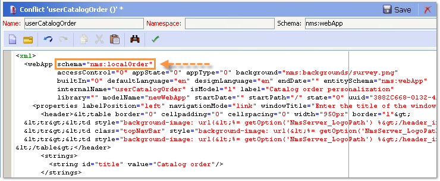
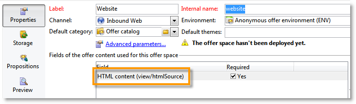
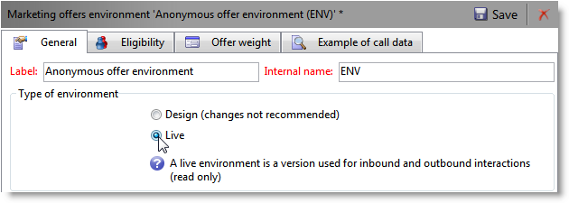
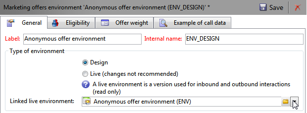
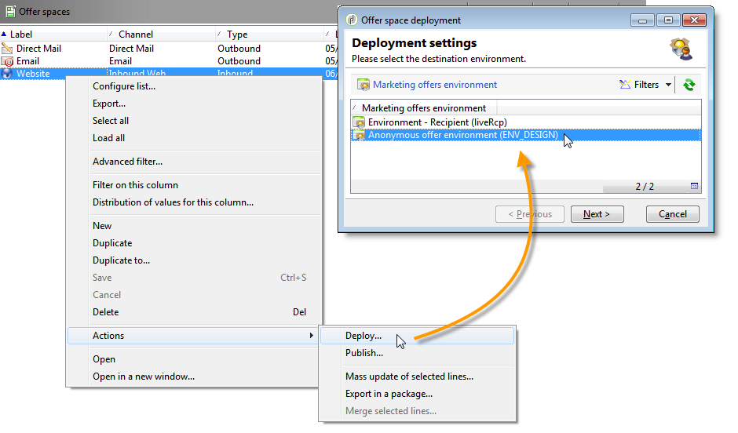
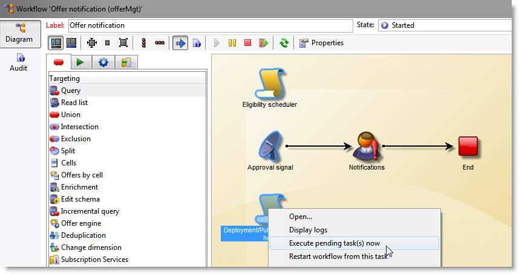
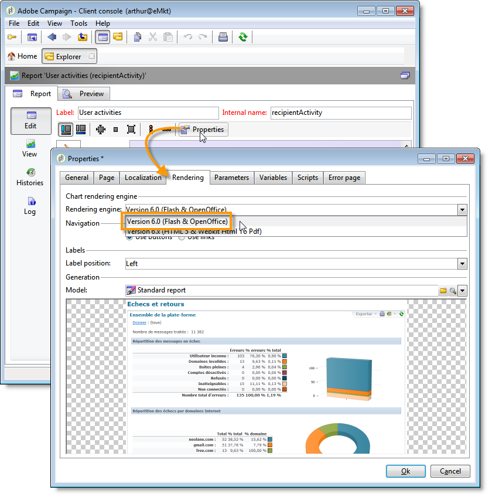

# 一般設定{#general-configurations}

この節では、v5.11またはv6.02から移行する際にAdobe Campaign v7で実行する設定について詳しく説明します。

さらに、次の点に注意してください。

* v5.11から移行する場合は、[このセクション &#x200B;](../../migration/using/configuring-your-platform.md#specific-configurations-in-v5-11)で説明されている設定も完了する必要があります。
* v6.02から移行する場合は、[このセクション &#x200B;](../../migration/using/configuring-your-platform.md#specific-configurations-in-v6-02)で説明されている設定も完了する必要があります。

## タイムゾーン {#time-zones}

### マルチタイムゾーンモード {#multi-time-zone-mode}

v6.02では、「マルチタイムゾーン」モードはPostgreSQL データベースエンジンでのみ使用できました。 現在は、どのタイプのデータベースエンジンを使用しても提供されます。 ベースを「マルチタイムゾーン」ベースに変換することを強くお勧めします。

TIMESTAMP WITH TIMEZONE モードを使用するには、**-userTimestamptz:1** オプションをアップグレード後のコマンドラインに追加する必要もあります。

>[!IMPORTANT]
>
>**-usetimestamptz:1** パラメーターが互換性のないデータベースエンジンで使用されている場合、データベースが破損し、データベースのバックアップを復元して、上記のコマンドを再実行する必要があります。

>[!NOTE]
>
>移行後のタイムゾーンは、コンソール（**[!UICONTROL 管理/プラットフォーム/オプション/WdbcTimeZone]** ノード）で変更できます。
>
>タイムゾーン管理について詳しくは、[この節](../../installation/using/time-zone-management.md)を参照してください。

### Oracle {#oracle}

アップグレード後に&#x200B;**ORA 01805** エラーが発生した場合、アプリケーションサーバーとデータベースサーバー間のOracle タイムゾーンファイルが同期されていません。 再同期するには、次の手順を実行します。

1. 使用するタイムゾーンファイルを特定するには、次のコマンドを実行します。

   ```
   select * from v$timezone_file
   ```

   タイムゾーンファイルは通常、**ORACLE_HOME/oracore/zoneinfo/** フォルダーにあります。

1. タイムゾーンファイルが両方のサーバーで同じであることを確認します。

詳細については、[https://docs.oracle.com/cd/E11882_01/server.112/e10729/ch4datetime.htm#NLSPG004](https://docs.oracle.com/cd/E11882_01/server.112/e10729/ch4datetime.htm#NLSPG004)を参照してください。

クライアントとサーバー間のタイムゾーンの不整合も、一部の遅延の原因になる可能性があります。 そのため、クライアント側とサーバー側で同じバージョンのOracle ライブラリを使用することをお勧めします。両方のタイムゾーンは同じである必要があります。

両側が同じタイムゾーンにあるかどうかを確認するには、次の手順を実行します。

1. 次のコマンドを実行して、クライアントサイドのタイムゾーンファイルのバージョンを確認します。

   ```
   genezi -v
   ```

   geneziは、**$ORACLE_HOME/bin** リポジトリにあるバイナリです。

1. 次のコマンドを実行して、サーバー側のタイムゾーンファイルのバージョンを確認します。

   ```
   select * from v$timezone_file
   ```

1. クライアントサイドのタイムゾーンファイルを変更するには、**ORA_TZFILE**&#x200B;環境変数を使用します。

## セキュリティ {#security}

### セキュリティゾーン {#security-zones}

>[!IMPORTANT]
>
>セキュリティ上の理由から、Adobe Campaign プラットフォームはデフォルトでアクセスできなくなりました。セキュリティゾーンを設定し、オペレーターのIP アドレスを収集する必要があります。

Adobe Campaign v7には、**セキュリティゾーン**&#x200B;という概念が含まれています。 インスタンスにログオンするには、各ユーザーをゾーンに関連付ける必要があり、セキュリティゾーンで定義されたアドレスまたはアドレス範囲にユーザーのIP アドレスを含める必要があります。 セキュリティゾーンの設定は、Adobe Campaign サーバー設定ファイルで行うことができます。 ユーザーが関連付けられているセキュリティゾーンは、コンソール（**[!UICONTROL 管理/アクセス管理/オペレーター]**）で定義する必要があります。

**移行前**&#x200B;に、移行後にアクティブ化するセキュリティゾーンの定義をネットワーク管理者に依頼してください。

**アップグレード後** （サーバーの再起動前）に、セキュリティゾーンを構成する必要があります。

セキュリティゾーンの設定は[このセクション &#x200B;](../../installation/using/security-zones.md)にあります。

### ユーザーパスワード {#user-passwords}

v7では、**internal**&#x200B;および&#x200B;**admin**&#x200B;のオペレーター接続はパスワードで保護する必要があります。 移行前&#x200B;**にこれらのアカウントとすべてのオペレーターアカウントにパスワードを割り当てることを強くお勧めします**。 **internal**&#x200B;のパスワードを指定していない場合は、接続できません。 パスワードを&#x200B;**internal**&#x200B;に割り当てるには、次のコマンドを入力します。

```
nlserver config -internalpassword
```

>[!IMPORTANT]
>
>**internal** パスワードは、すべてのトラッキングサーバーで同じである必要があります。 詳細については、[このセクション &#x200B;](../../installation/using/configuring-campaign-server.md#internal-identifier)および[このセクション &#x200B;](../../platform/using/access-management.md)を参照してください。

### v7の新機能 {#new-features-in-v7}

* 権限のないユーザーは、Adobe Campaignに接続できなくなります。 例えば、**connect**&#x200B;という権限を作成して、その権限を手動で追加する必要があります。

  この変更の影響を受けるユーザーは、アップグレード後に特定され、リストされます。

* パスワードが空の場合、トラッキングは機能しなくなります。 その場合は、エラーメッセージで通知され、再設定を求められます。
* ユーザーパスワードは&#x200B;**xtk:sessionInfo** スキーマに保存されなくなりました。
* **`xtk:builder:EvaluateJavaScript`**&#x200B;および&#x200B;**`xtk:builder:EvaluateJavaScriptTemplate`**&#x200B;関数を使用するには、管理権限が必要になりました。

特定のすぐに使用できるスキーマが変更され、デフォルトでは&#x200B;**管理者**&#x200B;権限を持つオペレーターのみが書き込みアクセスを使用してアクセスできるようになりました。

* ncm:publishing
* nl:monitoring
* nms:calendar
* xtk:builder
* xtk:connections
* xtk:dbInit
* xtk:entityBackupNew
* xtk:entityBackupOriginal
* xtk:entityOriginal
* xtk:form
* xtk:funcList
* xtk:fusion
* xtk:image
* xtk:javascript
* xtk:jssp
* xtk:jst
* xtk:navtree
* xtk:operatorGroup
* xtk:package
* xtk:queryDef
* xtk:resourceMenu
* xtk:rights
* xtk:schema
* xtk:scriptContext
* xtk:specFile
* xtk:sql
* xtk:sqlSchema
* xtk:srcSchema
* xtk:strings
* xtk:xslt

### Sessiontoken パラメーター {#sessiontoken-parameter}

v5では、**sessiontoken** パラメーターは、クライアント側（概要タイプ画面のリスト、リンクエディターなど）とサーバー側（web アプリケーション、レポート、jsp、jsspなど）の両方で動作しました。 v7では、サーバーサイドでのみ機能します。 v5と同様に完全な機能に戻りたい場合は、このパラメーターを使用してリンクを変更し、接続ページを介して渡す必要があります。

リンク例：

```
/view/recipientOverview?__sessiontoken=<trusted login>
```

接続ページを使用した新しいリンク：

```
/nl/jsp/logon.jsp?login=<trusted login>&action=submit&target=/view/recipientOverview
```

>[!IMPORTANT]
>
>信頼できるIP マスクにリンクされたオペレーターを使用する場合は、最小権限があり、**sessionTokenOnly** モードのセキュリティゾーンにあることを確認してください。

### SQL関数 {#sql-functions}

不明なSQL関数呼び出しは、サーバーに自然に送信されなくなりました。 現在、すべてのSQL関数を&#x200B;**xtk:funcList** スキーマに追加する必要があります（詳しくは、[このセクション &#x200B;](../../configuration/using/adding-additional-sql-functions.md)を参照してください）。 移行時に、古い未宣言のSQL関数との互換性を維持できるオプションがアップグレード後に追加されます。 これらの関数を引き続き使用する場合は、**XtkPassUnknownSQLFunctionsToRDBMS** オプションが&#x200B;**[!UICONTROL 管理/プラットフォーム/オプション]** ノードレベルで実際に定義されていることを確認してください。

>[!IMPORTANT]
>
>セキュリティ上のリスクがあるため、このオプションを使用しないことを強くお勧めします。

### JSSP {#jssp}

例えば、Web アプリケーションで、セキュリティゾーンで実行される設定に関係なく、HTTP プロトコル（HTTPSではなく）を介して特定のページへのアクセスを許可する場合は、対応するリレールールで&#x200B;**httpAllowed=&quot;true&quot;** パラメーターを指定する必要があります。

匿名JSSPを使用する場合は、JSSP （**serverConf.xml** ファイル）のリレー規則に&#x200B;**[!UICONTROL httpAllowed=&quot;true&quot;]** パラメーターを追加する必要があります。

例：

```
<url IPMask="" deny="" hostMask="" httpAllowed="true" relayHost="true" relayPath="true"
           status="blacklist" targetUrl="https://localhost:8080" timeout="" urlPath="*/cus/myPublicPage.jssp"/>
```

## 構文 {#syntax}

### JavaScript {#javascript}

Adobe Campaign v7では、最新のJavaScript インタープリターが統合されています。 ただし、このアップデートにより、特定のスクリプトが誤動作する場合があります。 以前のエンジンはより寛容であったため、特定の構文が機能し、新しいバージョンのエンジンではもはや機能しません。

**[!UICONTROL myObject。@attribute]**&#x200B;構文は、XML オブジェクトに対してのみ有効になりました。 この構文は、配信とコンテンツ管理のパーソナライズに使用できます。 この種類の構文をXML オブジェクト以外のオブジェクトで使用した場合、パーソナライゼーション機能は機能しなくなります。

その他のすべてのオブジェクトタイプでは、構文は&#x200B;**[!UICONTROL myObject`[`&quot;attribute&quot;`]`]**&#x200B;になりました。 例えば、次の構文を使用するXML以外のオブジェクト：**[!UICONTROL employee。@sn]**&#x200B;では、次の構文を使用する必要があります：**[!UICONTROL employee`[`&quot;sn&quot;`]`]**。

* 以前の構文：

  ```
  employee.@sn
  ```

* 新しい構文：

  ```
  employee["sn"]
  ```

XML オブジェクトの値を変更するには、XML ノードを追加する前に値を更新することから始める必要があります。

* 古いJavaScript コード：

  ```
  var cellStyle = node.style.copy();
  this.styles.appendChild(cellStyle);
  cellStyle.@width = column.@width;
  ```

* 新しいJavaScript コード：

  ```
  var cellStyle = node.style.copy();
  cellStyle.@width = column.@width;
  this.styles.appendChild(cellStyle);
  ```

XML属性をテーブルキーとして使用できなくなりました。

* 以前の構文：

  ```
  if(serverForm.activities[ctx.activityHistory.activity[0].@name].type !="end")
  ```

* 新しい構文：

  ```
  if(serverForm.activities[String(ctx.activityHistory.activity[0].@name)].type !="end"
  ```

### SQLData {#sqldata}

インスタンスのセキュリティを強化するために、Adobe Campaign v7では、SQLDataに基づく構文を置き換える新しい構文が導入されました。 この構文でこれらのコード要素を使用する場合は、変更する必要があります。 関係する主な要素は次のとおりです。

* サブクエリによるフィルタリング：新しい構文は、サブクエリを定義する`<subQuery>`要素に基づいています
* 集計：新しい構文は「aggregate function （collection）」です
* 結合によるフィルタリング：新しい構文は`[schemaName:alias:xPath]`です

queryDef （xtk:queryDef） スキーマが変更されました：

* sqlataに含まれるSELECTを置き換えるために、新しい`<subQuery>`要素を使用できます
* @setOperator属性に「IN」と「NOT IN」の2つの新しい値が導入されました
* `<where>`要素の子である新しい`<node>`要素：これにより、SELECTで「サブ選択」を行うことができます

「@expr」属性を使用すると、SQLDataが存在する可能性があります。 「SQLData」、「aliasSqlTable」、「sql」という用語の検索を実行できます。

Adobe Campaign v7 インスタンスはデフォルトで保護されています。 セキュリティは、**[!UICONTROL serverConf.xml]** ファイルのセキュリティゾーンの定義に関して提供されます。**allowSQLInjection**&#x200B;属性は、SQL構文のセキュリティを管理します。

アップグレード後の実行中にSQLData エラーが発生した場合は、この属性を変更して、SQLData ベースの構文の使用を一時的に許可し、コードを書き換えできるようにする必要があります。 これを行うには、**serverConf.xml** ファイルで次のオプションを変更する必要があります。

```
allowSQLInjection="true"
```

したがって、次のコマンドを使用してアップグレード後を再起動します。

```
nlserver config -postupgrade -instance:<instance_name> -force
```

セキュリティゾーンを設定してから（[&#x200B; セキュリティ &#x200B;](#security)を参照）、オプションを変更してセキュリティを再アクティブ化する必要があります。

```
allowSQLInjection="false"
```

次に、古い構文と新しい構文の比較例を示します。

**サブクエリによるフィルタリング**

* 以前の構文：

  ```
  <condition expr="@id NOT IN ([SQLDATA[SELECT iOperatorId FROM XtkOperatorGroup WHERE iGroupId = $(../@owner-id)]])" enabledIf="$(/ignored/@ownerType)=1"/>
  ```

* 新しい構文：

  ```
  <condition setOperator="NOT IN" expr="@id" enabledIf="$(/ignored/@ownerType)=1">
    <subQuery schema="xtk:operatorGroup">
       <select>
         <node expr="[@operator-id]" />
       </select>
       <where>
         <condition expr="[@group-id]=$long(../@owner-id)"/>
       </where>
     </subQuery>
  </condition>
  ```

* 以前の構文：

  ```
  <queryFilter name="dupEmail" label="Emails duplicated in the folder" schema="nms:recipient">
      <where>
        <condition sql="sEmail in (select sEmail from nmsRecipient where iFolderId=$(folderId) group by sEmail having count(sEmail)>1)" internalId="1"/>
      </where>
      <folder _operation="none" name="nmsSegment"/>
    </queryFilter>
  ```

* 新しい構文：

  ```
  <queryFilter name="dupEmail" label=" Emails duplicated in the folder " schema="nms:recipient">
      <where>
        <condition expr="@email" setOperator="IN" internalId="1">
          <subQuery schema="nms:recipient">
            <select><node expr="@email"/></select>
            <where><condition expr="[@folder-id]=$(folderId)"/></where>
            <groupBy><node expr="@email"/></groupBy>
            <having><condition expr="count(@email)>1"/></having>
          </subQuery>
        </condition>
      </where>
      <folder _operation="none" name="nmsSegment"/>
    </queryFilter>
  ```

**集計**

集計関数（コレクション）

* 以前の構文：

  ```
  <node sql="(select count(*) from NmsNewsgroup WHERE O0.iOperationId=iOperationId)" alias="@nbMessages"/>
  ```

* 新しい構文：

  ```
  <node expr="count([newsgroup/@id])" alias="../@nbMessages"/>
  ```

  >[!NOTE]
  >
  >ジョイントは、集計関数に対して自動的に実行されます。 条件WHERE O0.iOperationId=iOperationIdを指定する必要はなくなりました。
  >
  >「count （&#42;）」関数を使用できなくなりました。 「countall （）」を使用してください。

* 以前の構文：

  ```
  <node sql="(select Sum(iToDeliver) from NmsDelivery WHERE O0.iOperationId=iOperationId AND iSandboxMode=0 AND iState>=45)" alias="@nbMessages"/>
  ```

* 新しい構文：

  ```
  <node expr="Sum([delivery-linkedDelivery/properties/@toDeliver])" alias= "../@sumToDeliver">
                    <where><condition expr="[validation/@sandboxMode]=0 AND @state>=45" /></where></node>
  ```

**結合によるフィルター**

`[schemaName:alias:xPath]`

エイリアスはオプションです

* 以前の構文：

  ```
  <condition expr={"[" + joinPart.destination.nodePath + "] = [SQLDATA[W." + joinPart.source.SQLName + "]]"}
                                           aliasSqlTable={nodeSchemaRoot.SQLTable + " W"}/>
  ```

* 新しい構文：

  ```
  <condition expr={"[" + joinPart.destination.nodePath + "] = [" + nodeSchema.id + ":" + joinPart.source.nodePath + "]]"}/>
  ```

**ヒントとテクニック**

`<subQuery>`要素で、メイン `<queryDef>`の「フィールド」フィールドを参照する   要素、次の構文を使用：`[../@field]`

例：

```
<queryDef operation="select" schema="xtk:jobLog" startPath="/" xtkschema="xtk:queryDef">
  <select>
    <node expr="[job/@pid]" alias="@pid"/>
    <node expr="@id" ordered="true"/>
    <node expr="@logType"/>
  </select>
  <where>
    <condition expr="[@job-id]=99"/>
    <condition expr="@logType" setOperator="IN">
      <subQuery schema="xtk:jobLog">
        <select><node expr="@logType"/></select>
        <where><condition expr="[@job-id]=[../job/@id]"/></where>
        <groupBy><node expr="@logType"/></groupBy>
        <having><condition expr="count(@logType)>1"/></having>
      </subQuery>
    </condition>
  </where>
</queryDef>
```

## 競合 {#conflicts}

移行はアップグレード後に実行され、競合がレポート、フォーム、またはweb アプリケーションに表示される場合があります。 これらの競合は、コンソールから解決できます。

リソースの同期後、**postupgrade** コマンドを使用すると、同期によってエラーまたは警告が生成されるかどうかを検出できます。

### 同期結果の表示 {#view-the-synchronization-result}

同期結果は、次の2つの方法で表示できます。

* コマンドラインインターフェイスでは、エラーは3つの山形&#x200B;**>>>**&#x200B;によって具現化され、同期は自動的に停止されます。 警告はダブル シェブロン **>>**&#x200B;によって実体化され、同期が完了したら解決する必要があります。 アップグレード後の最後に、コマンド プロンプトに概要が表示されます。 例：

  ```
  AAAA-MM-DD HH:MM:SS.749Z        00002E7A          1     info    log     =========Summary of the update==========
  AAAA-MM-DD HH:MM:SS.749Z        00002E7A          1     info    log     test instance, 6 warning(s) and 0 error(s) during the update.
  AAAA-MM-DD HH:MM:SS.749Z        00002E7A          1     warning log     The document with identifier 'mobileAppDeliveryFeedback' and type 'xtk:report' is in conflict with the new version.
  AAAA-MM-DD HH:MM:SS.749Z        00002E7A          1     warning log     The document with identifier 'opensByUserAgent' and type 'xtk:report' is in conflict with the new version.
  AAAA-MM-DD HH:MM:SS.750Z        00002E7A          1     warning log     The document with identifier 'deliveryValidation' and type 'nms:webApp' is in conflict with the new version.
  AAAA-MM-DD HH:MM:SS.750Z        00002E7A          1     warning log     Document of identifier 'nms:includeView' and type 'xtk:srcSchema' updated in the database and found in the file system. You will have to merge the two versions manually.
  ```

  警告がリソースの競合に関係する場合は、それを解決するためにオペレーターの注意が必要です。

* postupgrade **.log`<server version number>` ファイルの`>`postupgrade_**&#x200B;_timeには、同期結果が含まれています。 デフォルトでは、次のディレクトリで使用できます。**インストールディレクトリ/var/`<instance>`postupgrade**。 エラーと警告は、**error**&#x200B;および&#x200B;**warning**&#x200B;属性によって示されます。

### 競合の解決 {#resolve-a-conflict}

競合の解決は、高度なオペレーターと「管理者」権限が付与されたオペレーターのみが実行する必要があります。

競合を解決するには、次のプロセスを適用します。

1. Adobe Campaign ツリー構造で、**[!UICONTROL 管理/設定/パッケージ管理/競合を編集]**&#x200B;にカーソルを合わせます。
1. リストで解決する競合を選択します。

対立を解決する方法は3つあります。

* **[!UICONTROL 解決済みとして宣言]**：事前にオペレーターの介入が必要です。
* **[!UICONTROL 新しいバージョンを受け入れる]**: Adobe Campaignで提供されたリソースがユーザーによって変更されていない場合にお勧めします。
* **[!UICONTROL 現在のバージョンを保持]**：更新が拒否されたことを意味します。

  >[!IMPORTANT]
  >
  >この解決モードを選択すると、新しいバージョンのパッチが失われるリスクがあります。 したがって、このオプションは、エキスパート演算子にのみ使用または予約しないことをお勧めします。

競合を手動で解決する場合は、次の手順に従います。

1. ウィンドウの下部セクションで&#x200B;**`_conflict_ string`**&#x200B;を検索して、競合のあるエンティティを見つけます。 新しいバージョンでインストールされたエンティティには&#x200B;**new**&#x200B;引数が含まれ、以前のバージョンと一致するエンティティには&#x200B;**cus**&#x200B;引数が含まれます。

   

1. 保持しないバージョンを削除します。 保持しているエンティティの&#x200B;**`_conflict_argument_ string`**&#x200B;を削除します。

   

1. あなたが解決したであろう紛争に行きます。 **[!UICONTROL アクション]**&#x200B;アイコンをクリックし、「**[!UICONTROL 解決済みとして宣言]**」を選択します。
1. 変更を保存します。これにより競合が解決します。

<!--
## Tomcat {#tomcat}

The integrated Tomcat server in Adobe Campaign v7 has changed version. Its installation folder (tomcat-6) has therefore also changed (tomcat 7). After the postupgrade, make sure to check that the paths do link to the updated folder (in the **[!UICONTROL serverConf.xml]** file):

```
$(XTK_INSTALL_DIR)/tomcat-X/bin/bootstrap.jar 
$(XTK_INSTALL_DIR)/tomcat-X/bin/tomcat-juli.jar
$(XTK_INSTALL_DIR)/tomcat-X/lib/tomcat-util.jar
$(XTK_INSTALL_DIR)/tomcat-X/lib/tomcat-api.jar
$(XTK_INSTALL_DIR)/tomcat-X/lib/servlet-api.jar
$(XTK_INSTALL_DIR)/tomcat-X/lib/jsp-api.jar
$(XTK_INSTALL_DIR)/tomcat-X/lib/el-api.jar
```
-->

## インタラクション {#interaction}

### 前提条件 {#prerequisites}

**アップグレード後**&#x200B;の前に、v7に存在しなくなった6.02からすべてのスキーマ参照を削除する必要があります。

* nms:emailOfferView
* nms:webOfferView
* nms:callCenterOfferView
* nms:mobileOfferView
* nms:paperOfferView

### オファーコンテンツ {#offer-content}

v7では、オファーコンテンツが移動されました。 v6.02では、コンテンツは各表現スキーマ （**nms:emailOfferView**）にありました。 v7では、コンテンツはオファースキーマになりました。 アップグレード後、コンテンツはインターフェイスに表示されません。 アップグレード後は、オファーコンテンツを再作成するか、コンテンツを表示域スキーマからオファースキーマに自動的に移動するスクリプトを開発する必要があります。

>[!IMPORTANT]
>
>移行後に、構成されたオファーを使用して一部の配信を送信する場合は、v7でこれらの配信をすべて削除して再作成する必要があります。 それができない場合は、「互換モード」が提供されます。 このモードは、インタラクション v7のすべての新機能のメリットを得ることはできないため、お勧めしません。 これは、実際の6.1への移行の前に継続的なキャンペーンを完了できる移行モードです。 このモードの詳細については、お問い合わせください。

移動スクリプトの例（**interactionTo610_full_XX.js**）は、Adobe Campaign v7 フォルダー内の&#x200B;**Migration** フォルダーで利用できます。 このファイルは、オファーごとに1つのメール表現（**[!UICONTROL htmlSource]**&#x200B;および&#x200B;**[!UICONTROL textSource]** フィールド）を使用するクライアントのスクリプトの例を示しています。 **NmsEmailOfferView** テーブルにあったコンテンツがオファーテーブルに移動されました。

>[!NOTE]
>
>このスクリプトを使用すると、「コンテンツ管理」および「レンダリング関数」オプションの恩恵を受けることはできません。 これらの機能を利用するには、カタログ オファー、特にオファーのコンテンツと設定スペースを再考する必要があります。

```
loadLibrary("/nl/core/shared/nl.js");

NL.require("/nl/core/shared/xtk.js");

// 1. Restore old emailOfferView schema
logInfo("Restoring old emailOfferView schema");
var oldOfferViewSchemas = <entities schema="xtk:srcSchema"/>;

oldOfferViewSchemas.appendChild(
  <srcSchema img="nms:offerView.png"
             label="Email offer representations"
             labelSingular="Email offer representation"
             name="emailOfferView" namespace="nlmig"
             genAccessors="false" implements="xtk:persist">
    <element name="emailOfferView" template="nms:offerView" sqltable="NmsEmailOfferView">
      <element name="offer" revLabel="Email representation" revIntegrity="owncopy"/>
      <element   name="htmlSource"      type="html" label="HTML content"  xml="true"/>
      <element   name="textSource"      type="CDATA" label="Text content" xml="true"/>
      <element   name="htmlSource_jst"  type="CDATA" label="HTML script"  desc="HTML content calculation script."  xml="true" advanced="true"/>
      <element   name="textSource_jst"  type="CDATA" label="Text script" desc="Text content calculation script." xml="true" advanced="true"/>
    </element>
  </srcSchema>);

var oldOfferViewsPkg = <builder><package buildNumber="*">{oldOfferViewSchemas}</package></builder>;
xtk.builder.InstallPackage(oldOfferViewsPkg);

// 2. Migrate data from old emailOfferView table to nms:offer
logInfo("Moving data from old EmailOfferView table to NmsOffer");
var OFFER_STATUS_VALIDATED = 3;

var queryDef = xtk.queryDef.create(
  <queryDef operation="select" schema="nlmig:emailOfferView">
    <select>
      <node expr="[@offer-id]"/>
      <node expr="[@space-id]"/>
      <node expr="htmlSource_jst"/>
      <node expr="textSource_jst"/>
    </select>
  </queryDef>);
var res = queryDef.ExecuteQuery();

var processedOffers = {};
for each( var emailOfferView in res.emailOfferView )
{
  if( processedOffers[String(emailOfferView.@["offer-id"])] != undefined )
  {
    logWarning("Found 2 or more eff fffffmail representations for offer " + String(emailOfferView.@["offer-id"]) + ". Only keep the first one here.");
    continue;
  }
  xtk.session.Write(
    <offer id={emailOfferView.@["offer-id"]} status={OFFER_STATUS_VALIDATED} xtkschema="nms:offer">
      <view>
        {emailOfferView.mdSource_jst}
        {emailOfferView.textSource_jst}
      </view>
    </offer>
  );
  processedOffers[String(emailOfferView.@["offer-id"])] = 1;
}

// 3. Get rid of emailOfferView schema now that data has been moved.
logInfo("Deleting EmailOfferView schema");
xtk.session.Write(<srcSchema xtkschema="xtk:srcSchema" name="emailOfferView" namespace="nlmig" _operation="delete"/>);

logInfo("Done");
```

### テストと設定 {#tests-and-configuration}

環境が1つしかない場合は、オファーコンテンツを移動した後に従う手順を次に示します。 この場合、「ENV」を例にとって考えてみましょう。

1. すべての「ENV」環境のオファースペースで、使用されるフィールドのリストを更新します。 例えば、**[!UICONTROL htmlSource]**&#x200B;のみを使用するオファースペースの場合、**[!UICONTROL view/htmlSource]**&#x200B;を追加する必要があります。

   

1. 「**[!UICONTROL 一般]**」タブの「**[!UICONTROL 環境の種類]**」フィールドで、「**[!UICONTROL ライブ]**」を選択します。

   

1. デザイン環境（「ENV_DESIGN」など）を作成し、ENV オンライン環境に接続します。

   

1. すべての「ENV」環境オファースペースをデプロイし（右クリック > **[!UICONTROL アクション > デプロイ]**）、「ENV_DESIGN」環境を選択します。

   

1. すべての「ENV」環境オファーに対して同じことを行います。
1. 関連するチャネルですべての環境オファー「ENV_DESIGN」をアクティブ化します。
1. オファーを公開してみます。 問題が発生しない場合は、最新のワークフロータスク **[!UICONTROL オファー通知]** （offerMgt）で保留中のタスクを実行して、すべてのオファーを公開します。

   

1. 包括的なテストの実施：

   >[!NOTE]
   >
   >オンラインのカテゴリとオファーの名前は、公開後に変更されます。 受信チャネルで、オファーとカテゴリへのすべての参照を更新します。

## レポート {#reports}

### 標準レポート {#standard-reports}

現在、すべての標準レポートでレンダリングエンジン v6.xが使用されています。これらのレポートにJavaScriptを追加した場合、一部の要素が機能しなくなる可能性があります。 確かに、旧バージョンのJavaScriptはv6.x レンダリングエンジンと互換性がありません。 したがって、JavaScript コードを確認し、後で調整する必要があります。 あらゆるレポート、特にエクスポート機能をテストする必要があります。

### パーソナライズレポート {#personalized-reports}

<!--
If you want to have the blue banner from v7 (allowing you access to the tabs), you must republish reports. If you encounter problems, you can force the v6.0 rendering engine. To do this, go to **[!UICONTROL Properties]** within the report, click **[!UICONTROL Rendering]** and choose the **[!UICONTROL Version 6.0 (Flash & OpenOffice)]** rendering engine.


-->
新しいレポート機能を利用する場合は、レポートを再公開する必要があります。 この場合、すべてのスクリプトを確認し、必要に応じて変更します。 PDFの書き出しに関して、Open Office用に特定のスクリプトを追加した場合、新しいPDFの書き出しエンジン（PhantomJS）では機能しなくなります。

## web アプリケーション {#web-applications}

Web アプリケーションファミリーには、次の2つがあります。

* 特定したweb アプリケーション（まとめて表示、承認フォーム、エクストラネット内部開発）,
* 匿名のweb アプリケーション（web フォームまたはアンケートフォーム）。

### 特定のweb アプリケーション {#identified-web-applications}

レポート （[詳細情報](#reports)）と同様に、JavaScriptを追加した場合は、必要に応じて確認して調整する必要があります。 v7の青いバナー（青いタブを含む）を利用する場合は、web アプリケーションを再公開する必要があります。

Web アプリケーションの接続方法がv7で変更されました。 特定したweb アプリケーションで接続の問題が発生した場合は、**serverConf.xml** ファイルの&#x200B;**allowUserPassword**&#x200B;および&#x200B;**sessionTokenOnly** オプションを一時的にアクティブ化する必要があります。 アップグレード後に、次のオプション値を変更します。

```
allowUserPassword="true"
```

```
sessionTokenOnly="true"
```

したがって、次のコマンドを使用してアップグレード後を再起動します。

```
nlserver config -postupgrade -instance:<instance_name> -force
```

web アプリケーションを公開する前に、v6.x レンダリングエンジンでテストします。 次に、この2つのオプションを無効にします。

```
allowUserPassword="false"
```

```
sessionTokenOnly="false"
```

### 匿名のweb アプリケーション {#anonymous-web-applications}

問題が発生した場合は、web アプリケーションを再公開します。
