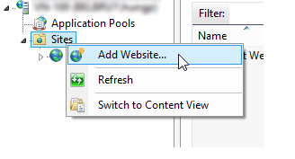

# WindowsでのAdobe Campaignへの移行7{#migrating-in-windows-for-adobe-campaign}

## 一般的な手順 {#general-procedure}

Windowsの場合、移行手順は次のとおりです。

1. サービスの停止：サービス停 [止を参照](#service-stop)、
1. データベースのバックアップ：詳しくは、デ [ータベースと現在のインストールのバックアップ](#back-up-the-database-and-the-current-installation)、
1. プラットフォームの移行：詳しくは、 [Adobe Campaign v7の導入](#deploying-adobe-campaign-v7)、
1. リダイレクトサーバー(IIS)を移行します：リダイレク [トサーバー(IIS)の移行を参照](#migrating-the-redirection-server--iis-)。
1. サービスの再開：詳しくは、 [サービスの再起動](#re-starting-the-services)、
1. 以前のAdobe Campaignバージョンを削除してクリーンアップします。詳しくは、前 [のバージョンのAdobe Campaignの削除とクレンジングを参照してください](#deleting-and-cleansing-adobe-campaign-previous-version)。

## サービス停止 {#service-stop}

まず、関連するすべてのマシン上のデータベースにアクセスできるすべてのプロセスを停止します。

1. リダイレクトモジュール(**webmdl** サービス)を使用するすべてのサーバーを停止する必要があります。 IISの場合は、次のコマンドを実行します。

   ```
   iisreset /stop
   ```

1. 次のコ **マンドを使用して** 、mtaモジュールとその子モジュール(**mtachild**)を停止する必要があります。

   ```
   nlserver stop mta@<instance name>
   nlserver stop mtachild@<instance name>
   ```

1. すべてのサーバーでAdobe Campaignサービスを停止します。 管理者権限でログインし、次のコマンドを実行します。

   ```
   net stop nlserver6
   ```

   v5.11から移行する場合は、次のコマンドを実行します。

   ```
   net stop nlserver5
   ```

1. 各サーバーで、Adobe Campaignサービスが正しく停止されていることを確認します。 管理者権限でログインし、次のコマンドを実行します。

   ```
   tasklist /FI "IMAGENAME eq nlserver*"
   ```

   アクティブなプロセスのリストとそのID(PID)が表示されます。

   ```
   Image Name                     PID Session Name        Session#    Mem Usage
   ========================= ======== ================ =========== ============
   nlserver.exe                  3192 Console                    1     13,108 K
   ```

1. 1つ以上のAdobe Campaignプロセスが、数分後もアクティブであるかブロックされている場合は、それらを強制終了します。 管理者権限でログインし、次のコマンドを実行します。

   ```
   taskkill /IM nlserver* /T
   ```

1. 数分後も一部のプロセスがアクティブなままの場合は、次のコマンドを使用して、プロセスを強制的に閉じることができます。

   ```
   taskkill /F /IM nlserver* /T
   ```

## データベースと現在のインストールのバックアップ {#back-up-the-database-and-the-current-installation}

手順は、Adobe Campaignの以前のバージョンによって異なります。

### Adobe Campaign v5.11からの移行 {#migrating-from-adobe-campaign-v5-11}

1. Adobe Campaignデータベースのバックアップを作成します。
1. 次のコマンドを使用して **Neolane v5** ディレクトリのバックアップを作成します。

   ```
   ren "Neolane v5" "Neolane v5.back"
   ```

   >[!CAUTION]
   >
   >予防策として、 **Neolane v5.backフォルダーをzip圧縮し** 、サーバー以外の安全な場所に保存することをお勧めします。

1. Windowsサービス管理コンソールで、5.11アプリケーションサーバーサービスの自動起動を無効にします。 次のコマンドも使用できます。

   ```
   sc config nlserver5 start= disabled
   ```

1. **config-`<instance name>`.xml** (Neolane v5内 **)を編集します。 back** folder)を使用して、mta **、wfserver****、** stat ****&#x200B;などの サービスが自動的に開始されない。 例えば、autoStartを **_autoStart** に置き換 **えます**。

   ```
   <?xml version='1.0'?>
   <serverconf>
     <shared>
       <dataStore hosts="myServer*" lang="en_US">
         <dataSource name="default">
           <dbcnx encrypted="1" login="myLogin" password="myPassword"  provider="postgresql" server="myServer"/>
         </dataSource>
       </dataStore>
     </shared>
   
     <mta _autoStart="true" statServerAddress="myStatServer"/>
     <stat _autoStart="true"/>
     <wfserver _autoStart="true"/>
     <inMail _autoStart="true"/>
     <sms _autoStart="false"/>
   </serverconf>
   ```

### Adobe Campaign v6.02からの移行 {#migrating-from-adobe-campaign-v6-02}

1. Adobe Campaignデータベースのバックアップを作成します。
1. 次のコマンドを使用して **Neolane v6** ディレクトリのバックアップを作成します。

   ```
   ren "Neolane v6" "Neolane v6.back"
   ```

   >[!CAUTION]
   >
   >予防策として、 **Neolane v6.backフォルダーをzip圧縮し** 、サーバー以外の安全な場所に保存することをお勧めします。

1. Windowsサービスマネージャーで、6.02アプリケーションサーバーの自動起動を非アクティブにします。 次のコマンドも使用できます。

   ```
   sc config nlserver6 start= disabled
   ```

1. **config-`<instance name>`.xml** （Neolane v6内）を **編集します。 back** folder)を使用して、mta **、wfserver****、** stat ****&#x200B;などの サービスが自動的に開始されない。 例えば、autoStartを **_autoStart** に置き換 **えます**。

   ```
   <?xml version='1.0'?>
   <serverconf>
     <shared>
       <dataStore hosts="myServer*" lang="en_US">
         <dataSource name="default">
           <dbcnx encrypted="1" login="myLogin" password="myPassword" provider="postgresql" server="myServer"/>
         </dataSource>
       </dataStore>
     </shared>
   
     <mta _autoStart="true" statServerAddress="myStatServer"/>
     <stat _autoStart="true"/>
     <wfserver _autoStart="true"/>
     <inMail _autoStart="true"/>
     <sms _autoStart="false"/>
   </serverconf>
   ```

### Adobe Campaign v6.1からの移行 {#migrating-from-adobe-campaign-v6-1}

1. Adobe Campaignデータベースのバックアップを作成します。
1. 次のコマンドを使用して **Adobe Campaign v6** ディレクトリのバックアップを作成します。

   ```
   ren "Adobe Campaign v6" "Adobe Campaign v6.back"
   ```

   >[!CAUTION]
   >
   >予防策として、 **Adobe Campaign v6.backフォルダーをzip圧縮し** 、サーバー以外の安全な場所に保存することをお勧めします。

1. Windowsサービス管理コンソールで、6.11アプリケーションサーバーサービスの自動起動を無効にします。 次のコマンドも使用できます。

   ```
   sc config nlserver6 start= disabled
   ```

## Deploying Adobe Campaign v7 {#deploying-adobe-campaign-v7}

Adobe Campaignの展開には、次の2つの段階があります。

* ビルドv7をインストールしています：この操作は、各サーバーで実行する必要があります。
* アップグレード後：このコマンドは、各インスタンスで起動する必要があります。

Adobe Campaignを導入するには、次の手順を適用します。

1. 最新のAdobe Campaign v7ビルドをインストールするには、 **setup.exeのインストールファイルを実行し** 、 WindowsでのAdobe Campaignサーバーのインストールについて詳しくは、この節を参照し [てください](../../installation/using/installing-the-server.md)。

   

   >[!NOTE]
   >
   >Adobe Campaign v7は、デフォルトでC:\Program Files\Adobe\Adobe Campaign v7ディレクトリにインストール **されます** 。

1. クライアントコンソールインストールプログラムを使用可能にするには、 **setup-client-7.0.XXXX.exeファイルをAdobe Campaignのインストールディレクトリにコピーします** 。C:\Program Files\Adobe\Adobe Campaign v7\datakit\nl\eng\jsp ****.

   >[!NOTE]
   >
   >WindowsでのAdobe Campaignのインストールについて詳しくは、この節を参照 [してください](../../installation/using/installing-the-server.md)。

1. 次のコマンドを使用して、最初に使用するインスタンスを起動します。

   ```
   net start nlserver6-v7
   net stop nlserver6-v7
   ```

   >[!NOTE]
   >
   >次の各コマンドを使用して、Adobe Campaign v7内部ファイルシステムを作成できます。 **conf** ディレクトリ( **config-default.xmlファイルと** serverConf.xmlファイル、 **var** for **** directoryなど)

1. Neolane v5.back **、Neolane v6.back**、 ********[](#back-up-the-database-and-the-current-installation)Adobe Campaign v6.backの各バックアップファイル（移行するバージョンに応じて、この節を参照）を使用して、各インスタンスの設定ファイルとサブフォルダーをコピー&amp;ペースト（上書き）します。
1. 移行元のバージョンに応じて、次のコマンドを実行します。

   ```
   copy "Neolane v5.back"/conf/config-<instance name>.xml "Adobe Campaign v7"/conf/
   copy "Neolane v5.back"/customers/* "Adobe Campaign v7"/customers/
   copy "Neolane v5.back"/var/* "Adobe Campaign v7"/var/
   ```

   ```
   copy "Neolane v6.back"/conf/config-<instance name>.xml "Adobe Campaign v7"/conf/
   copy "Neolane v6.back"/customers/* "Adobe Campaign v7"/customers/
   copy "Neolane v6.back"/var/* "Adobe Campaign v7"/var/
   ```

   ```
   copy "Adobe Campaign v6.back"/conf/config-<instance name>.xml "Adobe Campaign v7"/conf/
   copy "Adobe Campaign v6.back"/customers/* "Adobe Campaign v7"/customers/
   copy "Adobe Campaign v6.back"/var/* "Adobe Campaign v7"/var/
   ```

   >[!CAUTION]
   >
   >上記の最初のコマンドでは、 **config-default.xmlファイルをコピーしないでください** 。

1. Adobe Campaign v7の **serverConf.xml** ファイルと **** config-default.xmlファイルで、Adobe Campaignの以前のバージョンで設定した特定の設定を適用します。 serverConf.xmlフ **ァイルの場合は、** Neolane v5/conf/serverConf.xml.diff **、Neolane v6/conf/serverConf.xml.diff**、 ******** Adobe Campaign v6/conf/serverConf.xml.diffFileを使用します。

   >[!NOTE]
   >
   >以前のバージョンのAdobe CampaignからAdobe Campaign v7に設定をレポートする場合は、（Neolane v5、Neolane v6またはAdobe Campaign v6ではなく）物理ディレクトリへのパスがAdobe Campaign v7につながっていることを確認します。

1. 次のコマンドを使用して、Adobe Campaign v7の設定を再読み込みします。

   ```
   nlserver config -reload
   ```

1. 次のコマンドを使用して、アップグレード後のプロセスを開始します。

   ```
   nlserver config -postupgrade -instance:<instance name>
   ```

>[!CAUTION]
>
>まだAdobe Campaignサービスを開始しない：iisでは、一部の変更を行う必要があります。

## リダイレクトサーバー(IIS)を移行しています {#migrating-the-redirection-server--iis-}

この段階で、IISサーバーを停止する必要があります。 サービス停 [止を参照](#service-stop)。

1. インターネッ **トインフォメーションサービス(IIS)マネージャコンソールを開きます** 。
1. Adobe Campaignの以前のバージョンで使用するサイトの連結（リスンポート）を変更します。

   * Adobe Campaignの以前のバージョンで使用していたサイトを右クリックし、を選択しま **[!UICONTROL Edit bindings]**&#x200B;す。
   * リスンポートのタイプ(または&#x200B;**[!UICONTROL http]** その両方 **[!UICONTROL https]**)ごとに、適切な行を選択し、をクリックしま **[!UICONTROL Edit]**&#x200B;す。
   * 別のポートを入力してください。 デフォルトでは、リスンポートはhttpの場合は80、httpsの場合は443です。 新しいポートが使用可能であることを確認します。

      

      >[!NOTE]
      >
      >IISサーバーに、高度な設定（共有ポートと異なるIPアドレス）を持つAdobe CampaignのWebサイトが複数含まれている場合は、管理者にお問い合わせください。

1. Adobe Campaign v7用の新しいWebサイトを作成します。

   * フォルダを右クリック **[!UICONTROL Sites]** し、を選択しま **[!UICONTROL Add Web Site...]**&#x200B;す。

      

   * サイトの名前(例えば、 **Adobe Campaign v7** )を入力します。
   * Webサイトの基本ディレクトリへのアクセスパスは使用されませんが、フィールドを入力す **[!UICONTROL Physical access path]** る必要があります。 既定のIISアクセスパスを入力してください：C:\inetpub\wwwroot ****.
   * 「 **[!UICONTROL Connect as...]** as」ボタンをクリックし、オプションが選択され **[!UICONTROL Application user]** ていることを確認します。
   * およびフィールドにはデフォルト値を残すこ **[!UICONTROL IP address]** とがで **[!UICONTROL Port]** きます。 その他の値を使用する場合は、IPアドレスやポートが使用可能であることを確認します。
   * チェックボックスをオ **[!UICONTROL Start Web site immediately]** ンにします。

      

1. iis_neolane_setup.vbs **(** iis_neolane_setup.vbs)スクリプトを実行して、以前に作成した仮想ディレクトリにAdobe Campaignサーバーが使用するリソースを自動的に設定します。

   * このファイルは\tomcat-7\conf fileにあり **`[Adobe Campaign v7]`ます&#x200B;**。ここ&#x200B;**`[Adobe Campaign v7]`**では、Adobe Campaignのインストールディレクトリへのアクセスパスです。 スクリプトを実行するコマンドは次のとおりです（管理者の場合）。

      ```
      cd C:\Program Files (x86)\Adobe Campaign\Adobe Campaign v7\tomcat-7\conf
      cscript iis_neolane_setup.vbs
      ```

   * をクリックし **[!UICONTROL OK]** て、スクリプトの実行を確認します。

      

   * Adobe Campaign v7用に以前に作成したWebサイトの番号を入力し、をクリックしま **[!UICONTROL OK]**&#x200B;す。

      

   * 確認メッセージが表示されます。

      

   * タブで、Webサ **[!UICONTROL Content view]** イトの設定がAdobe Campaignリソースで正しく設定されていることを確認します。

      

      >[!NOTE]
      >
      >ツリー構造が表示されない場合は、IISを再起動します。
      >
      >この節では、次のIISの設定手順につい [て説明します](../../installation/using/integration-into-a-web-server-for-windows.md#configuring-the-iis-web-server)。

## Security zones {#security-zones}

v6.02以前から移行する場合は、サービスを開始する前にセキュリティゾーンを設定する必要があります。 詳細については、「セキュリティ」を参照し [てくださ](../../migration/using/general-configurations.md#security)い。

## サービスの再起動 {#re-starting-the-services}

次の各サーバーでIISおよびAdobe Campaignサービスを開始します。

1. トラッキングとリダイレクトサーバー。
1. ミッドソーシングサーバー。
1. マーケティングサーバー。

次の手順に進む前に、新しいインストールの完全なテストを実行し、回帰がないこと、および「一般設定」セクションの推奨事項に従ってすべての動作を確認 [します](../../migration/using/general-configurations.md) 。

## 以前のバージョンのAdobe Campaignの削除とクレンジング {#deleting-and-cleansing-adobe-campaign-previous-version}

手順は、Adobe Campaignの以前のバージョンによって異なります。

### Adobe Campaign v5 {#adobe-campaign-v5}

Adobe Campaign v5のインストールを削除してクリーンアップする前に、次の推奨事項を適用する必要があります。

* 新しいインストールの完全なチェックを実行する機能チームを招待します。
* Adobe Campaign v5は、ロールバックが必要ないことが確実な場合にのみアンインストールします。

1. IISで、Neolane v5 **webサイトを削除し、Neolane v5** アプリケーシ **** ョンプールを削除します。
1. Neolane v5. **backフォルダーの名前を** Neolane v5 **に変更します**。
1. コンポーネントの追加と削除ウィザードを使用して、Adobe Campaign v5をアンインストールします。

   

1. 次のコマンド **を使用して、nlserver5** Windowsサービスを削除します。

   ```
   sc delete nlserver5
   ```

1. サーバーを再起動します。

### Adobe Campaign v6.02 {#adobe-campaign-v6-02}

Adobe Campaign v6.02のインストールを削除してクリーニングする前に、次の推奨事項を適用する必要があります。

* 新しいインストールの完全なチェックを実行する機能チームを招待します。
* Adobe Campaign v6.02は、ロールバックが必要ないことが確実な場合にのみアンインストールします。

1. IISで、Neolane v6 **webサイトを削除し、Neolane v6** アプリケーシ **** ョンプールを削除します。
1. Neolane v6. **backフォルダーの名前を** Neolane v6 **に変更します**。
1. コンポーネントの追加と削除ウィザードを使用して、Adobe Campaign v6.02をアンインストールします。

   

1. サーバーを再起動します。

### Adobe Campaign v6.1 {#adobe-campaign-v6-1}

Adobe Campaign v6のインストールを削除してクリーニングする前に、次の推奨事項を適用する必要があります。

* 新しいインストールの完全なチェックを実行する機能チームを招待します。
* Adobe Campaign v6は、ロールバックが必要ないことが確実な場合にのみアンインストールします。

1. IISで、 **Adobe Campaign v6** webサイトを削除し、次に **Adobe Campaign v6** アプリケーションプールを削除します。
1. 「 **Adobe Campaign v6.back** 」フォルダーの名前を「 **Adobe Campaign v6**」に変更します。
1. コンポーネントの追加と削除ウィザードを使用して、Adobe Campaign v6をアンインストールします。

   

1. サーバーを再起動します。

