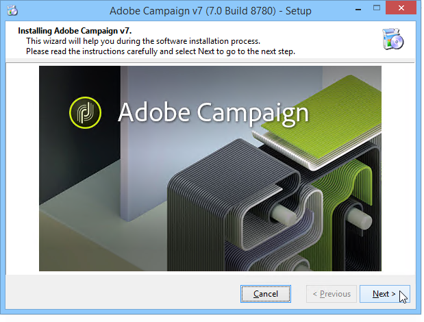
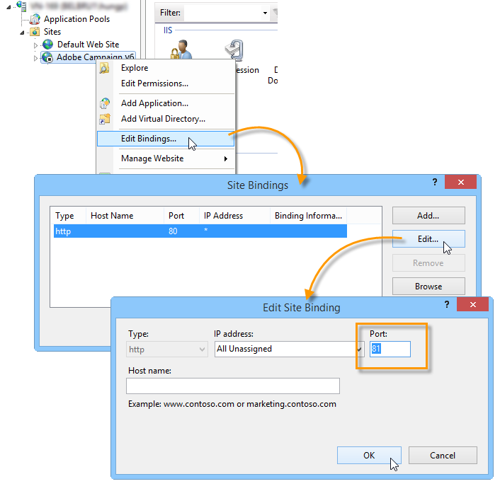
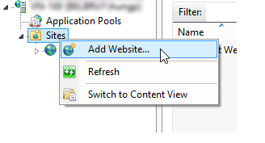
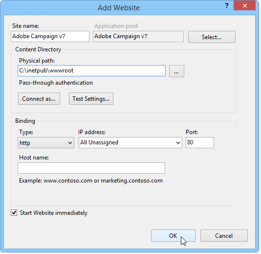
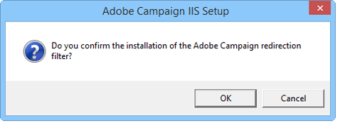
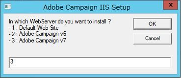
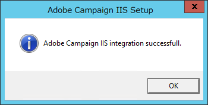
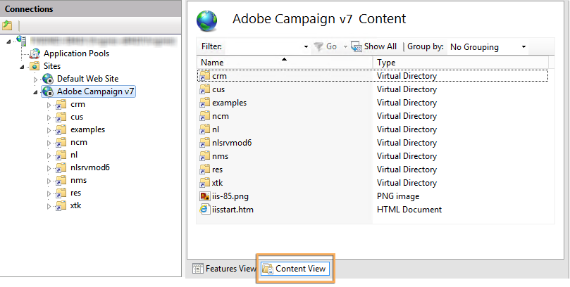
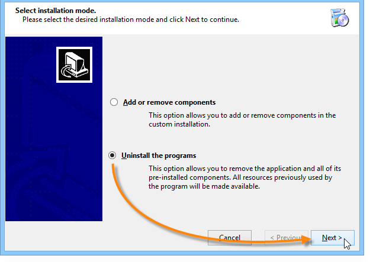

# Microsoft Windows プラットフォームをCampaign v7に移行する{#migrating-in-windows-for-adobe-campaign}


Microsoft Windows環境の場合、移行手順は次のとおりです。

1. すべてのサービスを停止 – [詳細情報](#service-stop)。
1. データベースのバックアップ - [詳細情報](#back-up-the-database)。
1. プラットフォームの移行 – [詳細情報](#deploying-adobe-campaign-v7)。
1. リダイレクト サーバー（IIS）を移行します – [詳細情報](#migrating-the-redirection-server--iis-)。
1. サービスを再起動します – [詳細情報](#re-starting-the-services)。
1. 以前のAdobe Campaign バージョンを削除して削除します – [詳細情報](#deleting-and-cleansing-adobe-campaign-previous-version)。

## サービス停止 {#service-stop}

まず、関係するすべてのマシン上のデータベースにアクセスするすべてのプロセスを停止します。

1. リダイレクトモジュール （**webmdl** サービス）を使用しているすべてのサーバーを停止する必要があります。 IISの場合は、次のコマンドを実行します。

   ```
   iisreset /stop
   ```

1. **mta** モジュールとその子モジュール （**mtachild**）は、次のコマンドを使用して停止する必要があります。

   ```
   nlserver stop mta@<instance name>
   nlserver stop mtachild@<instance name>
   ```

1. すべてのサーバーでAdobe Campaign サービスを停止します。 管理者権限でログインし、次のコマンドを実行します。

   ```
   net stop nlserver6
   ```

<!--

   If you are migrating from v5.11, run the following command:

   ```
   net stop nlserver5
   ```

-->

1. 各サーバーについて、Adobe Campaign サービスが適切に停止されていることを確認します。 管理者権限でログインし、次のコマンドを実行します。

   ```
   tasklist /FI "IMAGENAME eq nlserver*"
   ```

   アクティブなプロセスのリストとそのID （PID）が表示されます。

   ```
   Image Name                     PID Session Name        Session#    Mem Usage
   ========================= ======== ================ =========== ============
   nlserver.exe                  3192 Console                    1     13,108 K
   ```

1. 1つ以上のAdobe Campaign プロセスがまだアクティブであるか、数分後にブロックされている場合は、それらを殺します。 管理者権限でログインし、次のコマンドを実行します。

   ```
   taskkill /IM nlserver* /T
   ```

1. 数分後に一部のプロセスがまだアクティブな場合は、コマンドを使用して強制的に閉じることができます。

   ```
   taskkill /F /IM nlserver* /T
   ```

## Campaign データベースのバックアップ {#back-up-the-database}

Adobe Campaign v6.1をバックアップする手順は次のとおりです。

<!--

### For Adobe Campaign v5.11 {#migrating-from-adobe-campaign-v5-11}

1. Make a backup of the Adobe Campaign database.
1. Make a backup of the **Neolane v5** directory using the following command:

   ```
   ren "Neolane v5" "Neolane v5.back"
   ```

   >[!IMPORTANT]
   >
   >As a precaution, we recommend that you zip the **Neolane v5.back** folder and save it elsewhere in a safe location other than the server.

1. In the windows service management console, disable the automatic startup of the 5.11 application server service. You can also use the following command:

   ```
   sc config nlserver5 start= disabled
   ```

1. Edit the **config-`<instance name>`.xml** (in the **Neolane v5. back** folder) to prevent the **mta**, **wfserver**, **stat**, etc. services from starting automatically. For instance, replace **autoStart** with **_autoStart**.

   ```
   <?xml version='1.0'?>
   <serverconf>
     <shared>
       <dataStore hosts="myServer*" lang="en_US">
         <dataSource name="default">
           <dbcnx encrypted="1" login="myLogin" password="myPassword"  provider="postgresql" server="myServer"/>
         </dataSource>
       </dataStore>
     </shared>
   
     <mta _autoStart="true" statServerAddress="myStatServer"/>
     <stat _autoStart="true"/>
     <wfserver _autoStart="true"/>
     <inMail _autoStart="true"/>
     <sms _autoStart="false"/>
   </serverconf>
   ```

-->

<!--
### For Adobe Campaign v6.02 {#migrating-from-adobe-campaign-v6-02}

1. Make a backup of the Adobe Campaign database.
1. Make a backup of the **Neolane v6** directory using the following command:

   ```
   ren "Neolane v6" "Neolane v6.back"
   ```

   >[!IMPORTANT]
   >
   >As a precaution, we recommend that you zip the **Neolane v6.back** folder and save it elsewhere in a safe location other than the server.

1. In the Windows service manager, deactivate the 6.02 application server automatic startup. You can also use the following command:

   ```
   sc config nlserver6 start= disabled
   ```

1. Edit the **config-`<instance name>`.xml** (in the **Neolane v6. back** folder) to prevent the **mta**, **wfserver**, **stat**, etc. services from starting automatically. For instance, replace **autoStart** with **_autoStart**.

   ```
   <?xml version='1.0'?>
   <serverconf>
     <shared>
       <dataStore hosts="myServer*" lang="en_US">
         <dataSource name="default">
           <dbcnx encrypted="1" login="myLogin" password="myPassword" provider="postgresql" server="myServer"/>
         </dataSource>
       </dataStore>
     </shared>
   
     <mta _autoStart="true" statServerAddress="myStatServer"/>
     <stat _autoStart="true"/>
     <wfserver _autoStart="true"/>
     <inMail _autoStart="true"/>
     <sms _autoStart="false"/>
   </serverconf>
   ```

-->

1. Adobe Campaign データベースのバックアップを作成します。
1. 次のコマンドを使用して、**Adobe Campaign v6** ディレクトリのバックアップを作成します。

   ```
   ren "Adobe Campaign v6" "Adobe Campaign v6.back"
   ```

   >[!IMPORTANT]
   >
   >予防策として、**Adobe Campaign v6.back** フォルダーをzip圧縮し、サーバー以外の安全な場所に保存することをお勧めします。

1. Windows サービス管理コンソールで、6.11 アプリケーションサーバーサービスの自動起動を無効にします。 次のコマンドを使用することもできます。

   ```
   sc config nlserver6 start= disabled
   ```

## Adobe Campaign v7のデプロイ {#deploying-adobe-campaign-v7}

Adobe Campaignのデプロイには、次の2つの段階があります。

* ビルド v7のインストール：この操作は各サーバーで実行する必要があります。
* アップグレード後：このコマンドは、各インスタンスで起動する必要があります。

Adobe Campaignをデプロイするには、次の手順を実行します。

1. **setup.exe** インストール ファイルを実行して、最新のAdobe Campaign v7 ビルドをインストールします。 WindowsでのAdobe Campaign Serverのインストールについて詳しくは、[この節](../../installation/using/installing-the-server.md)を参照してください。

   

   >[!NOTE]
   >
   >Adobe Campaign v7は、デフォルトで&#x200B;**C:\Program Files\Adobe\Adobe Campaign v7** ディレクトリにインストールされます。

1. クライアントコンソールのインストールプログラムを使用できるようにするには、**setup-client-7.0.XXXX.exe** ファイルをAdobe Campaign インストールディレクトリ **C:\Program Files\Adobe\Adobe Campaign v7\datakit\nl\eng\jsp**&#x200B;にコピーします。

   >[!NOTE]
   >
   >WindowsへのAdobe Campaignのインストールについて詳しくは、[この節](../../installation/using/installing-the-server.md)を参照してください。

1. 次のコマンドを使用して、最初に使用するインスタンスを開始します。

   ```
   net start nlserver6-v7
   net stop nlserver6-v7
   ```

   >[!NOTE]
   >
   >これらのコマンドを使用すると、Adobe Campaign v7の内部ファイルシステム **conf** ディレクトリ（**config-default.xml**&#x200B;および&#x200B;**serverConf.xml** ファイル）、**var** ディレクトリなどを作成できます。

1. 各インスタンスの設定ファイルとサブフォルダーを、**Neolane v5.back**、**Neolane v6.back**&#x200B;または&#x200B;**Adobe Campaign v6.back** バックアップファイルを介してコピー&amp;ペースト（上書き）します（移行元のバージョンによって異なります。このセクションは[を参照](#back-up-the-database-and-the-current-installation)）。
1. 移行元のバージョンに応じて、次のコマンドを実行します。

   ```
   copy "Neolane v5.back"/conf/config-<instance name>.xml "Adobe Campaign v7"/conf/
   copy "Neolane v5.back"/customers/* "Adobe Campaign v7"/customers/
   copy "Neolane v5.back"/var/* "Adobe Campaign v7"/var/
   ```

   ```
   copy "Neolane v6.back"/conf/config-<instance name>.xml "Adobe Campaign v7"/conf/
   copy "Neolane v6.back"/customers/* "Adobe Campaign v7"/customers/
   copy "Neolane v6.back"/var/* "Adobe Campaign v7"/var/
   ```

   ```
   copy "Adobe Campaign v6.back"/conf/config-<instance name>.xml "Adobe Campaign v7"/conf/
   copy "Adobe Campaign v6.back"/customers/* "Adobe Campaign v7"/customers/
   copy "Adobe Campaign v6.back"/var/* "Adobe Campaign v7"/var/
   ```

   >[!IMPORTANT]
   >
   >上記の最初のコマンドでは、**config-default.xml** ファイルをコピーしないでください。

1. Adobe Campaign v7の&#x200B;**serverConf.xml**&#x200B;および&#x200B;**config-default.xml** ファイルで、以前のバージョンのAdobe Campaignで使用していた特定の設定を適用します。 **serverConf.xml** ファイルの場合、**Neolane v5/conf/serverConf.xml.diff**、**Neolane v6/conf/serverConf.xml.diff**&#x200B;または&#x200B;**Adobe Campaign v6/conf/serverConf.xml.diff** ファイルを使用します。

   >[!NOTE]
   >
   >Adobe Campaignの以前のバージョンからAdobe Campaign v7に設定をレポートする場合は、物理ディレクトリへのパスがAdobe Campaign v7 （Neolane v5、Neolane v6またはAdobe Campaign v6ではなく）に導かれることを確認します。

1. 次のコマンドを使用して、Adobe Campaign v7設定をリロードします。

   ```
   nlserver config -reload
   ```

1. 次のコマンドを使用して、アップグレード後のプロセスを開始します。

   ```
   nlserver config -postupgrade -instance:<instance name>
   ```

>[!IMPORTANT]
>
>まだAdobe Campaign サービスを開始しません。IISで変更を行う必要があります。

## リダイレクトサーバーの移行 {#migrating-the-redirection-server--iis-}

この段階で、IIS サーバーを停止する必要があります。 [ サービス停止](#service-stop)を参照してください。

1. **インターネット インフォメーション サービス （IIS） マネージャー** コンソールを開きます。
1. Adobe Campaignの以前のバージョンで使用していたサイトのバインディング（リッスン ポート）を変更します。

   * Adobe Campaignの以前のバージョンで使用されているサイトを右クリックし、**[!UICONTROL バインディングを編集]**&#x200B;を選択します。
   * リッスン ポート （**[!UICONTROL http]**&#x200B;または&#x200B;**[!UICONTROL https]**）の各タイプについて、適切な行を選択し、**[!UICONTROL 編集]**&#x200B;をクリックします。
   * 別のポートを入力してください。 デフォルトでは、リッスンポートはhttpで80、httpsで443です。 新しいポートが使用可能であることを確認します。

     

     >[!NOTE]
     >
     >IIS サーバーに、高度な設定（共有ポートと異なるIP アドレス）を持つAdobe Campaign用の複数のWeb サイトが含まれている場合は、管理者にお問い合わせください。

1. Adobe Campaign v7用の新しいweb サイトを作成します。

   * **[!UICONTROL Sites]** フォルダーを右クリックし、**[!UICONTROL Web サイトを追加…]**&#x200B;を選択します。

     

   * サイトの名前（**Adobe Campaign v7**）を入力します。
   * Web サイトの基本ディレクトリへのアクセスパスは使用されませんが、**[!UICONTROL 物理アクセスパス]** フィールドを入力する必要があります。 既定のIIS アクセス パス **C:\inetpub\wwwroot**&#x200B;を入力します。
   * 「**[!UICONTROL 別名で接続…]**」ボタンをクリックし、「**[!UICONTROL アプリケーションユーザー]**」オプションが選択されていることを確認します。
   * デフォルト値は、**[!UICONTROL IP アドレス]**&#x200B;および&#x200B;**[!UICONTROL ポート]** フィールドに残すことができます。 他の値を使用する場合は、IP アドレスまたはポートが使用可能であることを確認します。
   * 「**[!UICONTROL すぐにWeb サイトを開始する]**」ボックスをオンにします。

     

1. **iis_neolane_setup.vbs** スクリプトを実行して、以前に作成したバーチャル ディレクトリでAdobe Campaign サーバーが使用するリソースを自動設定します。

   * このファイルは、**`[Adobe Campaign v7]`\conf** ディレクトリにあります。このディレクトリには、**`[Adobe Campaign v7]`**&#x200B;がAdobe Campaign インストールディレクトリへのアクセスパスです。 スクリプトを実行するコマンドは次のとおりです（管理者の場合）。

     ```
     cd C:\Program Files (x86)\Adobe Campaign\Adobe Campaign v7\conf
     cscript iis_neolane_setup.vbs
     ```

   * 「**[!UICONTROL OK]**」をクリックして、スクリプトの実行を確認します。

     

   * Adobe Campaign v7用に以前に作成したweb サイトの番号を入力し、**[!UICONTROL OK]**&#x200B;をクリックします。

     

   * 確認メッセージが表示されます。

     

   * 「**[!UICONTROL コンテンツ表示]**」タブで、Adobe Campaign リソースを使用してWeb サイト設定が正しく設定されていることを確認します。

     

     >[!NOTE]
     >
     >ツリー構造が表示されない場合は、IISを再起動します。
     >
     >次のIIS設定手順について詳しくは、[この節](../../installation/using/integration-into-a-web-server-for-windows.md#configuring-the-iis-web-server)を参照してください。

<!--
## Security zones {#security-zones}

If you are migrating from v6.02 or earlier, you must configure your security zones before starting services. [Learn more](../../migration/using/general-configurations.md#security)
-->

## サービスを再開する {#re-starting-the-services}

次の各サーバーでIIS サービスとAdobe Campaign サービスを開始します。

1. トラッキングおよびリダイレクションサーバー：
1. ミッドソーシングサーバー：
1. マーケティングサーバー：

次のステップに進む前に、新しいインストールの完全なテストを実行し、リグレッションがなく、すべてが機能することを確認します。

## 以前のバージョンを削除 {#deleting-and-cleansing-adobe-campaign-previous-version}

Adobe Campaign v6.1を削除する手順は次のとおりです。

<!--

### For Adobe Campaign v5 {#adobe-campaign-v5}

Before you delete and cleanse the Adobe Campaign v5 installation, you must apply the following recommendations:

* Get the functional teams to run a full check of the new installation.
* Only uninstall Adobe Campaign v5 once you are certain that no rollback is necessary.

1. In IIS, delete the **Neolane v5** website, then the **Neolane v5** application pool. 
1. Rename the **Neolane v5.back** folder as **Neolane v5**.
1. Uninstall Adobe Campaign v5 using the Add/remove components assistant. 

   

1. Delete the **nlserver5** Windows service using the following command:

   ```
   sc delete nlserver5
   ```

1. Re-start the server.

### For Adobe Campaign v6.02 {#adobe-campaign-v6-02}

Before you delete and cleanse the Adobe Campaign v6.02 installation, you must apply the following recommendations:

* Get the functional teams to run a full check of the new installation.
* Only uninstall Adobe Campaign v6.02 once you are certain that no rollback is necessary.

1. In IIS, delete the **Neolane v6** website, then the **Neolane v6** application pool. 
1. Rename the **Neolane v6.back** folder as **Neolane v6**.
1. Uninstall Adobe Campaign v6.02 using the Add/remove components assistant. 

   

1. Re-start the server.

-->

Adobe Campaign v6 インストールを削除してクレンジングする前に、次の推奨事項を適用する必要があります。

* 機能部門に、新しいインストールのフルチェックを依頼します。
* ロールバックが不要であることが確認できたら、Adobe Campaign v6のみをアンインストールします。

1. IISで、**Adobe Campaign v6** web サイトを削除してから、**Adobe Campaign v6** アプリケーションプールを削除します。
1. **Adobe Campaign v6.back** フォルダーを&#x200B;**Adobe Campaign v6**&#x200B;に変更します。
1. コンポーネントの追加と削除アシスタントを使用して、Adobe Campaign v6をアンインストールします。

   

1. サーバーを再起動します。
