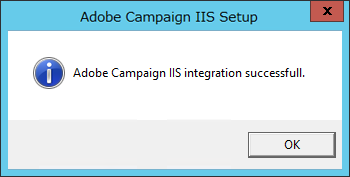

# Windows での Adobe Campaign 7 への移行{#migrating-in-windows-for-adobe-campaign}


## 一般的な手順 {#general-procedure}

Windows の場合、移行手順は次のとおりです。

1. サービスの停止：[ サービス停止 ](#service-stop) を参照してください。
1. データベースのバックアップ：[ データベースと現在のインストールのバックアップ ](#back-up-the-database-and-the-current-installation) を参照してください。
1. プラットフォームの移行：[Adobe Campaign v7 のデプロイ ](#deploying-adobe-campaign-v7) を参照してください。
1. リダイレクションサーバー (IIS) を移行します。[ リダイレクションサーバー (IIS)](#migrating-the-redirection-server--iis-) を参照してください。
1. サービスの再起動：[ サービスの再起動 ](#re-starting-the-services) を参照してください。
1. 以前のバージョンのAdobe Campaignを削除してクレンジングする：[ 以前のバージョンのAdobe Campaignの削除とクレンジング ](#deleting-and-cleansing-adobe-campaign-previous-version) を参照してください。

## サービス停止 {#service-stop}

まず、関係するすべてのマシン上のデータベースにアクセスできるすべてのプロセスを停止します。

1. リダイレクトモジュール（**webmdl** サービス）を使用するすべてのサーバーを停止する必要があります。 IIS の場合は、次のコマンドを実行します。

   ```
   iisreset /stop
   ```

1. **mta** モジュールとその子モジュール (**mtachild**) は、次のコマンドを使用して停止する必要があります。

   ```
   nlserver stop mta@<instance name>
   nlserver stop mtachild@<instance name>
   ```

1. すべてのサーバーでAdobe Campaignサービスを停止します。 管理者権限でログインし、次のコマンドを実行します。

   ```
   net stop nlserver6
   ```

   バージョン 5.11 から移行する場合は、次のコマンドを実行します。

   ```
   net stop nlserver5
   ```

1. 各サーバーで、Adobe Campaignサービスが正しく停止されていることを確認します。 管理者権限でログインし、次のコマンドを実行します。

   ```
   tasklist /FI "IMAGENAME eq nlserver*"
   ```

   アクティブなプロセスとその ID(PID) のリストが表示されます。

   ```
   Image Name                     PID Session Name        Session#    Mem Usage
   ========================= ======== ================ =========== ============
   nlserver.exe                  3192 Console                    1     13,108 K
   ```

1. 数分後も 1 つ以上のAdobe Campaignプロセスがアクティブまたはブロックされている場合は、それらを強制終了します。 管理者権限でログインし、次のコマンドを実行します。

   ```
   taskkill /IM nlserver* /T
   ```

1. 数分後もアクティブなプロセスがある場合は、次のコマンドを使用して、プロセスを強制的に閉じることができます。

   ```
   taskkill /F /IM nlserver* /T
   ```

## データベースと現在のインストールのバックアップ {#back-up-the-database-and-the-current-installation}

手順は、以前のバージョンのAdobe Campaignによって異なります。

### Adobe Campaign v5.11 からの移行 {#migrating-from-adobe-campaign-v5-11}

1. Adobe Campaignデータベースのバックアップを作成します。
1. 次のコマンドを使用して、**Neolane v5** ディレクトリのバックアップを作成します。

   ```
   ren "Neolane v5" "Neolane v5.back"
   ```

   >[!IMPORTANT]
   >
   >予防策として、**Neolane v5.back** フォルダーを zip で圧縮し、サーバー以外の安全な場所に保存することをお勧めします。

1. Windows サービス管理コンソールで、5.11 アプリケーションサーバーサービスの自動起動を無効にします。 次のコマンドも使用できます。

   ```
   sc config nlserver5 start= disabled
   ```

1. **config-`<instance name>`.xml** を編集します（**Neolane v5 内）。** フォルダーに戻る ) をクリックして、**mta**、**wfserver**、**stat** などを防ぎます。 サービスが自動的に開始されない問題を修正しました。 例えば、 **autoStart** を **_autoStart** に置き換えます。

   ```
   <?xml version='1.0'?>
   <serverconf>
     <shared>
       <dataStore hosts="myServer*" lang="en_US">
         <dataSource name="default">
           <dbcnx encrypted="1" login="myLogin" password="myPassword"  provider="postgresql" server="myServer"/>
         </dataSource>
       </dataStore>
     </shared>
   
     <mta _autoStart="true" statServerAddress="myStatServer"/>
     <stat _autoStart="true"/>
     <wfserver _autoStart="true"/>
     <inMail _autoStart="true"/>
     <sms _autoStart="false"/>
   </serverconf>
   ```

### Adobe Campaign v6.02 からの移行 {#migrating-from-adobe-campaign-v6-02}

1. Adobe Campaignデータベースのバックアップを作成します。
1. 次のコマンドを使用して、**Neolane v6** ディレクトリのバックアップを作成します。

   ```
   ren "Neolane v6" "Neolane v6.back"
   ```

   >[!IMPORTANT]
   >
   >予防策として、**Neolane v6.back** フォルダーを zip ファイルにして、サーバー以外の安全な場所に保存することをお勧めします。

1. Windows サービスマネージャで、6.02 アプリケーションサーバーの自動起動を無効にします。 次のコマンドも使用できます。

   ```
   sc config nlserver6 start= disabled
   ```

1. **config-`<instance name>`.xml** を編集します（**Neolane v6 内）。** フォルダーに戻る ) をクリックして、**mta**、**wfserver**、**stat** などを防ぎます。 サービスが自動的に開始されない問題を修正しました。 例えば、 **autoStart** を **_autoStart** に置き換えます。

   ```
   <?xml version='1.0'?>
   <serverconf>
     <shared>
       <dataStore hosts="myServer*" lang="en_US">
         <dataSource name="default">
           <dbcnx encrypted="1" login="myLogin" password="myPassword" provider="postgresql" server="myServer"/>
         </dataSource>
       </dataStore>
     </shared>
   
     <mta _autoStart="true" statServerAddress="myStatServer"/>
     <stat _autoStart="true"/>
     <wfserver _autoStart="true"/>
     <inMail _autoStart="true"/>
     <sms _autoStart="false"/>
   </serverconf>
   ```

### Adobe Campaign v6.1 からの移行 {#migrating-from-adobe-campaign-v6-1}

1. Adobe Campaignデータベースのバックアップを作成します。
1. 次のコマンドを使用して、**Adobe Campaign v6** ディレクトリのバックアップを作成します。

   ```
   ren "Adobe Campaign v6" "Adobe Campaign v6.back"
   ```

   >[!IMPORTANT]
   >
   >予防策として、**Adobe Campaign v6.back** フォルダーを zip ファイルにして、サーバー以外の安全な場所に保存することをお勧めします。

1. Windows サービス管理コンソールで、6.11 アプリケーションサーバーサービスの自動起動を無効にします。 次のコマンドも使用できます。

   ```
   sc config nlserver6 start= disabled
   ```

## Adobe Campaign v7 のデプロイ {#deploying-adobe-campaign-v7}

Adobe Campaignのデプロイには、次の 2 つの段階があります。

* ビルド v7 のインストール：この操作は、各サーバーで実行する必要があります。
* アップグレード後：このコマンドは、各インスタンスで開始する必要があります。

Adobe Campaignをデプロイするには、次の手順に従います。

1. **setup.exe** インストールファイルを実行して、最新のAdobe Campaign v7 ビルドをインストールします。 Windows でのAdobe Campaignサーバーのインストールについて詳しくは、[ この節 ](../../installation/using/installing-the-server.md) を参照してください。

   

   >[!NOTE]
   >
   >Adobe Campaign v7 は、デフォルトで **C:\Program Files\Adobe\Adobe Campaign v7** ディレクトリにインストールされます。

1. クライアントコンソールのインストールプログラムを使用可能にするには、**setup-client-7.0.XXXX.exe** ファイルをAdobe Campaignのインストールディレクトリにコピーします。**C:\Program Files\Adobe\Adobe Campaign v7\datakit\nl\eng\jsp**.

   >[!NOTE]
   >
   >Windows でのAdobe Campaignのインストールについて詳しくは、[ この節 ](../../installation/using/installing-the-server.md) を参照してください。

1. 次のコマンドを使用して、最初の使用のインスタンスを起動します。

   ```
   net start nlserver6-v7
   net stop nlserver6-v7
   ```

   >[!NOTE]
   >
   >次のコマンドを使用して、Adobe Campaign v7 の内部ファイルシステムを作成できます。**conf** ディレクトリ（**config-default.xml** および **serverConf.xml** ファイルを含む）、**var** ディレクトリなど

1. **Neolane v5.back**、**Neolane v6.back** または **Adobe Campaign v6.back** バックアップファイルを使用して、各インスタンスの設定ファイルとサブフォルダーをコピーして貼り付けます（移行元のバージョンに応じて異なります）。[](#back-up-the-database-and-the-current-installation)
1. 移行元のバージョンに応じて、次のコマンドを実行します。

   ```
   copy "Neolane v5.back"/conf/config-<instance name>.xml "Adobe Campaign v7"/conf/
   copy "Neolane v5.back"/customers/* "Adobe Campaign v7"/customers/
   copy "Neolane v5.back"/var/* "Adobe Campaign v7"/var/
   ```

   ```
   copy "Neolane v6.back"/conf/config-<instance name>.xml "Adobe Campaign v7"/conf/
   copy "Neolane v6.back"/customers/* "Adobe Campaign v7"/customers/
   copy "Neolane v6.back"/var/* "Adobe Campaign v7"/var/
   ```

   ```
   copy "Adobe Campaign v6.back"/conf/config-<instance name>.xml "Adobe Campaign v7"/conf/
   copy "Adobe Campaign v6.back"/customers/* "Adobe Campaign v7"/customers/
   copy "Adobe Campaign v6.back"/var/* "Adobe Campaign v7"/var/
   ```

   >[!IMPORTANT]
   >
   >上記の最初のコマンドの場合は、**config-default.xml** ファイルをコピーしないでください。

1. Adobe Campaign v7 の **serverConf.xml** ファイルと **config-default.xml** ファイルで、Adobe Campaignの以前のバージョンの設定を適用します。 **serverConf.xml** ファイルの場合は、**Neolane v5/conf/serverConf.xml.diff**、**Neolane v6/conf/serverConf.xml.diff** または **Adobe Campaign v6/conf/serverConf.xml.diff** ファイルを使用します。

   >[!NOTE]
   >
   >Adobe Campaignの以前のバージョンからAdobe Campaign v7 に設定をレポートする場合、物理ディレクトリへのパスがAdobe Campaign v7 に続くことを確認します (Neolane v5、Neolane v6 またはAdobe Campaign v6 ではなく )。

1. 次のコマンドを使用して、Adobe Campaign v7 設定を再読み込みします。

   ```
   nlserver config -reload
   ```

1. 次のコマンドを使用して、アップグレード後のプロセスを開始します。

   ```
   nlserver config -postupgrade -instance:<instance name>
   ```

>[!IMPORTANT]
>
>まだAdobe Campaignサービスを開始しない：IIS でいくつかの変更を加える必要があります。

## リダイレクションサーバー (IIS) の移行 {#migrating-the-redirection-server--iis-}

この段階で、IIS サーバーを停止する必要があります。 [ サービス停止 ](#service-stop) を参照してください。

1. **インターネットインフォメーションサービス (IIS) マネージャー** コンソールを開きます。
1. Adobe Campaignの以前のバージョンで使用するサイトのバインディング（リスンポート）を変更します。

   * Adobe Campaignの以前のバージョンで使用していたサイトを右クリックし、「**[!UICONTROL バインドを編集]**」を選択します。
   * リスンポートのタイプ（**[!UICONTROL http]** や **[!UICONTROL https]**）ごとに、適切な行を選択して「**[!UICONTROL 編集]**」をクリックします。
   * 別のポートを入力してください。 デフォルトでは、リスンポートは http の場合は 80、https の場合は 443 です。 新しいポートが使用可能であることを確認します。

      

      >[!NOTE]
      >
      >IIS サーバーに、高度な設定（共有ポートと異なる IP アドレス）を持つAdobe Campaign用の Web サイトが複数含まれている場合は、管理者に問い合わせてください。

1. Adobe Campaign v7 の新しい Web サイトの作成：

   * **[!UICONTROL Sites]** フォルダーを右クリックし、「**[!UICONTROL Web サイトを追加…」を選択します。]**.

      

   * サイトの名前 ( 例：**Adobe Campaign v7**) を入力します。
   * Web サイトの基本ディレクトリへのアクセスパスは使用されませんが、**[!UICONTROL 物理アクセスパス]** フィールドに入力する必要があります。 デフォルトの IIS アクセスパスを入力：**C:\inetpub\wwwroot**.
   * 「**[!UICONTROL 次として接続…」をクリックします。]** をボタンとして追加し、「**[!UICONTROL アプリケーションユーザー]**」オプションが選択されていることを確認します。
   * デフォルト値は「**[!UICONTROL IP アドレス]**」フィールドと「**[!UICONTROL ポート]**」フィールドに残すことができます。 他の値を使用する場合は、IP アドレスやポートが使用可能であることを確認します。
   * 「**[!UICONTROL Web サイトをすぐに開始]**」ボックスをオンにします。

      

1. **iis_neolane_setup.vbs** スクリプトを実行して、先ほど作成した仮想ディレクトリ上のAdobe Campaignサーバーが使用するリソースを自動的に設定します。

   * このファイルは、**`[Adobe Campaign v7]`\conf** ディレクトリにあります。ここで **`[Adobe Campaign v7]`** は、Adobe Campaignのインストールディレクトリへのアクセスパスです。 スクリプトを実行するコマンドは次のとおりです（管理者の場合）。

      ```
      cd C:\Program Files (x86)\Adobe Campaign\Adobe Campaign v7\conf
      cscript iis_neolane_setup.vbs
      ```

   * 「**[!UICONTROL OK]**」をクリックして、スクリプトの実行を確定します。

      

   * 以前にAdobe Campaign v7 用に作成した Web サイトの番号を入力し、「**[!UICONTROL OK]**」をクリックします。

      

   * 次の確認メッセージが表示されます。

      

   * 「**[!UICONTROL コンテンツビュー]**」タブで、Web サイトの設定がAdobe Campaignのリソースで正しく設定されていることを確認します。

      

      >[!NOTE]
      >
      >ツリー構造が表示されない場合は、IIS を再起動します。
      >
      >次の IIS の設定手順については、[ この節 ](../../installation/using/integration-into-a-web-server-for-windows.md#configuring-the-iis-web-server) で詳しく説明します。

## セキュリティゾーン {#security-zones}

v6.02 以前から移行する場合は、サービスを開始する前にセキュリティゾーンを設定する必要があります。 詳しくは、[ セキュリティ ](../../migration/using/general-configurations.md#security) を参照してください。

## サービスの再起動 {#re-starting-the-services}

次の各サーバーで IIS とAdobe Campaignサービスを開始します。

1. 追跡サーバーとリダイレクトサーバー。
1. ミッドソーシングサーバー.
1. マーケティングサーバー。

次の手順に進む前に、新しいインストールの完全なテストを実行し、不具合がなく、[ 一般設定 ](../../migration/using/general-configurations.md) セクションの推奨事項に従ってすべての動作を確認します。

## 以前のバージョンのAdobe Campaignの削除とクレンジング {#deleting-and-cleansing-adobe-campaign-previous-version}

手順は、以前のバージョンのAdobe Campaignによって異なります。

### Adobe Campaign v5 {#adobe-campaign-v5}

Adobe Campaign v5 のインストールを削除してクレンジングする前に、次の推奨事項を適用する必要があります。

* 機能チームに新しいインストールの完全なチェックを実行してもらう。
* ロールバックが必要ないことが確実である場合は、Adobe Campaign v5 をアンインストールしてください。

1. IIS で、**Neolane v5** Web サイトを削除し、**Neolane v5** アプリケーションプールを削除します。
1. **Neolane v5.back** フォルダーの名前を **Neolane v5** に変更します。
1. コンポーネントの追加と削除ウィザードを使用してAdobe Campaign v5 をアンインストールします。

   

1. 次のコマンドを使用して、**nlserver5** Windows サービスを削除します。

   ```
   sc delete nlserver5
   ```

1. サーバーを再起動します。

### Adobe Campaign v6.02 {#adobe-campaign-v6-02}

Adobe Campaign v6.02 のインストールを削除してクレンジングする前に、次の推奨事項を適用する必要があります。

* 機能チームに新しいインストールの完全なチェックを実行してもらう。
* ロールバックが必要ないことが確実である場合は、Adobe Campaign v6.02 のみをアンインストールします。

1. IIS で、**Neolane v6** Web サイトを削除し、**Neolane v6** アプリケーションプールを削除します。
1. **Neolane v6.back** フォルダーの名前を **Neolane v6** に変更します。
1. コンポーネントの追加と削除ウィザードを使用してAdobe Campaign v6.02 をアンインストールします。

   

1. サーバーを再起動します。

### Adobe Campaign v6.1 {#adobe-campaign-v6-1}

Adobe Campaign v6 のインストールを削除してクレンジングする前に、次の推奨事項を適用する必要があります。

* 機能チームに新しいインストールの完全なチェックを実行してもらう。
* ロールバックが必要ないことが確実である場合は、Adobe Campaign v6 をアンインストールしてください。

1. IIS で、**Adobe Campaign v6** Web サイトを削除し、**Adobe Campaign v6** アプリケーションプールを削除します。
1. **Adobe Campaign v6.back** フォルダーの名前を **Adobe Campaign v6** に変更します。
1. コンポーネントの追加と削除ウィザードを使用してAdobe Campaign v6 をアンインストールします。

   

1. サーバーを再起動します。
