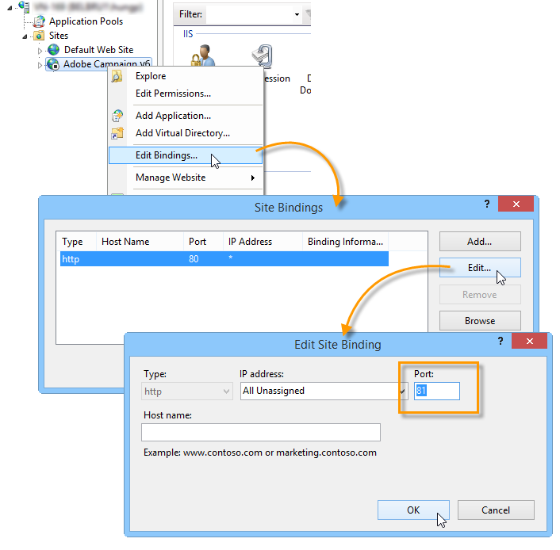

# Microsoft Windows プラットフォームの Campaign v7 への移行{#migrating-in-windows-for-adobe-campaign}


Microsoft Windows 環境の場合の移行手順は次のとおりです。

1. すべてのサービスを停止 — [詳細情報](#service-stop).
1. データベースのバックアップ — [詳細情報](#back-up-the-database).
1. プラットフォームの移行 — [詳細情報](#deploying-adobe-campaign-v7).
1. リダイレクトサーバー (IIS) を移行します — [詳細情報](#migrating-the-redirection-server--iis-).
1. サービスを再開 — [詳細情報](#re-starting-the-services).
1. 以前のバージョンのAdobe Campaignを削除して消去します — [詳細情報](#deleting-and-cleansing-adobe-campaign-previous-version).

## サービス停止 {#service-stop}

まず、関係するすべてのマシン上のデータベースにアクセスして、すべてのプロセスを停止します。

1. リダイレクトモジュールを使用するすべてのサーバー (**webmdl** サービス ) を停止する必要があります。 IIS の場合は、次のコマンドを実行します。

   ```
   iisreset /stop
   ```

1. The **mta** モジュールとその子モジュール (**mtachild**) は、次のコマンドを使用して停止する必要があります。

   ```
   nlserver stop mta@<instance name>
   nlserver stop mtachild@<instance name>
   ```

1. すべてのサーバーでAdobe Campaignサービスを停止します。 管理者権限でログインし、次のコマンドを実行します。

   ```
   net stop nlserver6
   ```

<!--

   If you are migrating from v5.11, run the following command:

   ```
   net stop nlserver5
   ```

-->

1. 各サーバーで、Adobe Campaignサービスが正しく停止されていることを確認します。 管理者権限でログインし、次のコマンドを実行します。

   ```
   tasklist /FI "IMAGENAME eq nlserver*"
   ```

   アクティブなプロセスのリストとその ID(PID) が表示されます。

   ```
   Image Name                     PID Session Name        Session#    Mem Usage
   ========================= ======== ================ =========== ============
   nlserver.exe                  3192 Console                    1     13,108 K
   ```

1. 数分後に 1 つ以上のAdobe Campaignプロセスがアクティブまたはブロックされたままの場合は、プロセスを強制終了します。 管理者権限でログインし、次のコマンドを実行します。

   ```
   taskkill /IM nlserver* /T
   ```

1. 数分後に一部のプロセスがアクティブなままの場合は、次のコマンドを使用して、プロセスを強制的に閉じることができます。

   ```
   taskkill /F /IM nlserver* /T
   ```

## Campaign データベースのバックアップ {#back-up-the-database}

Adobe Campaign v6.1 のバックアップ手順を次に示します。

<!--

### For Adobe Campaign v5.11 {#migrating-from-adobe-campaign-v5-11}

1. Make a backup of the Adobe Campaign database.
1. Make a backup of the **Neolane v5** directory using the following command:

   ```
   ren "Neolane v5" "Neolane v5.back"
   ```

   >[!IMPORTANT]
   >
   >As a precaution, we recommend that you zip the **Neolane v5.back** folder and save it elsewhere in a safe location other than the server.

1. In the windows service management console, disable the automatic startup of the 5.11 application server service. You can also use the following command:

   ```
   sc config nlserver5 start= disabled
   ```

1. Edit the **config-`<instance name>`.xml** (in the **Neolane v5. back** folder) to prevent the **mta**, **wfserver**, **stat**, etc. services from starting automatically. For instance, replace **autoStart** with **_autoStart**.

   ```
   <?xml version='1.0'?>
   <serverconf>
     <shared>
       <dataStore hosts="myServer*" lang="en_US">
         <dataSource name="default">
           <dbcnx encrypted="1" login="myLogin" password="myPassword"  provider="postgresql" server="myServer"/>
         </dataSource>
       </dataStore>
     </shared>
   
     <mta _autoStart="true" statServerAddress="myStatServer"/>
     <stat _autoStart="true"/>
     <wfserver _autoStart="true"/>
     <inMail _autoStart="true"/>
     <sms _autoStart="false"/>
   </serverconf>
   ```

-->

<!--
### For Adobe Campaign v6.02 {#migrating-from-adobe-campaign-v6-02}

1. Make a backup of the Adobe Campaign database.
1. Make a backup of the **Neolane v6** directory using the following command:

   ```
   ren "Neolane v6" "Neolane v6.back"
   ```

   >[!IMPORTANT]
   >
   >As a precaution, we recommend that you zip the **Neolane v6.back** folder and save it elsewhere in a safe location other than the server.

1. In the Windows service manager, deactivate the 6.02 application server automatic startup. You can also use the following command:

   ```
   sc config nlserver6 start= disabled
   ```

1. Edit the **config-`<instance name>`.xml** (in the **Neolane v6. back** folder) to prevent the **mta**, **wfserver**, **stat**, etc. services from starting automatically. For instance, replace **autoStart** with **_autoStart**.

   ```
   <?xml version='1.0'?>
   <serverconf>
     <shared>
       <dataStore hosts="myServer*" lang="en_US">
         <dataSource name="default">
           <dbcnx encrypted="1" login="myLogin" password="myPassword" provider="postgresql" server="myServer"/>
         </dataSource>
       </dataStore>
     </shared>
   
     <mta _autoStart="true" statServerAddress="myStatServer"/>
     <stat _autoStart="true"/>
     <wfserver _autoStart="true"/>
     <inMail _autoStart="true"/>
     <sms _autoStart="false"/>
   </serverconf>
   ```

-->

1. Adobe Campaignデータベースのバックアップを作成します。
1. のバックアップを作成する **Adobe Campaign v6** 次のコマンドを使用するディレクトリ：

   ```
   ren "Adobe Campaign v6" "Adobe Campaign v6.back"
   ```

   >[!IMPORTANT]
   >
   >予防措置として、 **Adobe Campaign v6.back** フォルダーに保存し、サーバー以外の安全な場所に保存します。

1. Windows サービス管理コンソールで、6.11 アプリケーションサーバーサービスの自動起動を無効にします。 また、次のコマンドを使用することもできます。

   ```
   sc config nlserver6 start= disabled
   ```

## Adobe Campaign v7 のデプロイ {#deploying-adobe-campaign-v7}

Adobe Campaignのデプロイには、次の 2 つの段階があります。

* ビルド v7 のインストール：この操作は各サーバーで実行する必要があります。
* アップグレード後：このコマンドは、各インスタンスで開始する必要があります。

Adobe Campaignをデプロイするには、次の手順に従います。

1. を実行して最新のAdobe Campaign v7 ビルドをインストールする **setup.exe** インストールファイル。 Windows でのAdobe Campaignサーバーのインストールについて詳しくは、 [この節](../../installation/using/installing-the-server.md).

   

   >[!NOTE]
   >
   >Adobe Campaign v7 は、デフォルトで **C:\Program Files\Adobe\Adobe Campaign v7** ディレクトリ。

1. クライアントコンソールのインストールプログラムを使用可能にするには、 **setup-client-7.0.XXX.exe** ファイルをAdobe Campaignのインストールディレクトリに移動します。 **C:\Program Files\Adobe\Adobe Campaign v7\datakit\nl\eng\jsp**.

   >[!NOTE]
   >
   >Windows でのAdobe Campaignのインストールについて詳しくは、 [この節](../../installation/using/installing-the-server.md).

1. 次のコマンドを使用して、最初の使用用のインスタンスを起動します。

   ```
   net start nlserver6-v7
   net stop nlserver6-v7
   ```

   >[!NOTE]
   >
   >次のコマンドを使用して、Adobe Campaign v7 内部ファイルシステムを作成できます。 **conf** ディレクトリ ( **config-default.xml** および **serverConf.xml** ファイル )、 **var** ディレクトリ等

1. を使用して、各インスタンスの設定ファイルとサブフォルダーをコピー&amp;ペースト（上書き）します。 **Neolane v5.back**, **Neolane v6.back** または **Adobe Campaign v6.back** バックアップファイル ( 移行元のバージョンに応じて異なります。詳しくは、 [この節](#back-up-the-database-and-the-current-installation)) をクリックします。
1. 移行元のバージョンに応じて、次のコマンドを実行します。

   ```
   copy "Neolane v5.back"/conf/config-<instance name>.xml "Adobe Campaign v7"/conf/
   copy "Neolane v5.back"/customers/* "Adobe Campaign v7"/customers/
   copy "Neolane v5.back"/var/* "Adobe Campaign v7"/var/
   ```

   ```
   copy "Neolane v6.back"/conf/config-<instance name>.xml "Adobe Campaign v7"/conf/
   copy "Neolane v6.back"/customers/* "Adobe Campaign v7"/customers/
   copy "Neolane v6.back"/var/* "Adobe Campaign v7"/var/
   ```

   ```
   copy "Adobe Campaign v6.back"/conf/config-<instance name>.xml "Adobe Campaign v7"/conf/
   copy "Adobe Campaign v6.back"/customers/* "Adobe Campaign v7"/customers/
   copy "Adobe Campaign v6.back"/var/* "Adobe Campaign v7"/var/
   ```

   >[!IMPORTANT]
   >
   >上記の最初のコマンドでは、 **config-default.xml** ファイル。

1. Adobe Analytics の **serverConf.xml** および **config-default.xml** Adobe Campaign v7 のファイルを使用する場合は、Adobe Campaignの以前のバージョンで使用していた特定の設定を適用します。 の **serverConf.xml** ファイルを使用する場合は、 **Neolane v5/conf/serverConf.xml.diff**, **Neolane v6/conf/serverConf.xml.diff** または **Adobe Campaign v6/conf/serverConf.xml.diff** ファイル。

   >[!NOTE]
   >
   >Adobe Campaignの以前のバージョンからAdobe Campaign v7 に設定をレポートする場合、物理ディレクトリへのパスがAdobe Campaign v7 になることを確認します (Neolane v5、Neolane v6 またはAdobe Campaign v6 にはならないことを確認します )。

1. 次のコマンドを使用して、Adobe Campaign v7 設定を再読み込みします。

   ```
   nlserver config -reload
   ```

1. 次のコマンドを使用して、アップグレード後のプロセスを開始します。

   ```
   nlserver config -postupgrade -instance:<instance name>
   ```

>[!IMPORTANT]
>
>まだAdobe Campaignサービスを開始しないでください。IIS でいくつかの変更を行う必要があります。

## リダイレクションサーバーを移行 {#migrating-the-redirection-server--iis-}

この段階で、IIS サーバーを停止する必要があります。 参照： [サービス停止](#service-stop).

1. を開きます。 **インターネットインフォメーションサービス (IIS) マネージャ** コンソール。
1. Adobe Campaignの以前のバージョンで使用するサイトのバインディング（リッスンポート）を変更します。

   * Adobe Campaignの以前のバージョンで使用したサイトを右クリックし、「 」を選択します。 **[!UICONTROL バインディングを編集]**.
   * リスンポートの各タイプ (**[!UICONTROL http]** および/または **[!UICONTROL https]**)、適切な行を選択して、 **[!UICONTROL 編集]**.
   * 別のポートを入力してください。 デフォルトでは、リスンポートは http の場合は 80、https の場合は 443 です。 新しいポートが使用可能であることを確認します。

     

     >[!NOTE]
     >
     >IIS サーバーに、高度な設定（共有ポートと異なる IP アドレス）を持つAdobe Campaign用の Web サイトが複数含まれている場合は、管理者にお問い合わせください。

1. Adobe Campaign v7 用の新しい Web サイトの作成：

   * を右クリックします。 **[!UICONTROL Sites]** フォルダーと選択 **[!UICONTROL Web サイトの追加…]**.

     

   * サイトの名前を入力します。 **Adobe Campaign v7** 例：
   * Web サイトの基本ディレクトリへのアクセスパスは使用されませんが、 **[!UICONTROL 物理アクセスパス]** フィールドに値を入力する必要があります。 デフォルトの IIS アクセスパスを入力： **C:\inetpub\wwwroot**.
   * 次をクリック： **[!UICONTROL 接続名…]** ボタンとして、 **[!UICONTROL アプリケーションユーザー]** 」オプションが選択されている。
   * デフォルト値を **[!UICONTROL IP アドレス]** および **[!UICONTROL ポート]** フィールド。 他の値を使用する場合は、IP アドレスまたはポート（あるいは両方）が使用可能であることを確認します。
   * 次を確認します。 **[!UICONTROL Web サイトをすぐに開始する]** ボックス。

     

1. を実行します。 **iis_neolane_setup.vbs** 先ほど作成した仮想ディレクトリ上のAdobe Campaignサーバーで使用されるリソースを自動的に設定するスクリプト。

   * このファイルは、 **`[Adobe Campaign v7]`\conf** ディレクトリ。ここで、 **`[Adobe Campaign v7]`** は、Adobe Campaignインストールディレクトリへのアクセスパスです。 スクリプトを実行するコマンドは、次のとおりです（管理者向け）。

     ```
     cd C:\Program Files (x86)\Adobe Campaign\Adobe Campaign v7\conf
     cscript iis_neolane_setup.vbs
     ```

   * クリック **[!UICONTROL OK]** スクリプトの実行を確定します。

     

   * Adobe Campaign v7 用に以前に作成した Web サイトの番号を入力し、 **[!UICONTROL OK]**.

     

   * 次の確認メッセージが表示されます。

     

   * Adobe Analytics の **[!UICONTROL コンテンツ表示]** 「 」タブで、Web サイトの設定がAdobe Campaignのリソースで正しく設定されていることを確認します。

     

     >[!NOTE]
     >
     >ツリー構造が表示されない場合は、IIS を再起動します。
     >
     >次の IIS 設定手順について詳しくは、 [この節](../../installation/using/integration-into-a-web-server-for-windows.md#configuring-the-iis-web-server).

<!--
## Security zones {#security-zones}

If you are migrating from v6.02 or earlier, you must configure your security zones before starting services. [Learn more](../../migration/using/general-configurations.md#security)
-->

## サービスを再開します {#re-starting-the-services}

次の各サーバーで IIS とAdobe Campaignサービスを起動します。

1. トラッキングおよびリダイレクトサーバー。
1. ミッドソーシングサーバー.
1. マーケティングサーバー。

次の手順に進む前に、新しいインストールの完全なテストを実行し、リグレッションがなく、すべてが機能していることを確認します。

## 以前のバージョンを削除 {#deleting-and-cleansing-adobe-campaign-previous-version}

Adobe Campaign v6.1 を削除する手順を次に示します。

<!--

### For Adobe Campaign v5 {#adobe-campaign-v5}

Before you delete and cleanse the Adobe Campaign v5 installation, you must apply the following recommendations:

* Get the functional teams to run a full check of the new installation.
* Only uninstall Adobe Campaign v5 once you are certain that no rollback is necessary.

1. In IIS, delete the **Neolane v5** website, then the **Neolane v5** application pool. 
1. Rename the **Neolane v5.back** folder as **Neolane v5**.
1. Uninstall Adobe Campaign v5 using the Add/remove components wizard. 

   

1. Delete the **nlserver5** Windows service using the following command:

   ```
   sc delete nlserver5
   ```

1. Re-start the server.

### For Adobe Campaign v6.02 {#adobe-campaign-v6-02}

Before you delete and cleanse the Adobe Campaign v6.02 installation, you must apply the following recommendations:

* Get the functional teams to run a full check of the new installation.
* Only uninstall Adobe Campaign v6.02 once you are certain that no rollback is necessary.

1. In IIS, delete the **Neolane v6** website, then the **Neolane v6** application pool. 
1. Rename the **Neolane v6.back** folder as **Neolane v6**.
1. Uninstall Adobe Campaign v6.02 using the Add/remove components wizard. 

   

1. Re-start the server.

-->

Adobe Campaign v6 のインストールを削除してクレンジングする前に、次の推奨事項を適用する必要があります。

* 機能チームに新しいインストールの完全なチェックを実行してもらいます。
* ロールバックが必要ないことが確実な場合にのみ、Adobe Campaign v6 をアンインストールします。

1. IIS で、 **Adobe Campaign v6** Web サイトに移動し、 **Adobe Campaign v6** アプリケーションプール。
1. 名前を変更 **Adobe Campaign v6.back** フォルダー名 **Adobe Campaign v6**.
1. コンポーネントの追加と削除ウィザードを使用してAdobe Campaign v6 をアンインストールします。

   

1. サーバーを再起動します。
