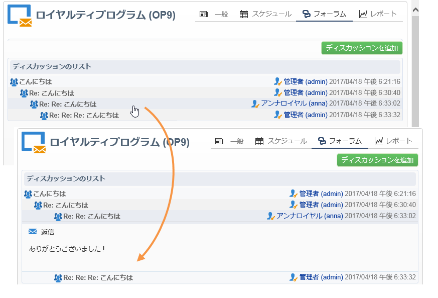
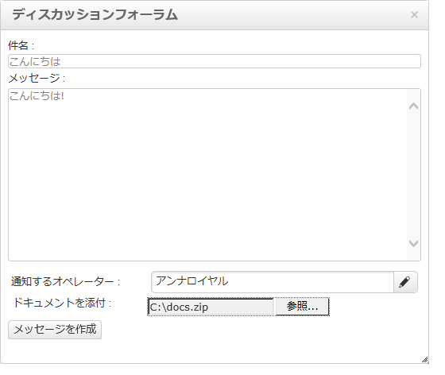
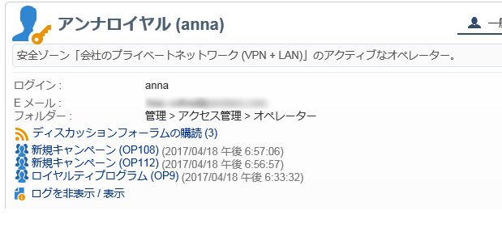

# ディスカッションフォーラム{#discussion-forums}

Adobe Campaign のオペレーターは、ディスカッションフォーラムを使用して情報を共有できます。プラン、プログラム、キャンペーン、リソース、シミュレーション、在庫の各要素には、それぞれ独自のディスカッションフォーラムがあります。各オペレーターにも個人用のフォーラムがあります。個人用フォーラムも含め、すべてのディスカッションは公開されています。

フォーラムに購読登録すると、メッセージが投稿されるたびに通知 E メールを受信できます。

## フォーラムへのアクセス {#accessing-a-forum}

キャンペーンやオペレーターなどのフォーラムにアクセスするには、対応するダッシュボードに移動し、右上隅にある「**[!UICONTROL フォーラム]**」リンクをクリックします。このリンクにはフォーラムのメッセージの総数も表示されます。

## フォーラムの利用 {#using-a-forum}

メッセージとメッセージへの回答は、時間順（新しい順）に表示されます。

メッセージのコンテンツを表示するには、ヘッダーをクリックします。

**新しいディスカッションを開始する**

新しいディスカッションを開始するには、右上隅にある「**[!UICONTROL ディスカッションを追加]**」ボタンをクリックします。「**[!UICONTROL ディスカッションフォーラム]**」ボックスが表示されます（下の図を参照）。

**既存のディスカッションにメッセージを投稿する**

既存のディスカッションにメッセージを投稿するには、回答するメッセージを開き、左上隅にある「**[!UICONTROL 返信]**」リンクをクリックします。「**[!UICONTROL ディスカッションフォーラム]**」ボックスが表示されます（下の図を参照）。

メッセージに返信すると、元のメッセージの投稿者に通知が届きます。

**メッセージの作成**

「**[!UICONTROL ディスカッションフォーラム]**」ボックスで以下の手順に従います。

1. 「**[!UICONTROL メッセージ]**」フィールドにテキストを、「**[!UICONTROL 件名]**」フィールドにディスカッションのタイトルを入力します。

   

1. 必要に応じて以下を実行します。

   * フォーラムに購読登録していないオペレーターをディスカッションに参加させたい場合は、「**[!UICONTROL 通知するオペレーター]**」フィールドを使用します。このメッセージに関する通知 E メールがオペレーターに送信されます（オペレーターがフォーラムに登録されることはありません）。複数のオペレーターに通知を送信する場合は、オペレーターのグループを選択します。
   * メッセージに添付ファイルを追加するには、「**[!UICONTROL 参照]**」をクリックします。添付ファイルは通知 E メールにも添付されます。添付ファイルは個別に送信することしかできません。複数のファイルを送信するには、zip ファイルにまとめる必要があります。

1. 「**[!UICONTROL メッセージを作成]**」をクリックしてメッセージをフォーラムに投稿します。

>[!NOTE]
>
>一度フォーラムに投稿すると、メッセージの変更や削除はできません。

## オペレーターの個人用フォーラムへの投稿 {#posting-to-the-personal-forum-of-an-operator}

オペレーターのフォーラムへのメッセージの投稿は、例えば、特定のキャンペーンに関係するメッセージを投稿しなくても、Adobe Campaign での会話を把握したい場合に便利です。個人用フォーラムは公開されているので、投稿するメッセージはすべてのオペレーターに表示されます。個人用フォーラムに投稿があるたびに、そのオペレーターにメッセージが届きます。

オペレーターのフォーラムにアクセスするには、以下を実行します。

* エクスプローラーの&#x200B;**[!UICONTROL 管理／アクセス管理／オペレーター]**&#x200B;ノードへのアクセス権がある場合は、該当するオペレーターのダッシュボードを開き、右上隅にある「**[!UICONTROL フォーラム]**」リンクをクリックします。
* アクセス権がない場合は、Adobe Campaign でオペレーターの名前を見つけます（そのオペレーターがフォーラムに投稿したメッセージやそのオペレーターに割り当てられたタスクを使用）。名前をクリックすると、そのオペレーターのダッシュボードにアクセスできます。オペレーターのフォルダーのビューを作成するよう管理者に依頼することもできます。

## フォーラムの購読 {#subscribing-to-a-forum}

フォーラムを購読すると、ディスカッションをフォローできます。フォーラムにメッセージが投稿されるたびに、E メール通知が届きます。この E メールには、メッセージの本文と添付ファイルが含まれます。メッセージに回答するには、E メールの本文をクリックし、Adobe Campaign の Web インターフェイスにログインします。フォーラムに購読登録すると、この情報はすべてのオペレーターに表示されます。

* フォーラムを購読するには、メッセージリストの上のセクション内の右上にある「**[!UICONTROL ディスカッションをフォロー]**」ボタンをクリックします。

   

   フォーラムに購読登録すると、セクションが青になります。

* フォーラムを購読解除するには、「**[!UICONTROL 購読解除]**」ボタンをクリックします。

   

* 個人用ダッシュボードに、購読済みのフォーラムのリストが表示されます。「**[!UICONTROL ディスカッションフォーラムの購読]**」リンクをクリックしてリストを表示し、関心がある項目をクリックしてフォーラムにアクセスします。

   

   個人用ダッシュボードについて詳しくは、[この節](../../platform/using/access-management-operators.md)を参照してください。

* フォーラムの購読者を確認するには、メッセージリストの上にある「**[!UICONTROL このディスカッションフォーラムの購読者のリスト]**」リンクをクリックします。

   

## 通知配信の確認 {#checking-notification-delivery}

フォーラムを購読しているにも関わらず、オペレーターに通知が届かない場合は、以下の手順を実行します。

* オペレーターのプロファイルに E メールアドレスが入力されていることを確認します。
* **[!UICONTROL 管理／プロダクション／テクニカルワークフロー／キャンペーンプロセス]**&#x200B;ノードに移動し、「**[!UICONTROL ディスカッションフォーラムのジョブ]**」ワークフローが開始済みでエラーがないことを確認します。
* 配信ログを表示します。

   * Adobe Campaign のホームページで、**[!UICONTROL キャンペーン／ブラウジング／配信]**&#x200B;に移動し、「**[!UICONTROL ディスカッションフォーラムの通知]**」の配信を開きます。
   * エクスプローラーで、**[!UICONTROL 管理／プロダクション／自動作成されたオブジェクト／テクニカル配信／ワークフローの通知]**&#x200B;に移動し、「**[!UICONTROL ディスカッションフォーラムの通知]**」をクリックします。
   「**[!UICONTROL ディスカッションフォーラムの通知]**」ボックスの「**[!UICONTROL 編集／配信]**」タブで配信ログを確認します。「**[!UICONTROL トラッキング／ログ]**」および「**[!UICONTROL 除外の原因]**」タブを確認することもできます。
