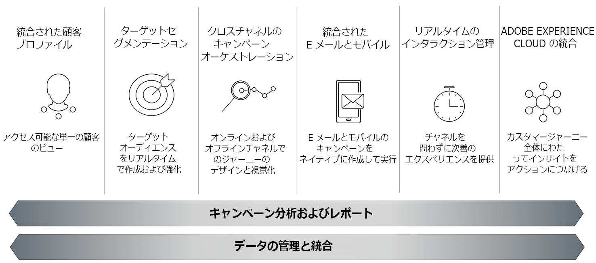

# Adobe Campaign Classic について{#about-adobe-campaign-classic}

高いレベルの顧客エンゲージメントを実現し、優れたエクスペリエンスを提供するには、あらゆる顧客接点で一貫したカスタマージャーニーを用意する必要があります。最新のマーケティングソリューションを利用すれば、マーケティング ROI の最大化とロイヤリティの強化を実現するクロスチャネルのマーケティングキャンペーンを効率的に設計、計画、展開、管理、最適化することができます。

Adobe Campaign は、対話的なマーケティングキャンペーンの構築を容易にします。Adobe Campaign には、マーケティングや顧客とのやり取りをモデル化し、合理化し、自動化するための革新的な機能が用意されています。

>[!NOTE]
>
>Adobe Campaign Classic には v6.11 と v7 があります。特に明記しない限り、ヘルプ資料は両方のバージョンの最新ビルドに適用されます。スクリーンショットは、Campaign Classic v7 のものです。

## 主な機能 {#key-capabilities}

Adobe Campaign は、クロスチャネルのカスタマーエクスペリエンスを構築するための基盤を提供し、視覚的なキャンペーンのオーケストレーションや、リアルタイムの対話管理、クロスチャネルのキャンペーン展開に必要な環境を提供します。

Adobe Campaign におけるマーケティングキャンペーンのサイクルは、この製品の主な機能領域を表しています。

### 統合された顧客プロファイル {#integrated-customer-profile}

プロファイル（顧客、見込み客、ニュースレター購読者など）は、Adobe Campaign データベースで一元管理されます。プロファイルを取得してこのデータベースを作成するために使用可能なメカニズムは多数あります。Web フォームによるオンライン収集、テキストファイルの手動または自動インポート、会社のデータベースまたは他の情報システムによるレプリケーションなどです。Adobe Campaign を利用すれば、マーケティング履歴、購入情報、嗜好、CRM データおよび関連する PII データを包括的に集約し、分析をおこなって、行動に移すことができます。

Adobe Campaign では、受信者は配信（E メール、SMS など）の送信先となるデフォルトプロファイルです。データベースに格納された受信者データを活用して、任意の配信のターゲットを絞り込み、配信コンテンツにパーソナライゼーションデータを追加することができます。データベースには、他のタイプのプロファイルも含まれています。それらのプロファイルは用途が異なります。例えば、シードプロファイルは、配信を最終的なターゲットに送信する前のテスト用に作成されます。

Profile management basics are explained in [About profiles](../../platform/using/about-profiles.md).

### ターゲティングされたセグメント {#targeted-segmentation}

Adobe Campaign には、高度にターゲティングされた最適なオファーを作成できる、強力で使いやすいセグメント化機能とターゲティング機能が用意されています。記述的分析機能では、マーケティングキャンペーンのアップストリームおよびダウンストリームの情報を分析でき、フィルター管理および[グラフィカルクエリエディター](../../platform/using/about-queries-in-campaign.md)機能を使用して、購読者の母集団やサンプルをフィルターしたり、無制限の数の基準を使用してターゲットグループを作成したりすることができます。The analysis and targeting features are described in [this page](../../reporting/using/about-descriptive-analysis.md) and in the [Creating filters](../../platform/using/creating-filters.md) section.

高度なデータ管理機能は、データ処理機能を強化します。データマートでモデル化されていないデータを含めることで、ターゲティングプロセスを簡素化し、最適化します。この機能について詳しくは、[このページ](../../workflow/using/targeting-data.md#data-management)で説明しています。

### クロスチャネルのキャンペーンオーケストレーション {#cross-channel-campaign-orchestration}

Adobe Campaign では、ターゲティングおよびパーソナライズされたキャンペーンの設計と編成を複数のチャネル（E メール、ダイレクトメール、SMS、プッシュ通知）でおこなうことができます。すべてのキャンペーンおよび通信をスケジュール、編成、設定、パーソナライズ、自動化、実行および測定するために必要なすべての機能が、単一のインターフェイスに用意されています。キャンペーンのスケジュールおよび実行について詳しくは、[このページ](../../campaign/using/setting-up-marketing-campaigns.md)を参照してください。

### パーソナライゼーションとリアルタイムのインタラクション {#personalization-and-real-time-interaction}

顧客プロファイルと環境設定に基づいてメッセージコンテンツとヘッダーを効果的にパーソナライズすることで、顧客の注意を引き、応答率を向上させます。メッセージコンテンツ管理とパーソナライゼーションについて詳しくは、[このページ](../../delivery/using/about-personalization.md)を参照してください。コンテンツ、通知および承認サイクルの協調管理について詳しくは、[この節](../../campaign/using/about-marketing-resource-management.md)で説明しています。

### 分析とレポート {#analysis-and-reporting}

Adobe Campaign では、顧客のデータおよびプロファイルを段階的にエンリッチメントすることによって、顧客の行動を監視および解釈できます。レポートおよび分析ツールを使用すると、各新規キャンペーンから利益を得たり、マーケティング戦略のターゲティングを向上させたり、投資への影響および投資利益率を最適化したりできます。詳しくは、[このページ](../../reporting/using/delivery-reports.md)を参照してください。

### Adobe Experience Cloud 統合 {#adobe-experience-cloud-integrations}

Adobe Campaignの配信機能と高度なキャンペーン管理機能を組み合わせて、ユーザーエクスペリエンスをパーソナライズするためのソリューションを作成できます。例えば、Adobe Experience Manager、Adobe Analytics、Adobe targetまたはAdobe Experience cloudでトリガーされます。 Adobe IMS と統合し、Adobe ID を使用して Campaign にログインすることもできます。クロスソリューションと認証統合について詳しくは、[この節](../../integrations/using/about-adobe-id.md)を参照してください。

## コア機能とアドオン {#core-capabilities-and-add-ons}

Adobe Campaign は、ニーズやアーキテクチャに応じて対話型マーケティング機能を実装し、最適化するための一連の機能を備えています。これらの機能には、コア機能と、インストールしたパッケージおよび設定によって使える機能があります。詳細な製品説明は、以下を参照してください。 [Adobe Campaign Classic製品概要](https://helpx.adobe.com/legal/product-descriptions/adobe-campaign-classic---product-description.html)。

使用できる機能は以下のとおりです。ライセンス契約によって、ご利用のインスタンスで使える機能と使えない機能があります。

* [チャネル](../../delivery/using/communication-channels.md)：各種チャネル（E メール、SMS、LINE、モバイルアプリ、ダイレクトメール）を使用した配信のデザインと送信
* [キャンペーン](../../campaign/using/designing-marketing-campaigns.md)：クロスチャネルキャンペーンのオーケストレーション
* [MRM](../../campaign/using/about-marketing-resource-management.md)：マーケティングリソースと予算の管理
* [インタラクション](../../interaction/using/interaction-and-offer-management.md)：Campaign のオファーの管理
* [Message Center](../../message-center/using/about-transactional-messaging.md)：E メール、SMS またはモバイルアプリでのトランザクションメッセージの送信
* [Social Marketing](../../social/using/about-social-marketing.md) — ソーシャルメディアでの通信：Facebook、Twitter、
* [ワークフロー](../../workflow/using/about-workflows.md)／データ管理：プロセスの自動化と、ワークフローを使用したデータの管理
* [Web アプリケーション](../../web/using/about-web-applications.md)：Web ページおよびフォームの作成
* [調査マネージャー](../../web/using/about-surveys.md)：オンライン調査および集計の作成
* [コンテンツマネージャー](../../delivery/using/about-content-management.md)：E メールコンテンツの管理
* [分散型マーケティング](../../campaign/using/about-distributed-marketing.md)：セントラルエージェントやローカルエージェントのキャンペーンの調整
* [Response Manager](../../campaign/using/about-response-manager.md)：顧客の応答の管理
* [コネクタ](../../platform/using/about-connectors.md)：外部のソリューションやデータベースエンジンと通信するために使用
* [Web サービス](../../configuration/using/about-web-services.md)： API／Web サービスを介した Campaign の使用
* [レポート](../../reporting/using/about-adobe-campaign-reporting-tools.md)：組み込みレポートへのアクセス、データの分析および独自レポートのデザイン

