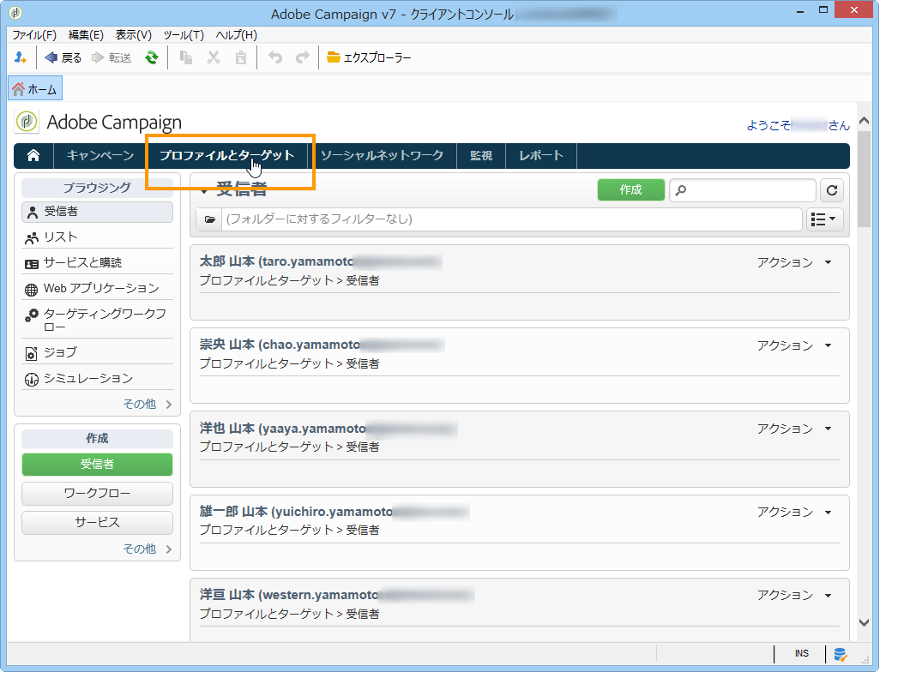
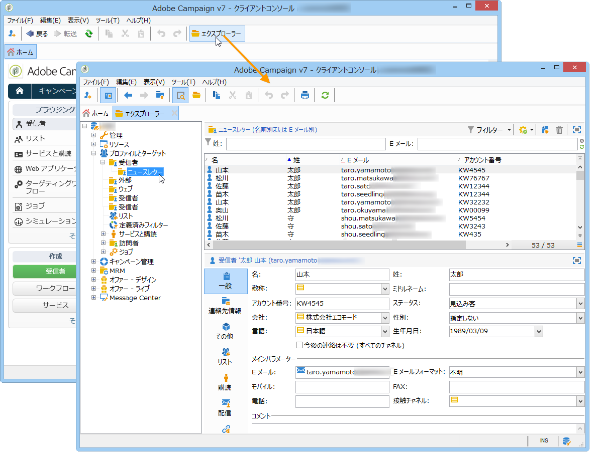

# プロファイルについて{#about-profiles}

## プロファイルのタイプ {#profile-types}

Adobe Campaign では、作成、インポート、ターゲティング、アクショントラッキング、更新など、プロファイルをライフサイクル全体にわたって管理できます。

各プロファイルは、データベースエントリに対応します。これには、個人のターゲティング、選定およびトラッキングに必要な情報がすべて含まれています。

プロファイルは、ストレージスペースに基づいて識別できます。つまり、プロファイルは受信者、訪問者、オペレーター、購読者、見込み客などに対応します。

## 受信者プロファイル {#recipient-profiles}

配信の受信者はプロファイルとしてデータベースに保存されており、これには、姓、名、住所、購読、配信など、受信者に関連付けられた情報が含まれます。キャンペーンを作成する場合、配信のターゲットを、単純な基準または詳細な基準に従って選択されたベース内のプロファイルに定義できます。

プロファイルがデータベースではなくファイルに保存されている受信者を対象にしたキャンペーンを作成することもできます。これらは「外部」配信と呼ばれます。このタイプの配信について詳しくは、[このページ](../../delivery/using/steps-defining-the-target-population.md#selecting-external-recipients)を参照してください。

受信者プロファイルを作成する主な方法は次のとおりです。

* グラフィカルインターフェイス画面での直接入力
* 受信者リストのインポート
* Web フォームによるオンライン収集

>[!NOTE]
>
>ファイルおよび Web フォームのインポート方法を確認するには、[一般的なインポートおよびエクスポート](../../platform/using/generic-imports-and-exports.md)を参照してください。

## プロファイルとターゲット {#profiles-and-targets}

「**[!UICONTROL プロファイルとターゲット]**」リンクをクリックすると、Adobe Campaign データベースに保存されている受信者を表示できます。新規受信者の作成、既存の受信者の編集およびそのプロファイルへのアクセスをおこなうことができます。詳しくは、[このページ](../../platform/using/editing-a-profile.md)を参照してください。

次のものにアクセスすることもできます。

* リスト：[リストの作成および管理](../../platform/using/creating-and-managing-lists.md)を参照してください。
* 購読サービス：[このページ](../../delivery/using/managing-subscriptions.md)を参照してください。
* Web アプリケーション：[このページ](../../web/using/about-web-applications.md)を参照してください。
* インポートおよびエクスポート（ジョブ）：[一般的なインポートおよびエクスポート](../../platform/using/generic-imports-and-exports.md)を参照してください。
* ターゲティングワークフロー：[このページ](../../workflow/using/building-a-workflow.md#implementation-steps-)を参照してください。

受信者ページでは、編集、更新、追加、削除、並べ替えなど、頻繁におこなう操作をプロファイルに対して実行できます。

プロファイルをより詳細に操作するには、Adobe Campaign ツリーを編集する必要があります。そのためには、Adobe Campaign のホームページで「**[!UICONTROL エクスプローラー]**」リンクをクリックします。

デフォルトでは、受信者はツリーの&#x200B;**[!UICONTROL プロファイルとターゲット／受信者]**&#x200B;ノードに保存されています。このビューでは、受信者の作成のほか、次の操作を実行できます。

* データベースのプロファイルの並べ替えおよびフィルター：[フィルターオプション](../../platform/using/filtering-options.md)を参照してください。
* データベースからのプロファイルの移動、コピーまたは削除：[プロファイルの管理](../../platform/using/managing-profiles.md)を参照してください。
* プロファイルの更新：[データの更新](../../platform/using/updating-data.md)を参照してください。
* 受信者のエクスポート：[プロファイルのエクスポートとインポート](../../platform/using/exporting-and-importing-profiles.md)を参照してください。
* 受信者グループの作成：[リストの作成および管理](../../platform/using/creating-and-managing-lists.md)を参照してください。

高度な機能および設定にアクセスするには、「**[!UICONTROL エクスプローラー]**」アイコンをクリックする必要があります。

Adobe Campaign エクスプローラーの一般的なレイアウトについては、[Adobe Campaign エクスプローラーの使用](../../platform/using/adobe-campaign-workspace.md#using-adobe-campaign-explorer)で説明しています。

>[!NOTE]
>
>**[!UICONTROL プロファイルとターゲット／受信者]**&#x200B;リンクをクリックして、Adobe Campaign ツリーからこのリストの詳細ビューを表示することもできます。リスト表示は、ニーズに合わせて設定できます。列の追加または削除、列の順序の定義、データの並べ替えなどをおこなうことができます。リストの表示設定は、[Adobe Campaign エクスプローラーの使用](../../platform/using/adobe-campaign-workspace.md#using-adobe-campaign-explorer)で説明しています。
>
>受信者ビューを定義することもできます。この機能について詳しくは、[フォルダーとビュー](../../platform/using/access-management.md#folders-and-views)を参照してください。

## アクティブなプロファイル {#active-profiles}

アクティブなプロファイルは、請求の対象として考慮されるプロファイルです。

「**プロファイル**」とは、エンドユーザー、見込み客またはリードを表している情報のレコード（例：nmsRecipient テーブル内のレコードや、cookie ID、顧客 ID、モバイル ID、または特定のチャネルに関連するその他の情報が含まれている外部テーブル内のレコード）のことです。

請求に関係するのは、**アクティブ**&#x200B;なプロファイルのみです。過去 12 ヶ月以内にいずれかのチャネルでターゲットになるか通信がおこなわれたプロファイルは、アクティブとみなされます。

>[!NOTE]
>
>ただし、Facebook および Twitter チャネルは考慮されません。

**[!UICONTROL アクティブなプロファイルの数]**&#x200B;の概要は、**[!UICONTROL 管理／キャンペーン管理／顧客指標]**&#x200B;メニューから表示できます。

実際のカウントは、**[!UICONTROL アクティブな請求プロファイルの数]**（**[!UICONTROL billingActiveContactCount]**）[テクニカルワークフロー](../../workflow/using/delivery.md)がおこないます。このワークフローは毎日実行され、新しいデータを&#x200B;**[!UICONTROL 顧客指標]**&#x200B;メニューの現在の期間に対する既存のレポートに追加します。各期間は 12 ヶ月続きます。

配信の準備中に（タイポロジルール、強制隔離によって）除外されたプロファイルは、考慮されません。プロファイルは、複数の配信のターゲットになっていても一度しかカウントされません。
