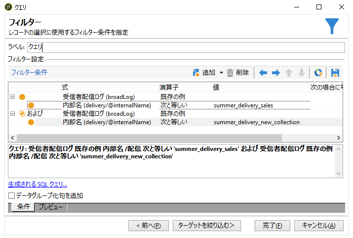

# Campaign のクエリについて{#about-queries-in-campaign}

Adobe Campaign のクエリツールは、ターゲット母集団の作成、顧客のセグメント化、トラッキングログの抽出とフィルター、フィルターの作成などのために、ソフトウェアの複数のレベルで使用できます。

Adobe Campaign のクエリツールでは、専用のウィザードである汎用クエリエディターを使用して、データベースに対してクエリを実行できます。汎用クエリエディターにアクセスするには、**[!UICONTROL ツール／汎用クエリエディター...]** メニューを使用します。汎用クエリエディターでは、データベースに格納されている情報を抽出し、構成、グループ化、並べ替えなどをおこなうことができます。例えば、ユーザーは、特定の期間にニュースレター内のリンクを「n」回以上クリックした受信者を収集することができます。このツールでは、ニーズに応じて結果を収集、並べ替えおよび表示できます。

このツールは、Adobe Campaign のすべてのクエリ機能を組み合わせたものです。例えば、制限フィルターを作成して保存できます。つまり、汎用クエリエディターで作成したユーザーフィルターを、ターゲティングワークフローのクエリボックスなどで使用できます。

クエリは、選択したテーブルのフィールドを使用するか、数式を使用して作成します。

[ここをクリック](../../workflow/using/query.md)して、Campaign クエリエディターを開きます。

